# Block Diagrams

Block diagrams visualize system components and their connections.

**Note:** Block diagram support in Mermaid is new and experimental.

## Basic Syntax

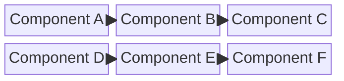

## Common Patterns

### Web Application Architecture
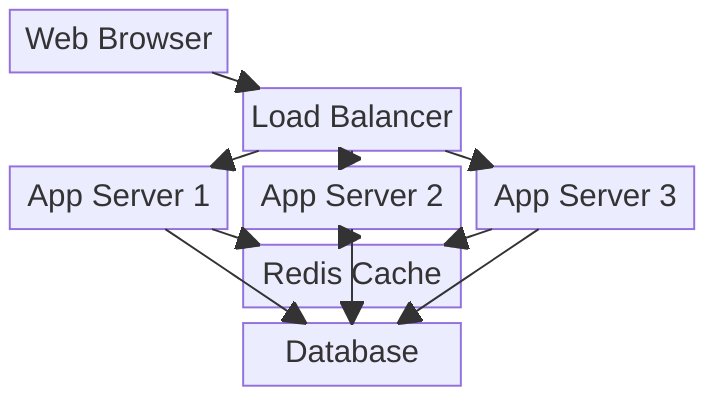

### Data Processing Pipeline
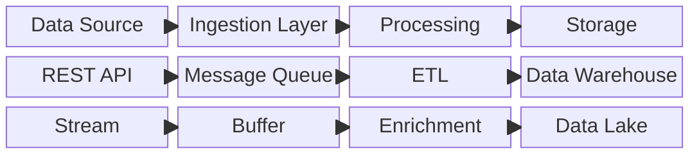

### Microservices Architecture
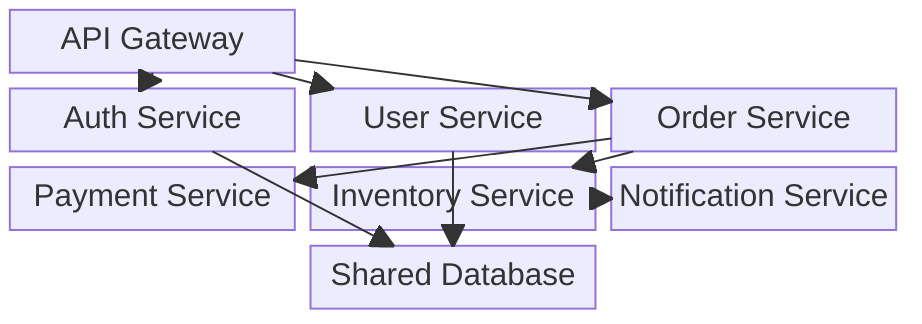

### Network Topology
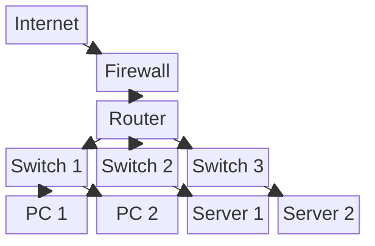

### CI/CD Pipeline
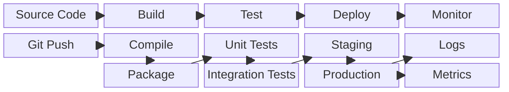

### IoT System
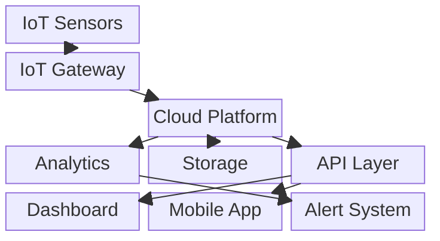

### E-Commerce System
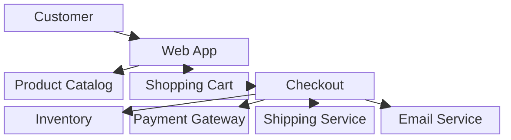

### Video Streaming Platform
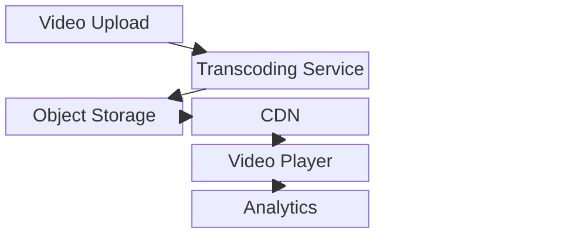

### Authentication System
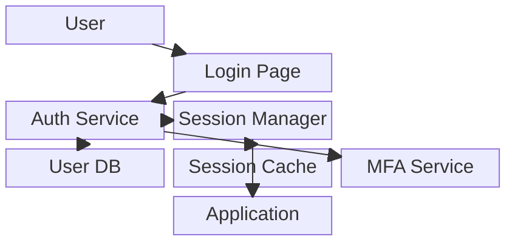

### Machine Learning Pipeline
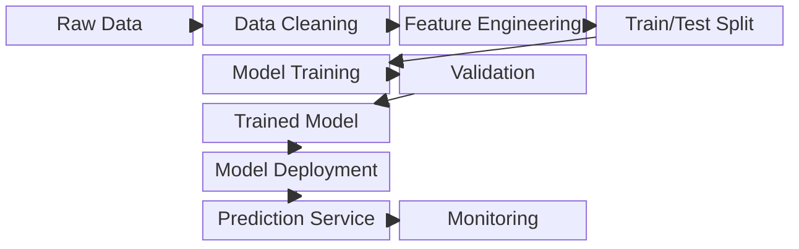

## Tips

- Use `columns` to set grid layout
- Use `space` for empty cells
- Blocks are defined with labels in quotes
- Arrows show connections
- Organize logically top to bottom or left to right
- Group related components
- Show data flow with arrows
- Keep layout clean and readable
- Use consistent block sizing
- Label all components clearly
