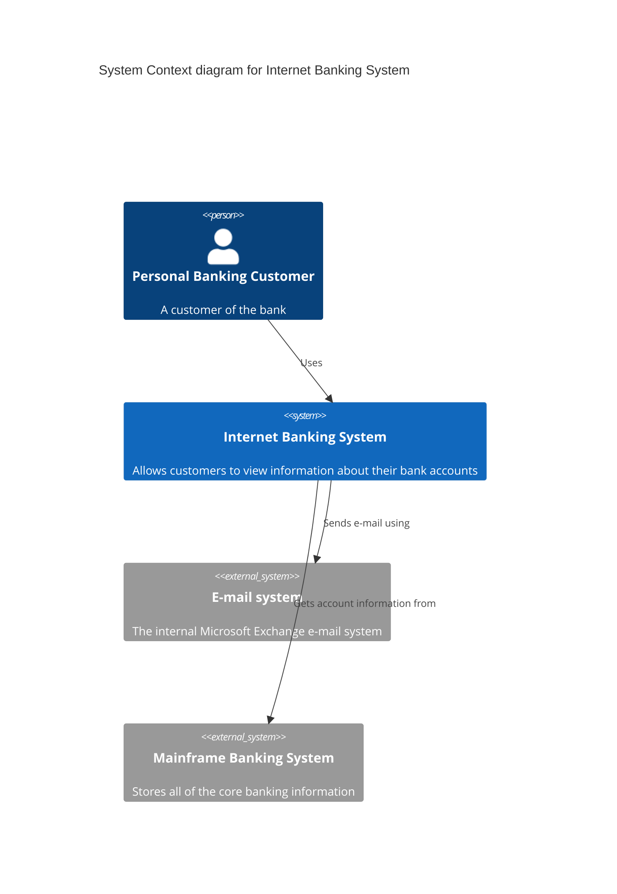
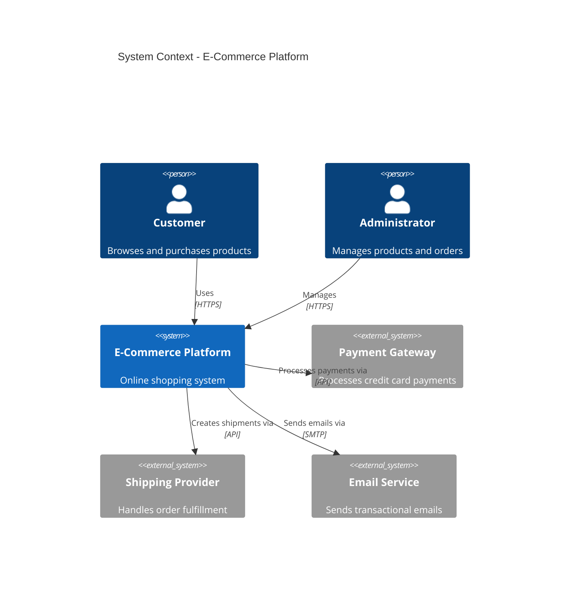
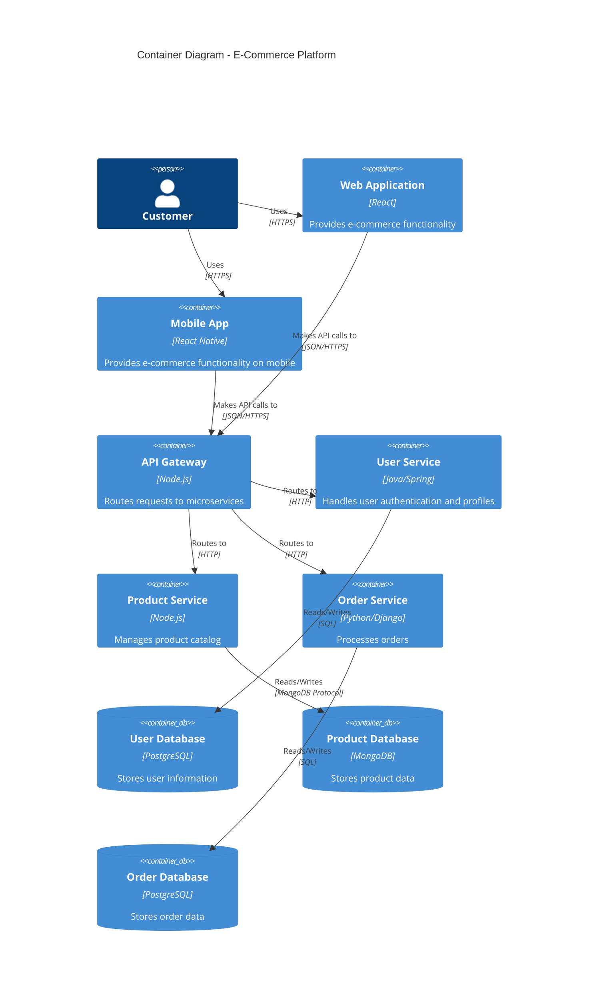
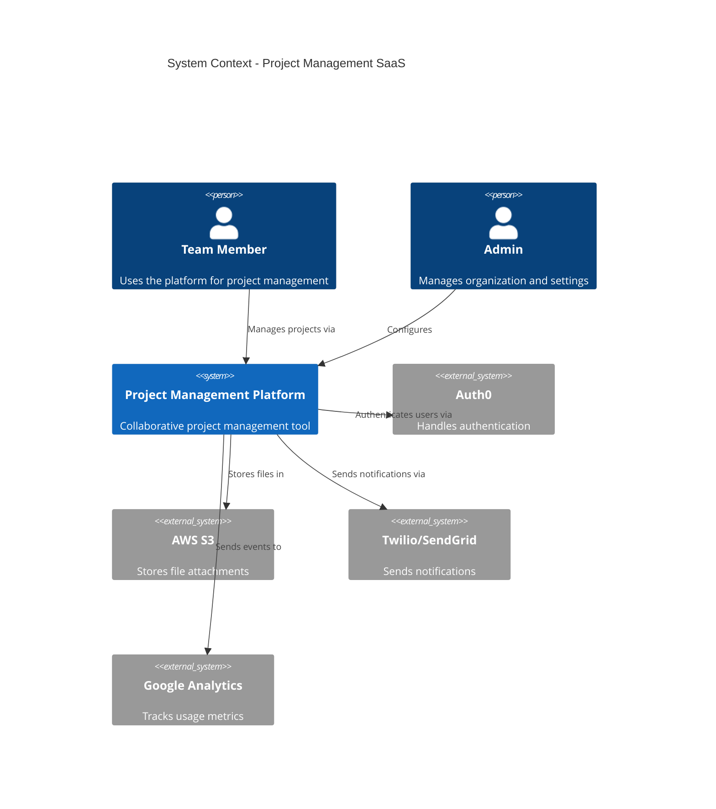
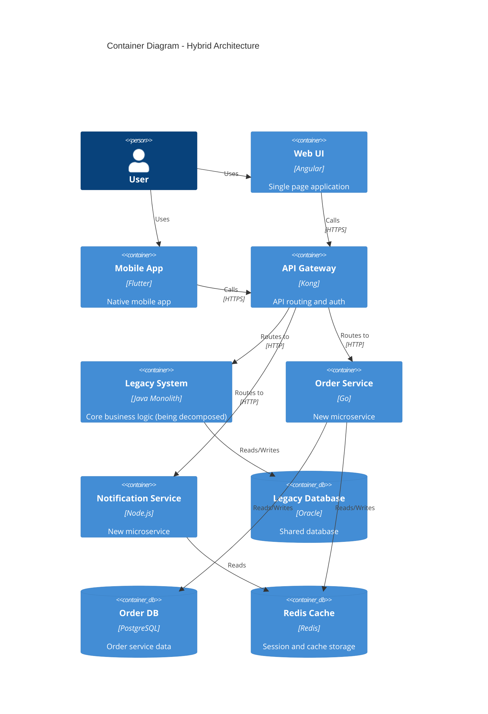
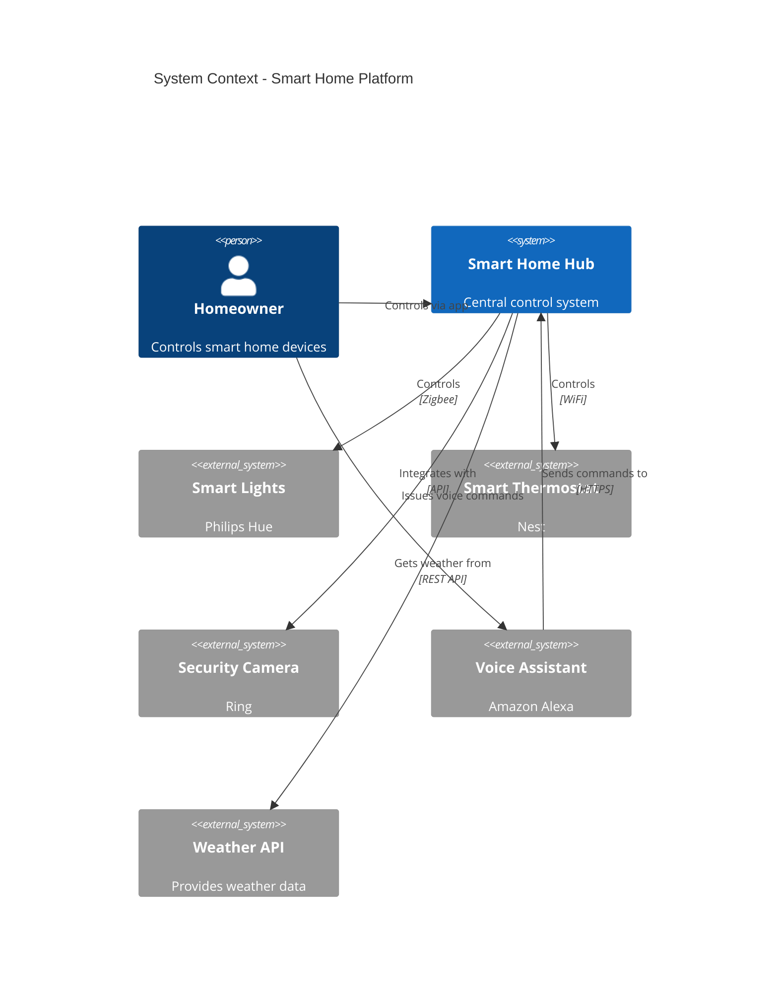
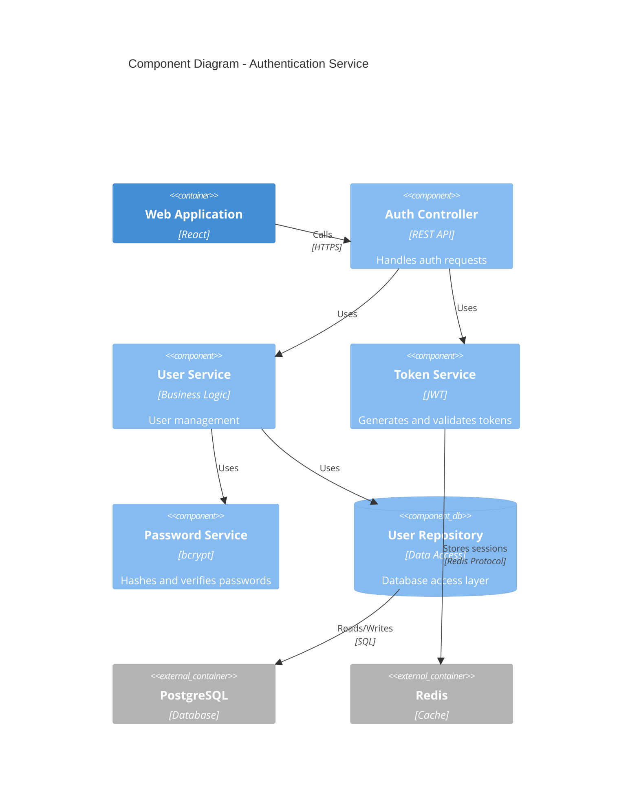
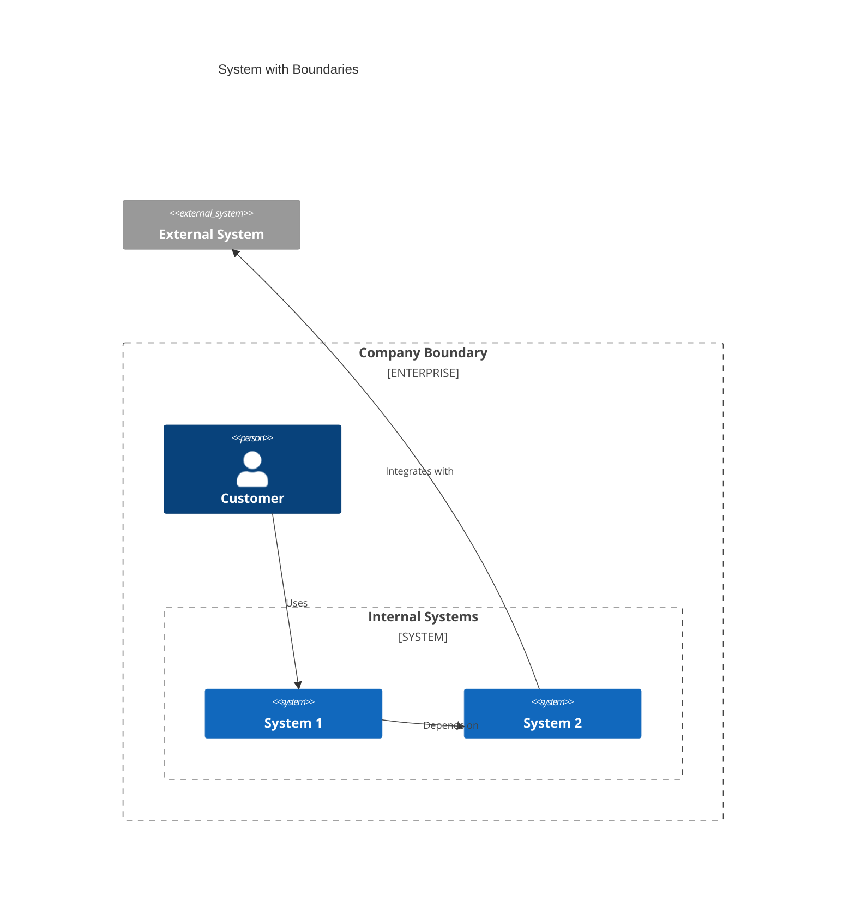

# C4 Diagrams

C4 diagrams visualize software architecture at different levels of detail.

**Note:** C4 diagram support in Mermaid is experimental and syntax may change.

## Basic Syntax



## Element Types

### System Context Level
- `Person(alias, label, description)` - User or actor
- `Person_Ext(alias, label, description)` - External user
- `System(alias, label, description)` - Software system
- `System_Ext(alias, label, description)` - External system
- `SystemDb(alias, label, description)` - Database system
- `SystemDb_Ext(alias, label, description)` - External database

### Container Level
- `Container(alias, label, technology, description)` - Application/container
- `ContainerDb(alias, label, technology, description)` - Database container
- `Container_Ext(alias, label, technology, description)` - External container

### Component Level
- `Component(alias, label, technology, description)` - Software component
- `ComponentDb(alias, label, technology, description)` - Database component

## Relationships

```mermaid
Rel(from, to, label)
Rel(from, to, label, technology)
BiRel(from, to, label)
BiRel(from, to, label, technology)
Rel_Back(from, to, label)
Rel_D(from, to, label)  // Down
Rel_U(from, to, label)  // Up
Rel_L(from, to, label)  // Left
Rel_R(from, to, label)  // Right
```

## Common Patterns

### System Context - Web Application


### Container Diagram - Microservices


### System Context - SaaS Platform


### Container Diagram - Monolith to Microservices


### System Context - IoT Platform


### Component Diagram - Authentication Service


## Boundaries



## Tips

- Start with System Context (highest level)
- Drill down to Containers for architecture overview
- Use Components for detailed service internals
- Keep diagrams focused on one level of abstraction
- Use boundaries to group related elements
- Include technology choices in Container diagrams
- Show external dependencies clearly
- Use consistent naming conventions
- Direction suffixes (_D, _U, _L, _R) control layout
- C4 model = Context, Containers, Components, Code
