# Class Diagrams

Class diagrams show object-oriented structure with classes, attributes, methods, and relationships.

## Basic Syntax

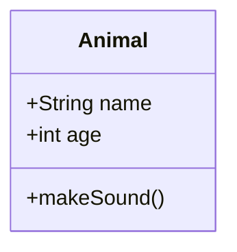

## Visibility Modifiers

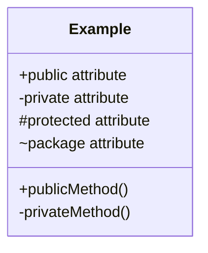

## Data Types

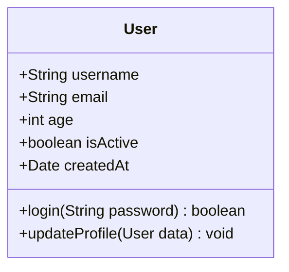

## Relationships

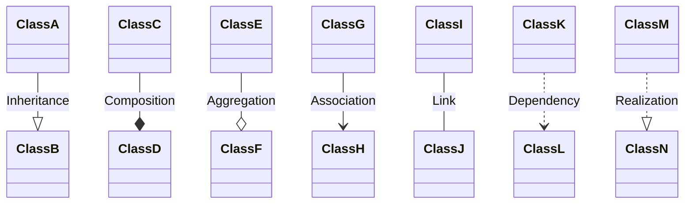

### Relationship Cardinality

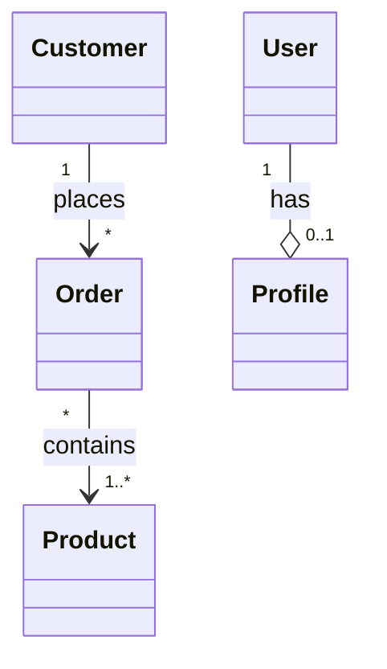

## Abstract Classes & Interfaces

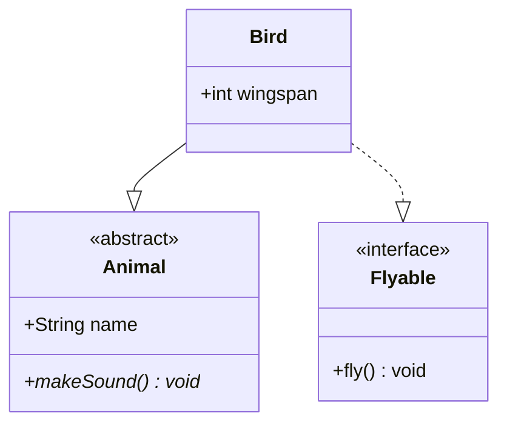

## Enumerations

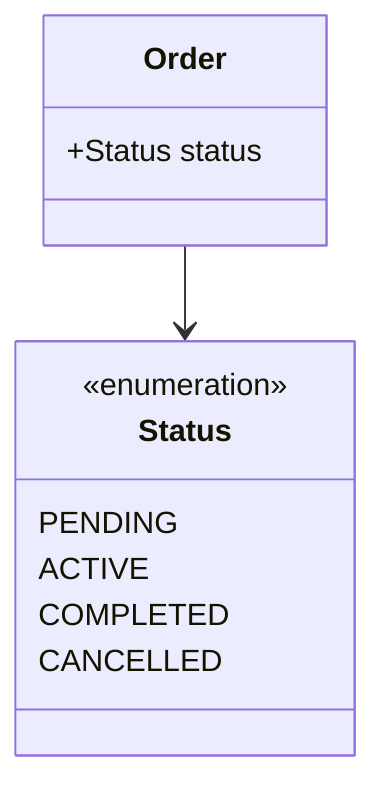

## Generic Types

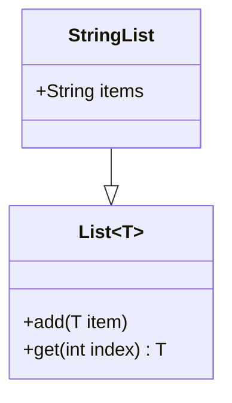

## Common Patterns

### Simple Inheritance
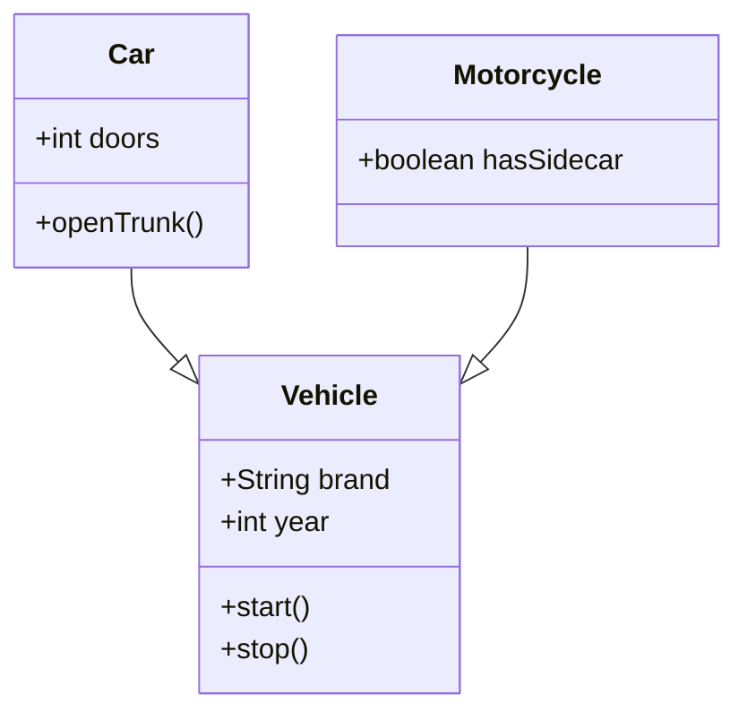

### Repository Pattern
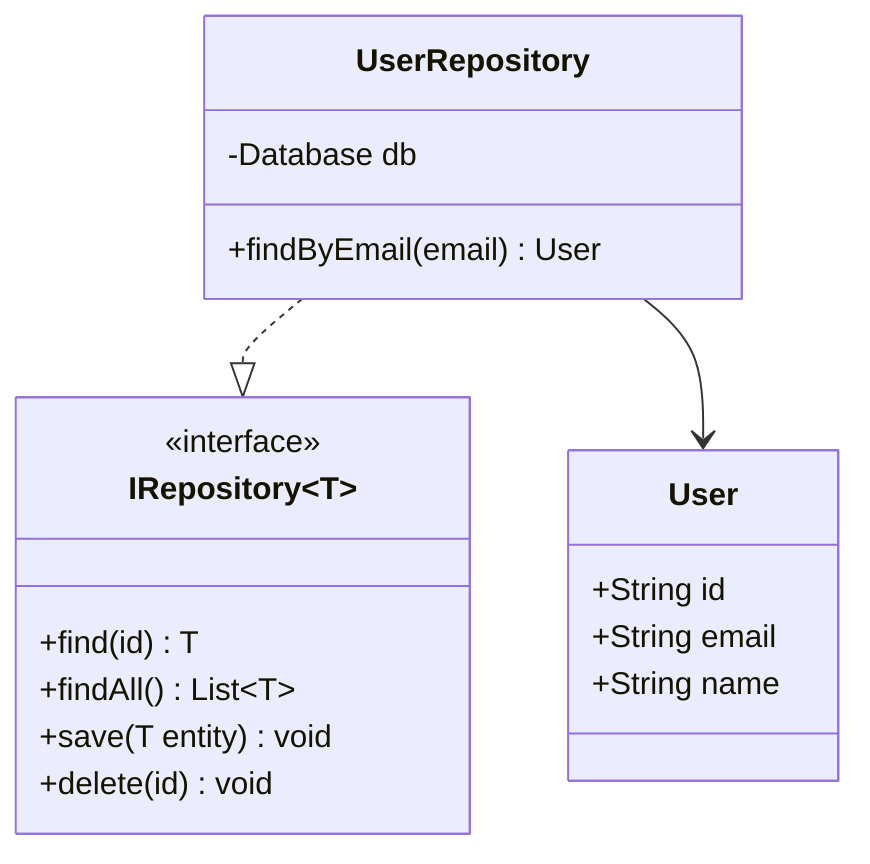

### MVC Pattern
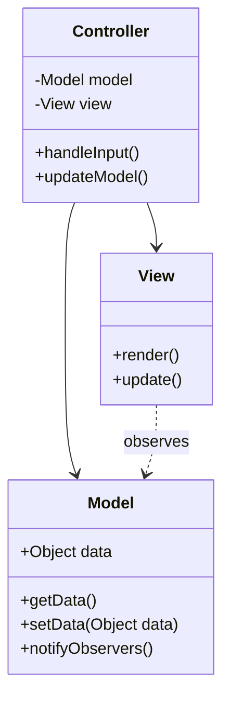

### Service Layer Architecture
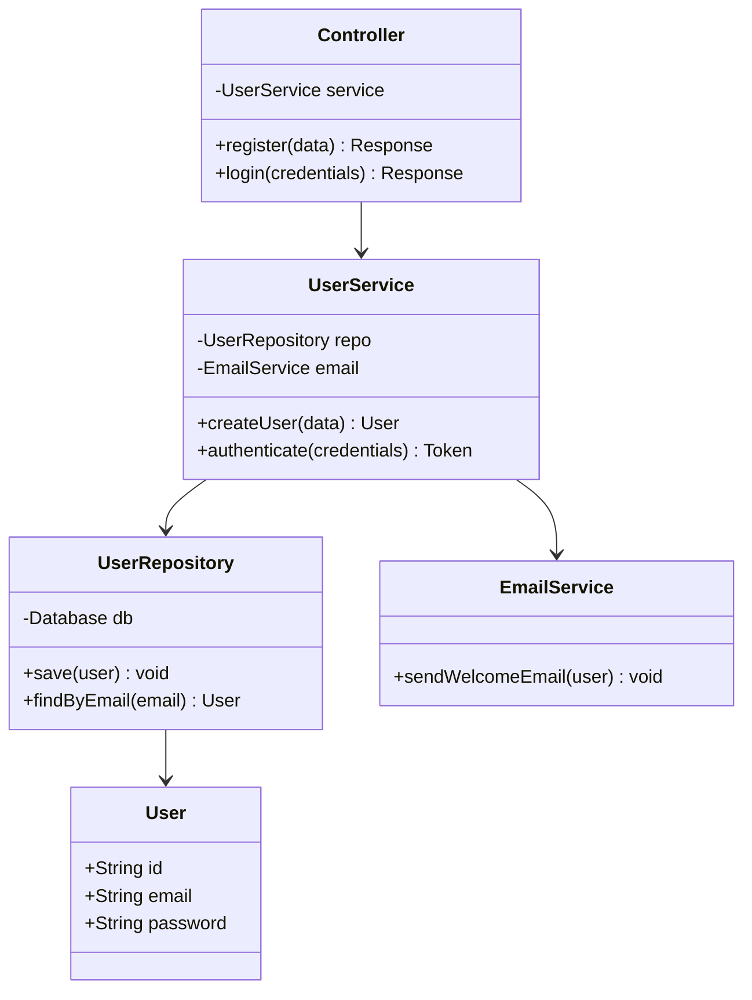

### Factory Pattern
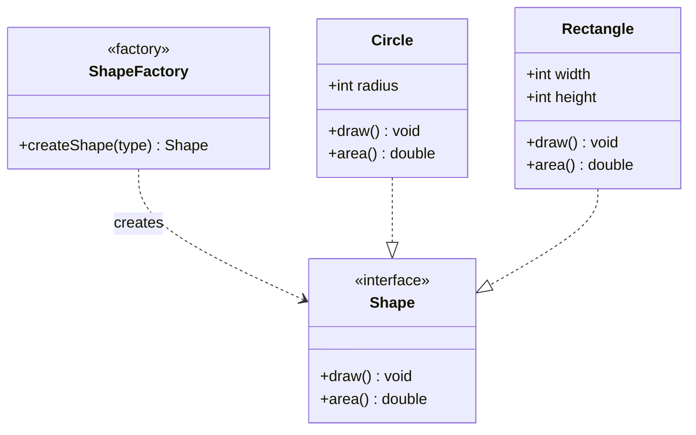

## Annotations

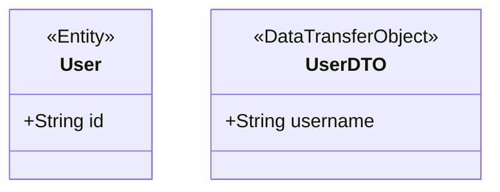

## Notes

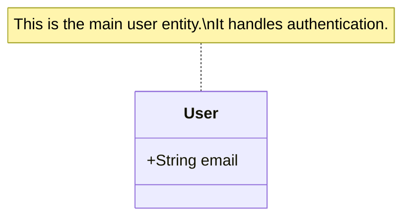

## Styling

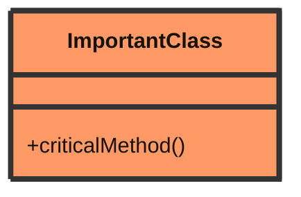

## Tips

- Use meaningful class names (PascalCase)
- Show only relevant attributes/methods
- Use interfaces for contracts
- Mark abstract classes and methods
- Show cardinality on associations
- Group related classes visually
- Use composition over inheritance when modeling "has-a" relationships
