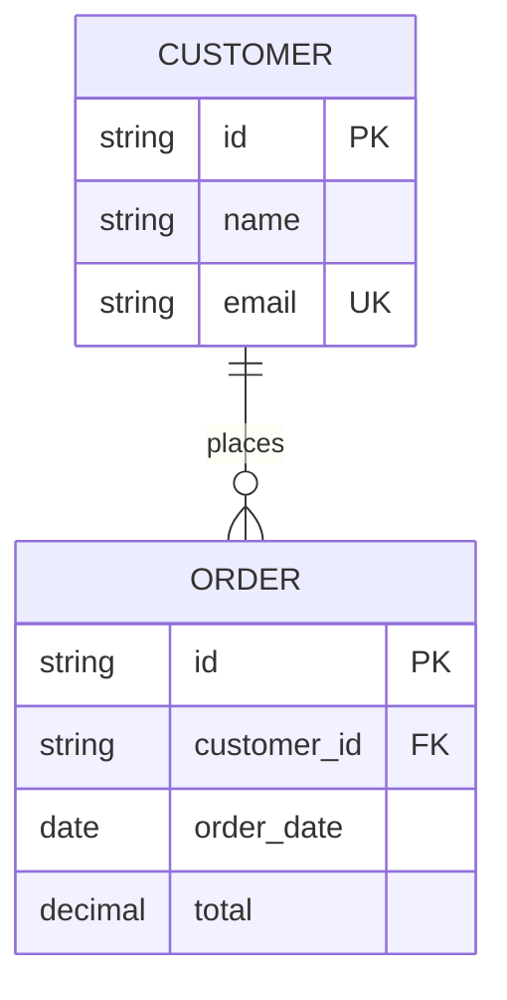
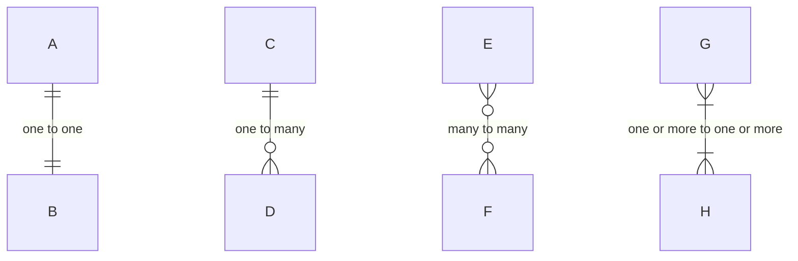
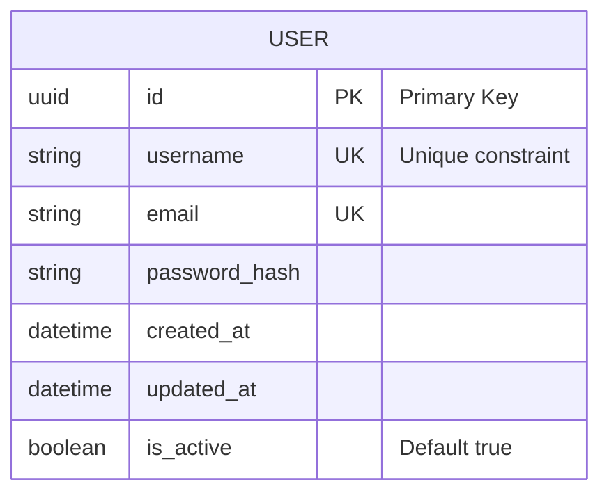
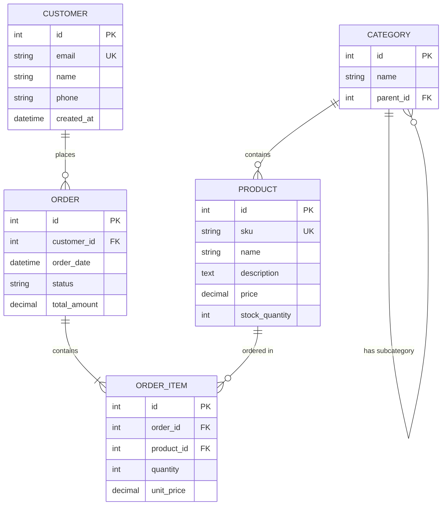
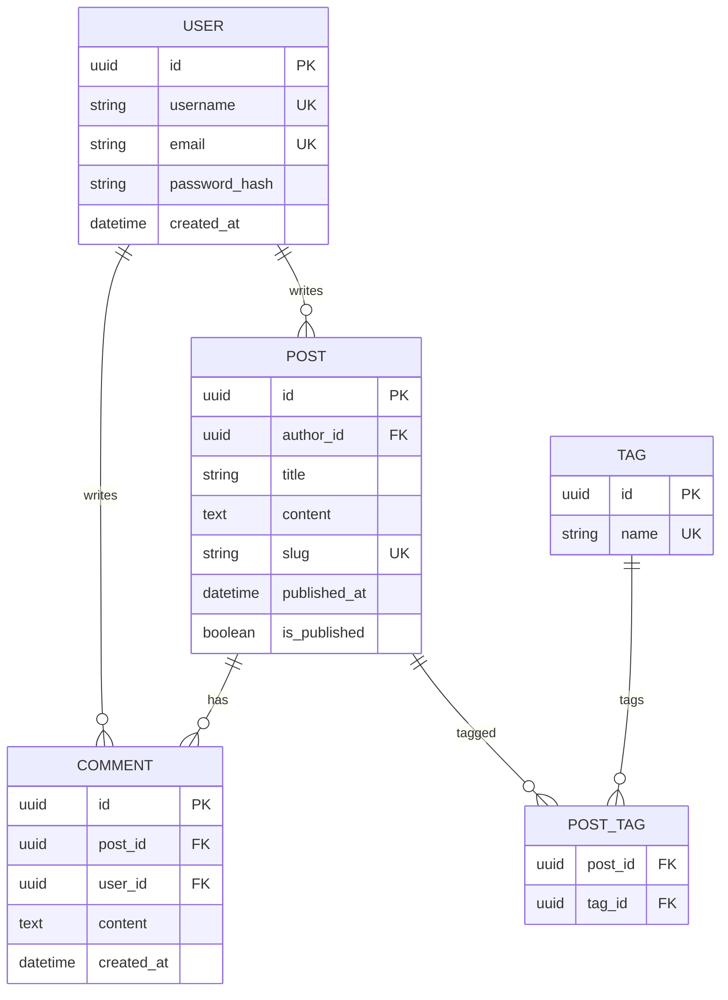
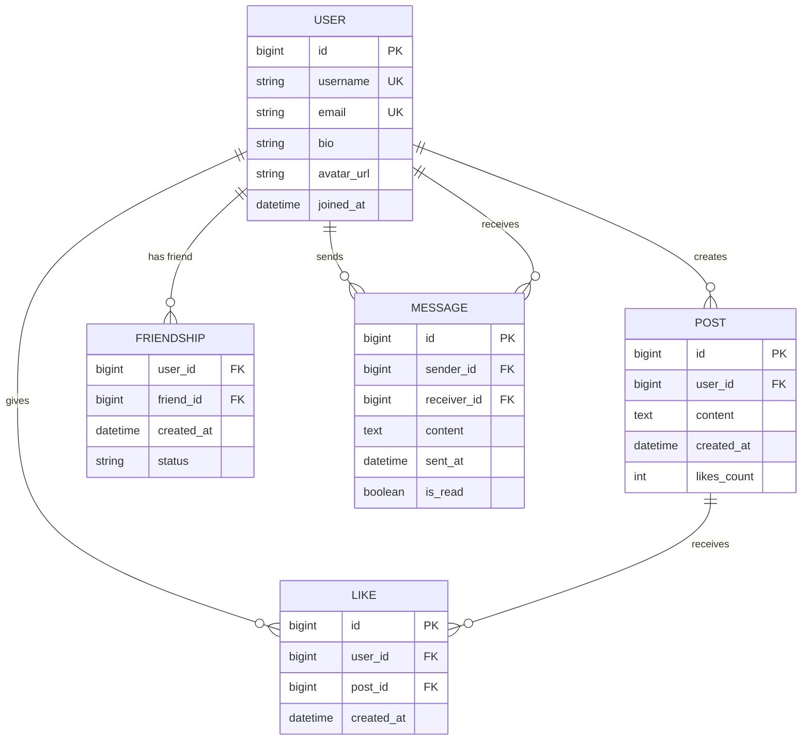
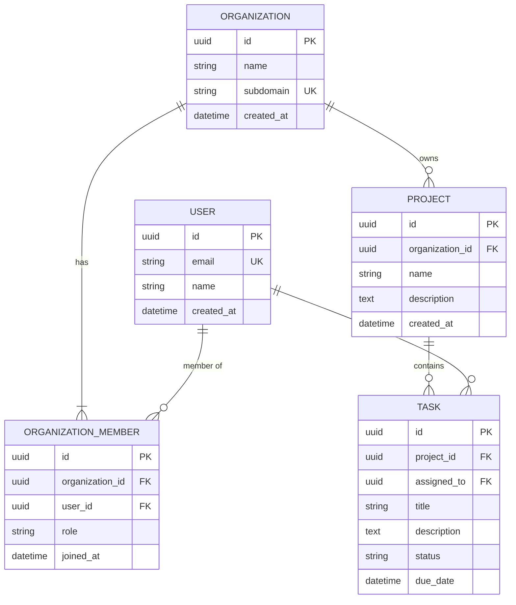
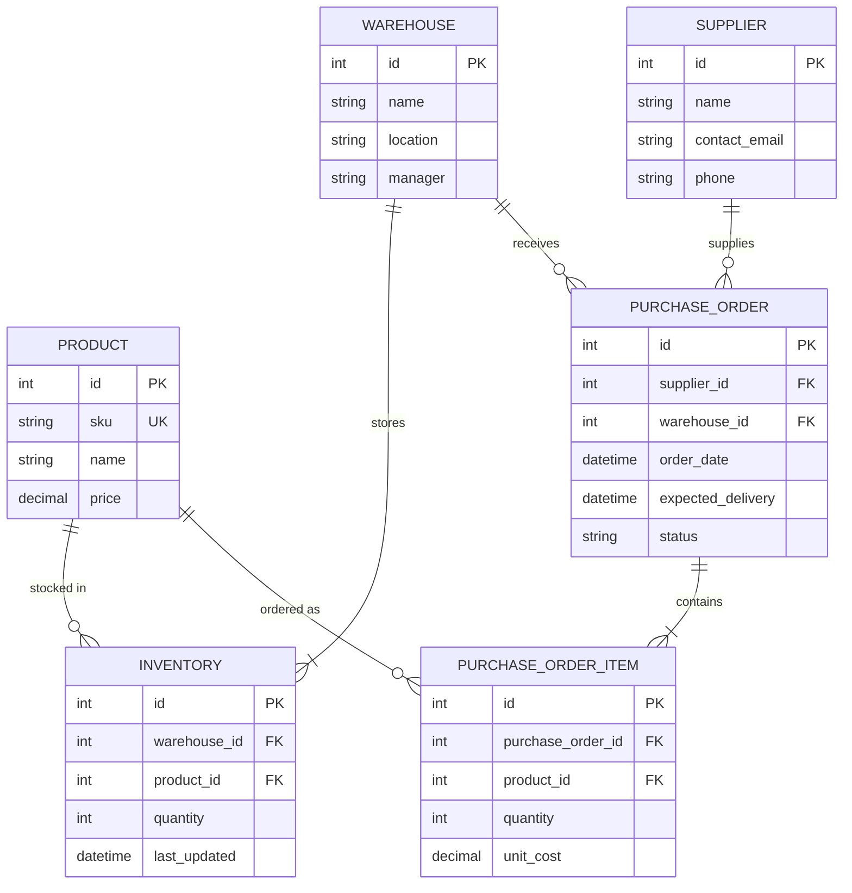
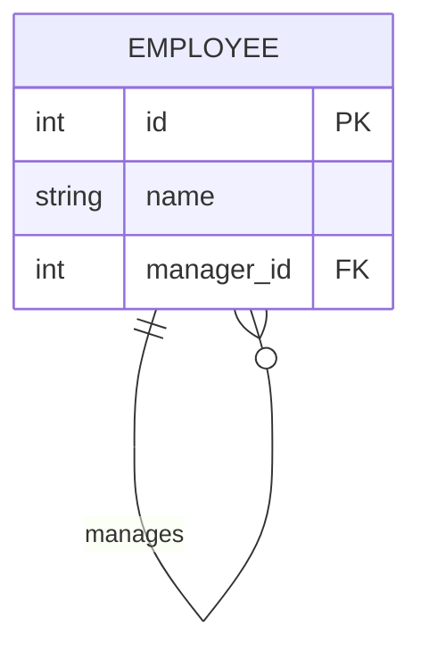
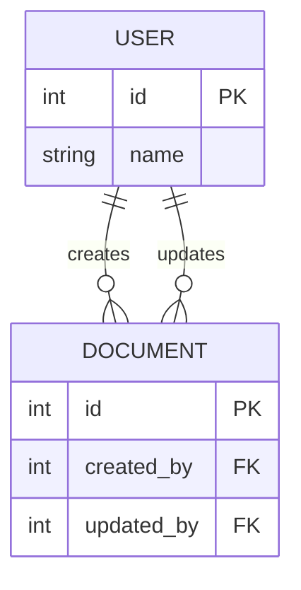

# Entity Relationship Diagrams

ER diagrams model database schemas and relationships between entities.

## Basic Syntax

## Relationship Types

## Cardinality Symbols

- `||` - Exactly one
- `o|` - Zero or one
- `}o` - Zero or more
- `}|` - One or more

## Attribute Types

## Common Key Constraints

- `PK` - Primary Key
- `FK` - Foreign Key
- `UK` - Unique Key

## Common Patterns

### E-Commerce Database

### Blog Platform

### Social Network

### SaaS Application

### Inventory Management

## Advanced Features

### Self-Referencing Relationship

### Multiple Relationships

## Tips

- Use meaningful entity names (UPPERCASE by convention)
- Include all foreign keys with FK annotation
- Mark unique constraints with UK
- Add comments for complex attributes
- Show cardinality accurately
- Keep entity count manageable (split large diagrams)
- Use junction tables for many-to-many relationships
- Consider normalization when designing
