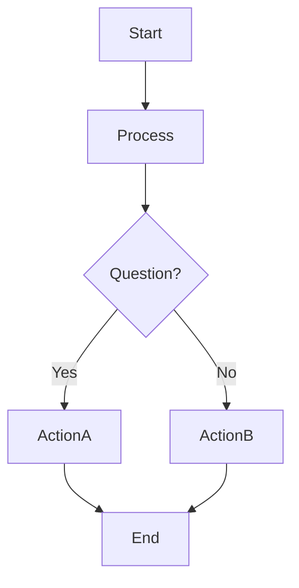
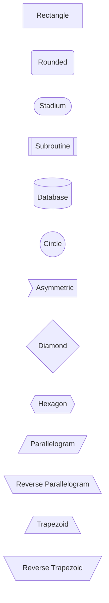
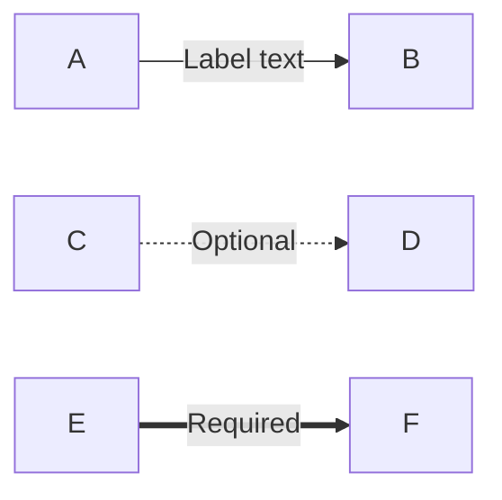
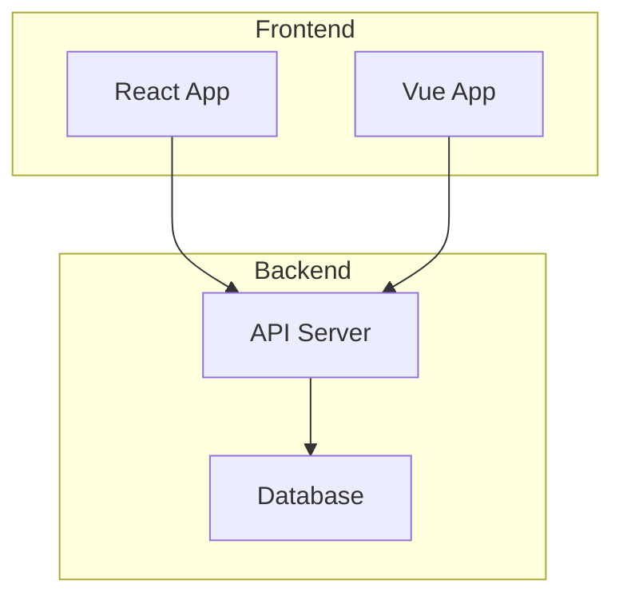
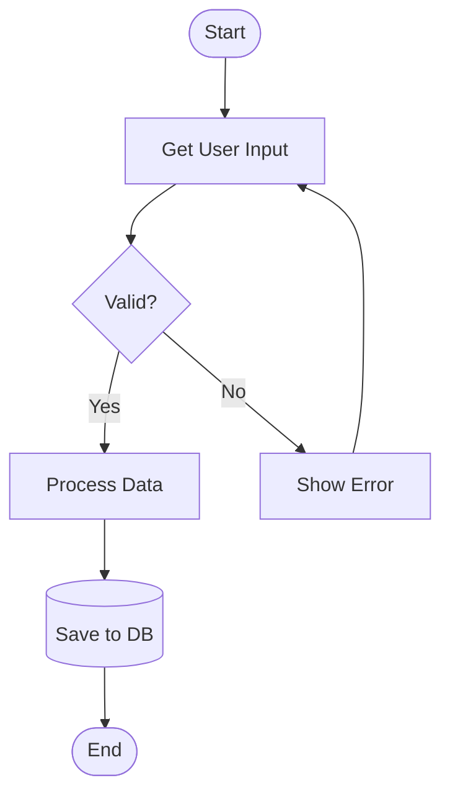
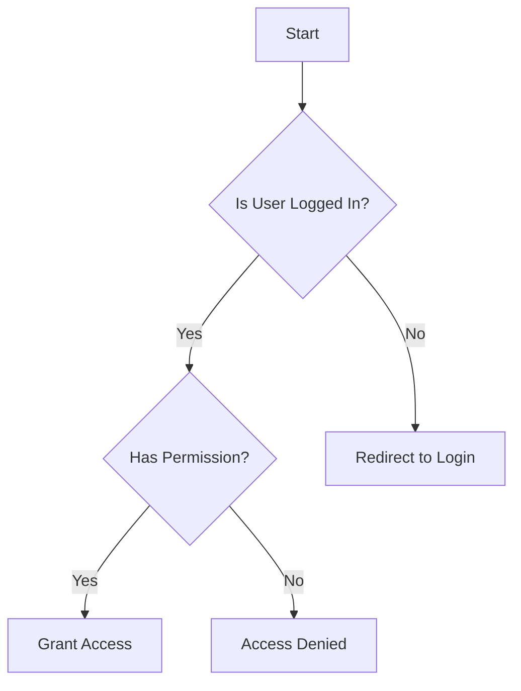
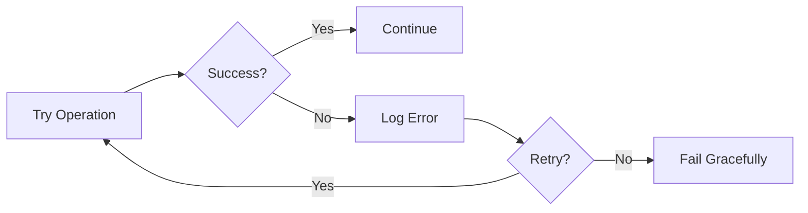
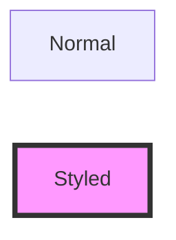
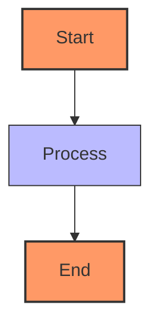

# Flowchart Diagrams

Flowcharts visualize processes, algorithms, and decision flows.

## Syntax



## Orientations

- `flowchart TD` or `flowchart TB` - Top to Bottom
- `flowchart BT` - Bottom to Top
- `flowchart LR` - Left to Right
- `flowchart RL` - Right to Left

## Node Shapes



## Arrow Types

```mermaid
flowchart LR
    A --> B     %% Solid arrow
    C -.-> D    %% Dotted arrow
    E ==> F     %% Thick arrow
    G --- H     %% Solid line (no arrow)
    I -.- J     %% Dotted line
    K === L     %% Thick line
```

## Arrow Labels



## Subgraphs



## Common Patterns

### Simple Process Flow


### Decision Tree


### Error Handling Flow


## Styling



### Class Definitions


## Tips

- Use meaningful IDs (not just A, B, C)
- Quote labels with special characters: `Node["Text with spaces"]`
- Maximum clarity: one decision per diamond
- Group related nodes with subgraphs
- Keep flows unidirectional when possible
