# Gantt Charts

Gantt charts visualize project schedules and timelines.

## Basic Syntax

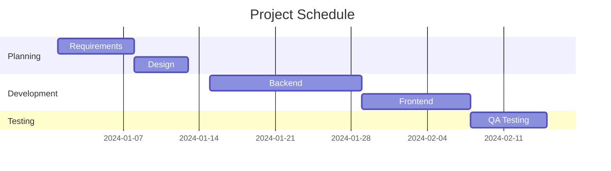

## Date Formats

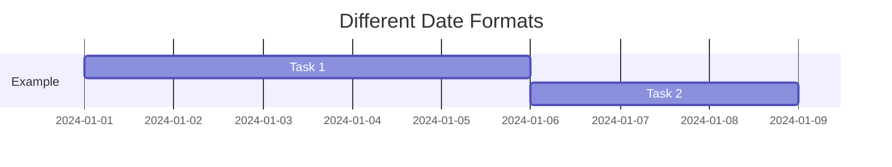

Common formats:
- `YYYY-MM-DD` - 2024-01-15
- `DD-MM-YYYY` - 15-01-2024
- `YYYY-MM-DD HH:mm` - 2024-01-15 14:30

## Task Dependencies

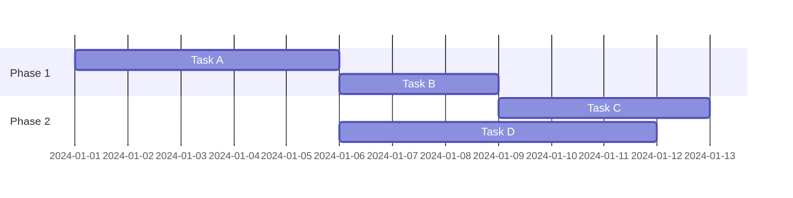

## Task States

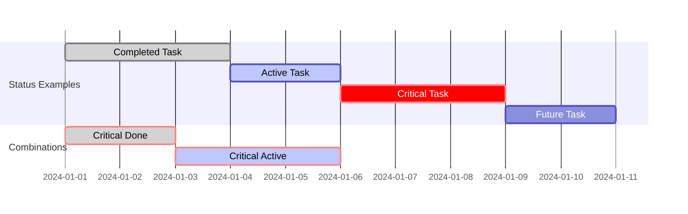

## Milestones

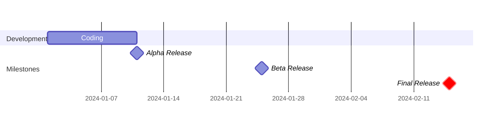

## Common Patterns

### Software Development Sprint
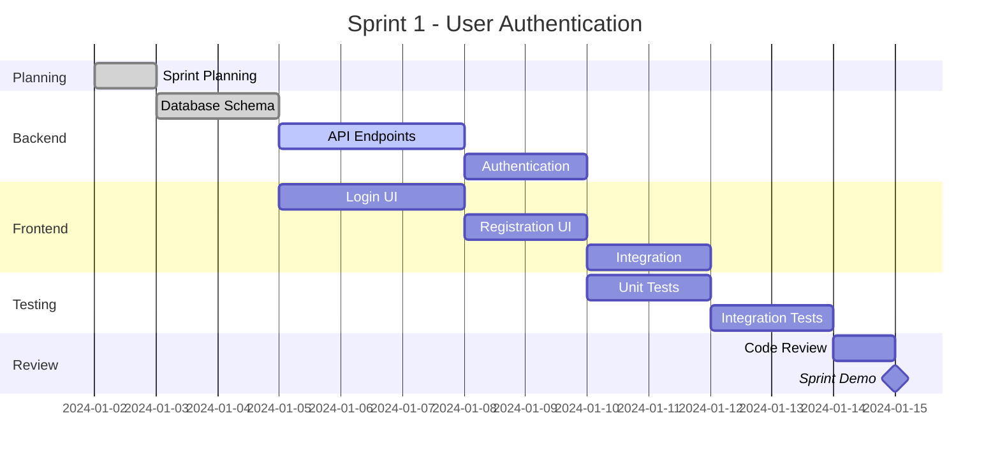

### Product Launch
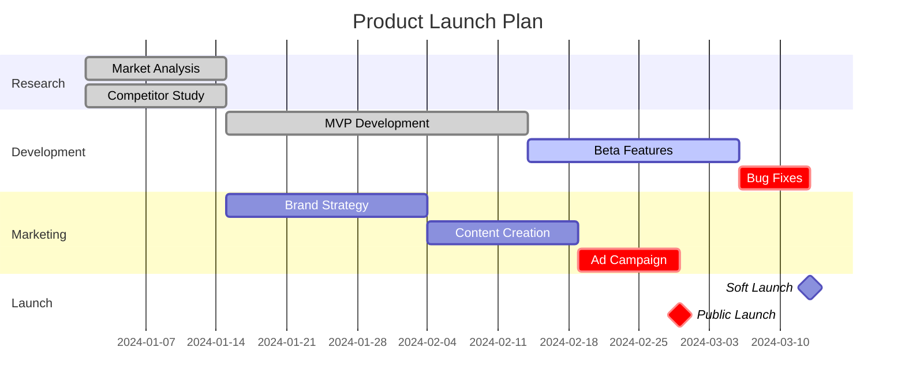

### Construction Project
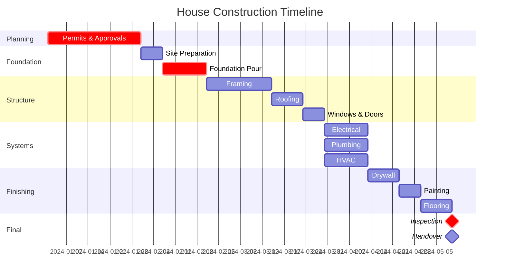

### Marketing Campaign
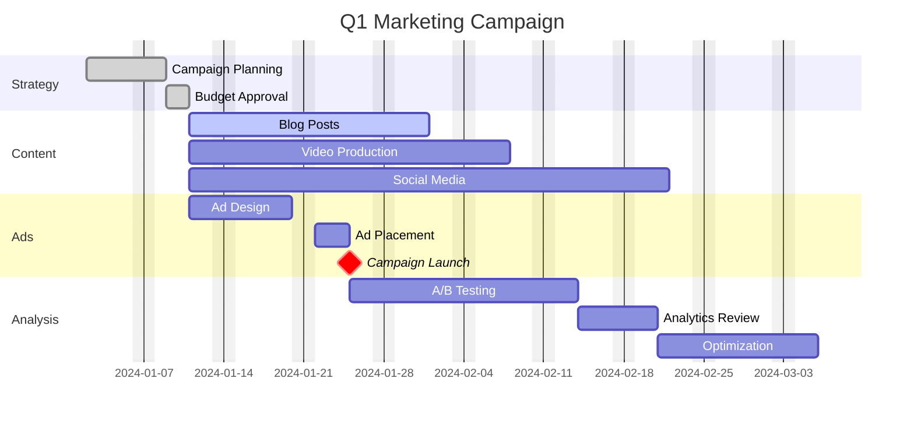

### Event Planning
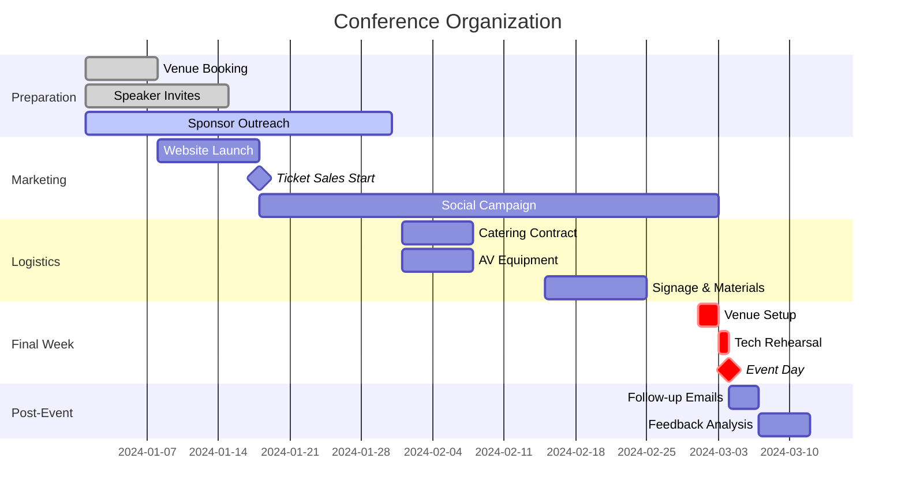

## Excluding Days

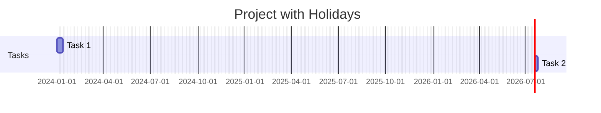

## Axis Format

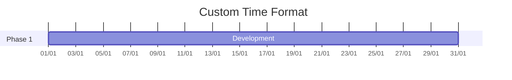

Format options:
- `%Y` - 4-digit year (2024)
- `%y` - 2-digit year (24)
- `%m` - Month number (01-12)
- `%b` - Month abbreviation (Jan)
- `%B` - Full month (January)
- `%d` - Day of month (01-31)
- `%a` - Day abbreviation (Mon)
- `%A` - Full day (Monday)
- `%H:%M` - Time (14:30)

## Today Marker

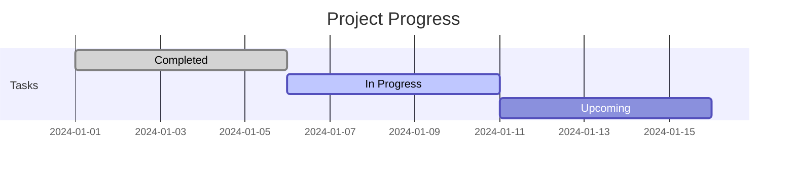

## Tips

- Use `excludes weekends` for business day planning
- Mark critical path with `crit` tag
- Use milestones (0d duration) for key dates
- Combine tags: `crit, done` or `crit, active`
- Use `after taskId` for dependencies
- Keep section names concise
- Use meaningful task IDs for dependencies
- Consider time zones for global teams
