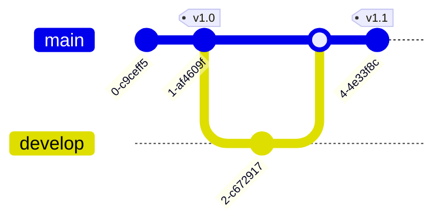
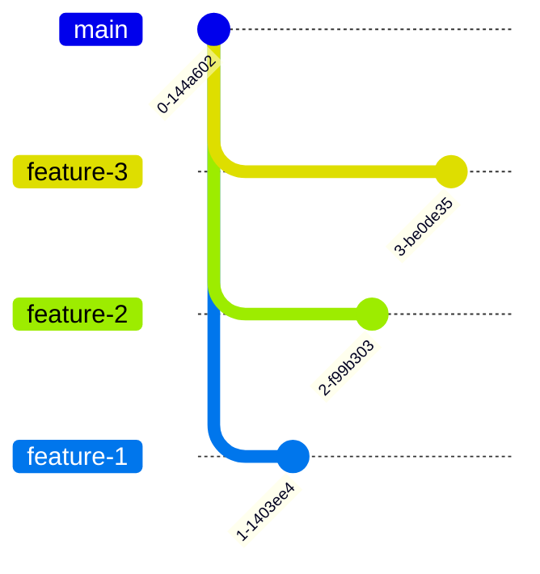

# Git Graphs

Git graphs visualize branching strategies and commit histories.

## Basic Syntax

## Commit with Messages

## Tags

## Common Patterns

### Git Flow

### Feature Branch Workflow

### Release Process

### Hotfix Workflow

### Multiple Feature Development

### Trunk-Based Development

### Parallel Release Branches

### Revert and Fix

## Branch Ordering

## Cherry-Pick Pattern

## Tips

- Use meaningful commit messages
- Tag releases with version numbers
- Show merge direction clearly
- Keep graph readable (limit branches shown)
- Use consistent branch naming
- Order branches logically with `order:` parameter
- Illustrate specific workflows, not entire history
- Consider chronological flow (top to bottom)
