# User Journey Diagrams

User journey maps track user experience across tasks and touchpoints.

## Basic Syntax

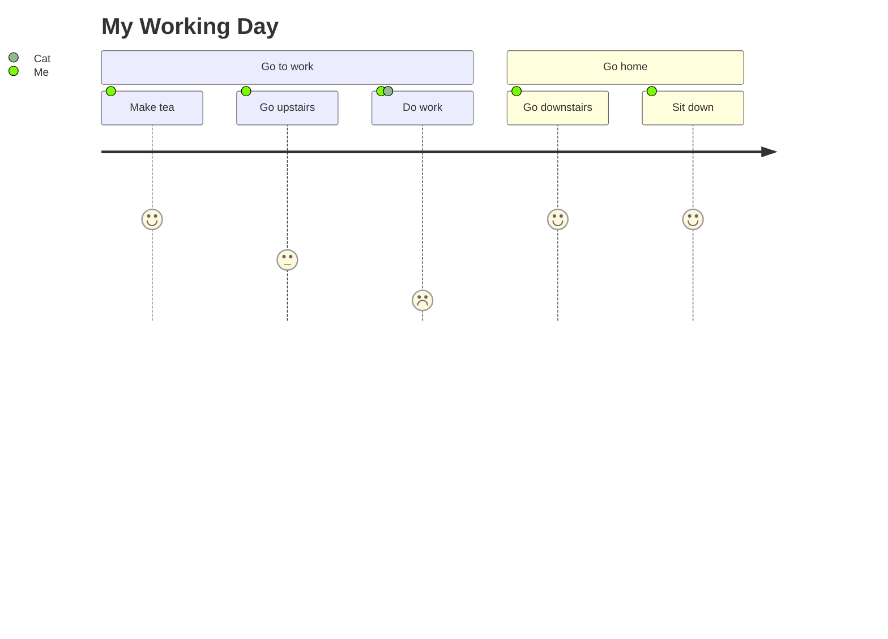

## Satisfaction Scores

- `1` - Very Dissatisfied
- `2` - Dissatisfied
- `3` - Neutral
- `4` - Satisfied
- `5` - Very Satisfied

## Common Patterns

### E-Commerce Purchase Journey
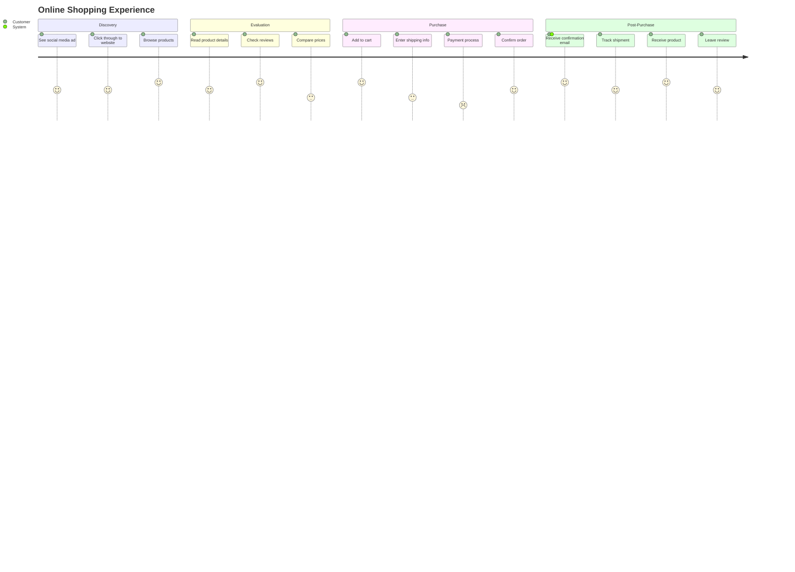

### SaaS Onboarding
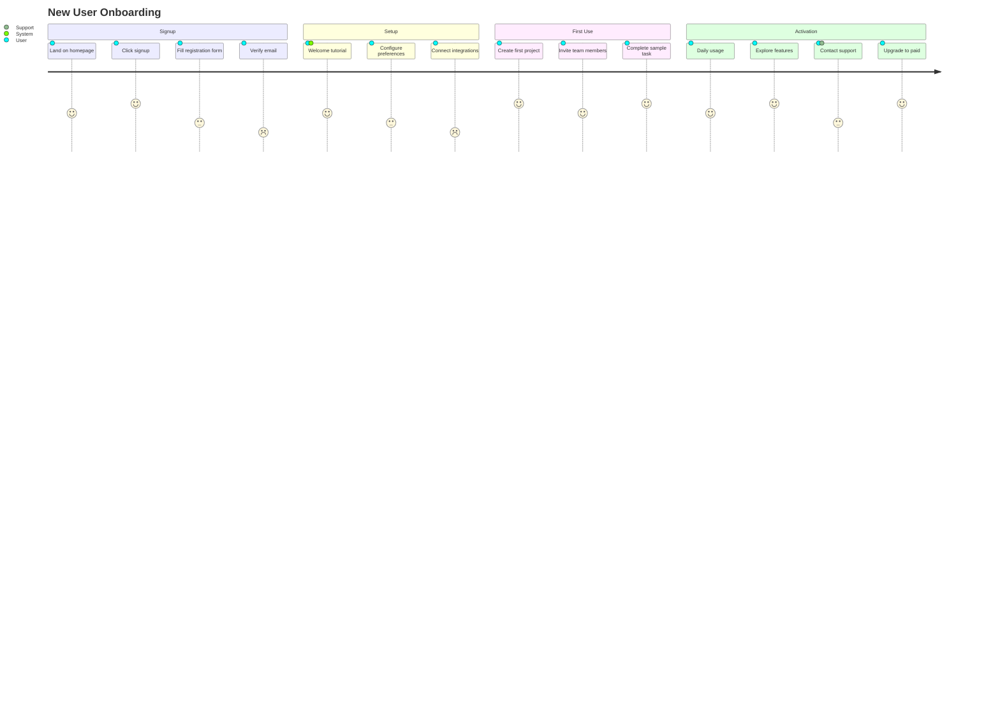

### Customer Support Journey
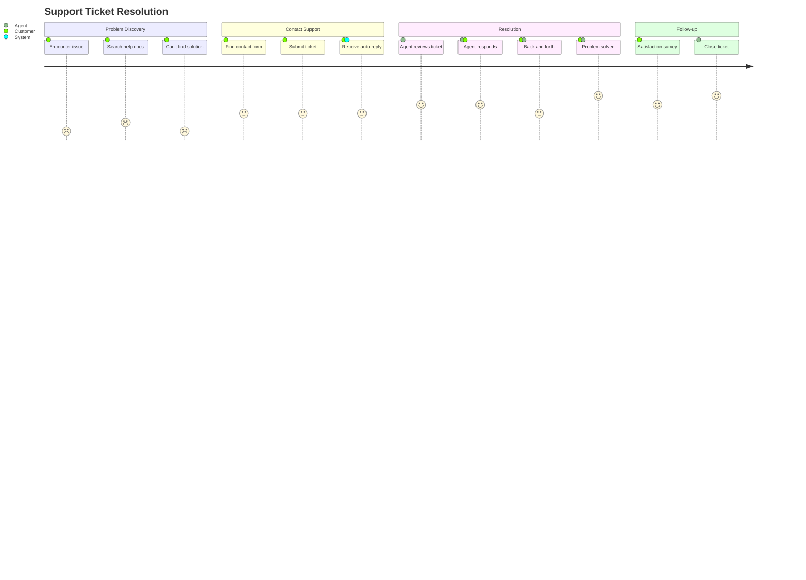

### Job Application Process
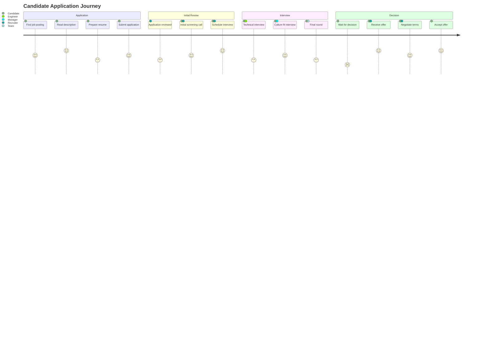

### Restaurant Dining Experience
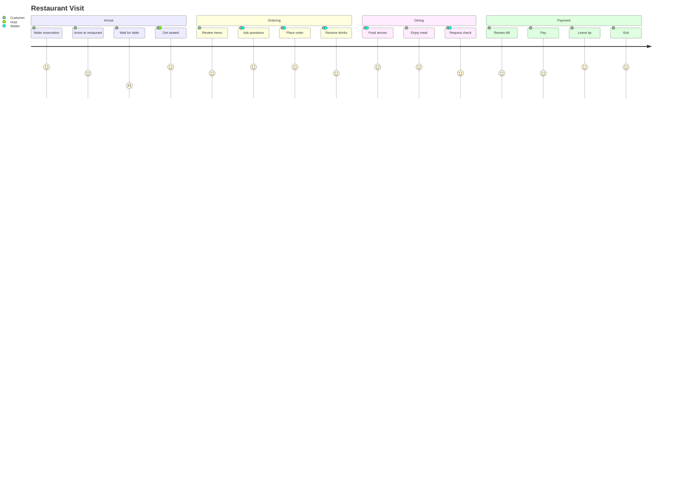

### Mobile App User Flow
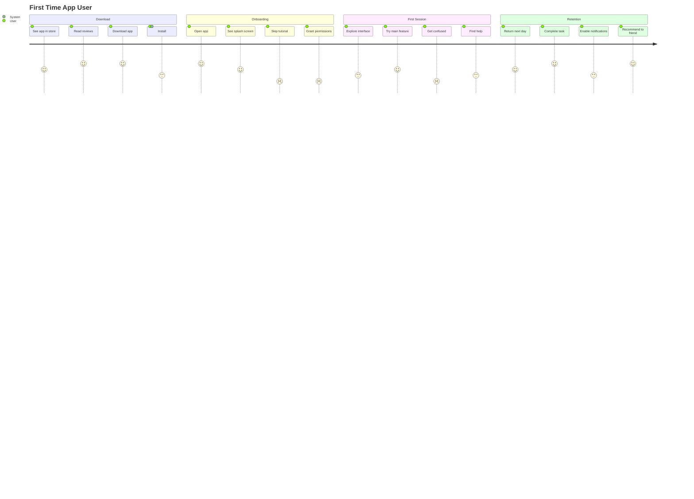

### Banking Customer Journey
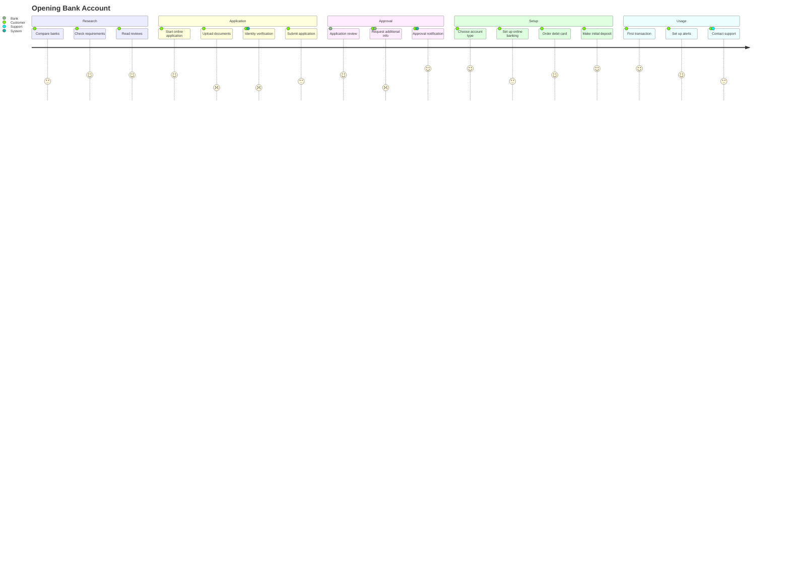

### Healthcare Appointment
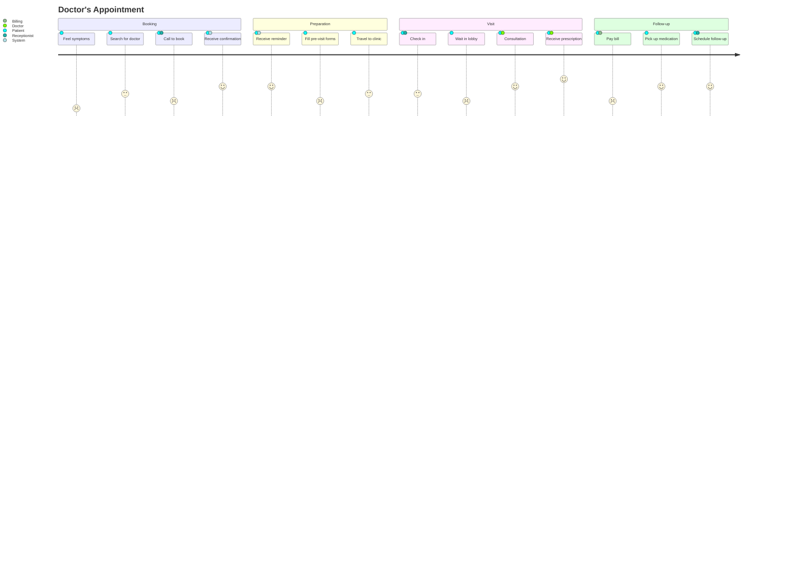

### Event Registration
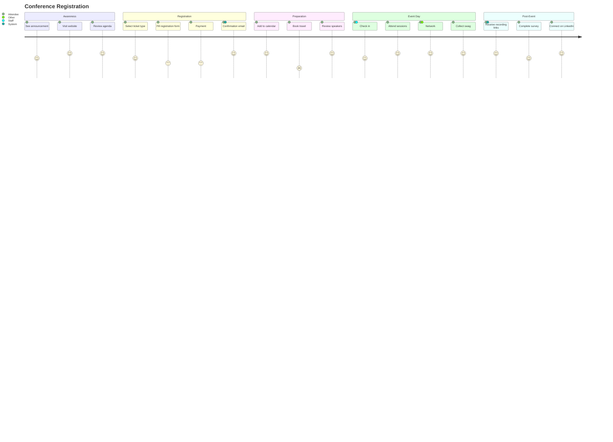

## Multiple Actors

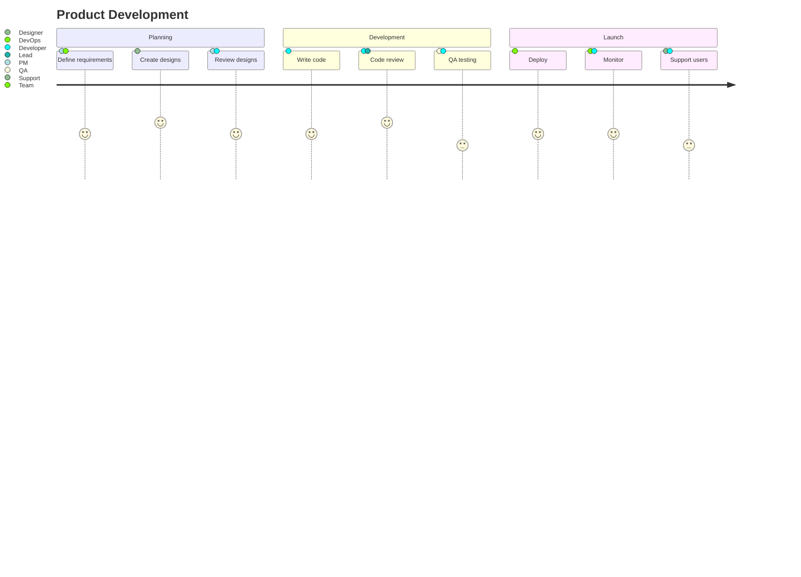

## Tips

- Scores range from 1 (worst) to 5 (best)
- Include multiple actors when relevant
- Break journey into logical sections
- Focus on key touchpoints
- Identify pain points (low scores)
- Highlight moments of delight (high scores)
- Use realistic scenarios
- Consider the entire end-to-end experience
