# Kanban Diagrams

Kanban boards visualize workflow and task status.

**Note:** Kanban diagram support in Mermaid is new and experimental.

## Basic Syntax

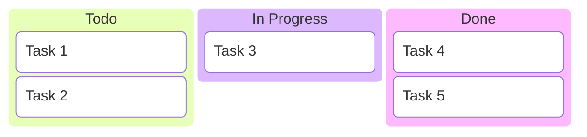

## Common Patterns

### Software Development Board
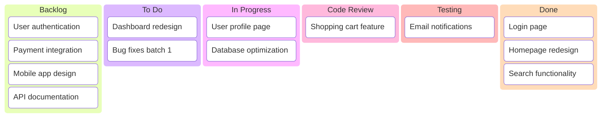

### Content Production
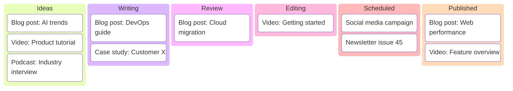

### Marketing Campaign
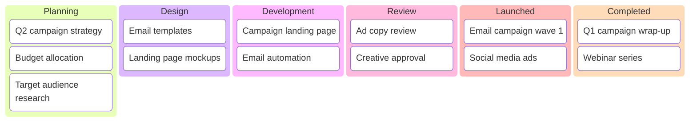

### Support Ticket Board
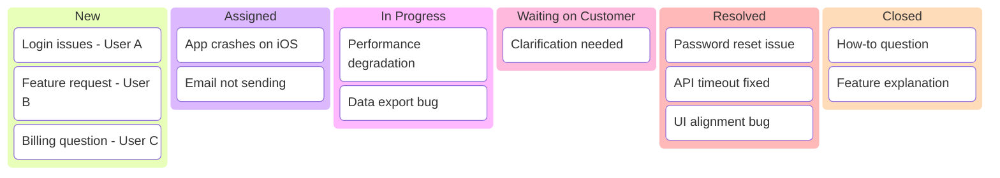

### Product Roadmap
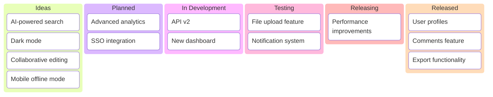

### Sprint Board
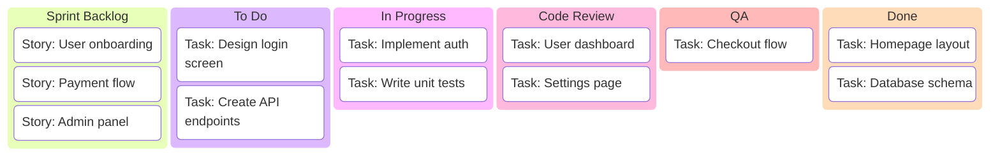

### Sales Pipeline
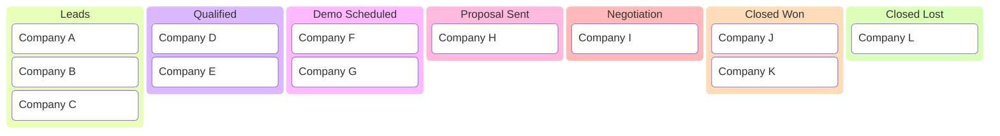

### Bug Tracking
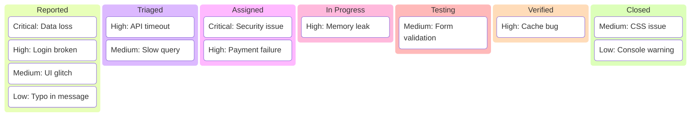

### Event Planning
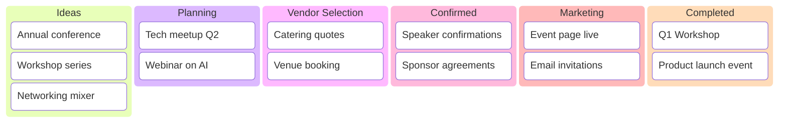

### HR Recruitment
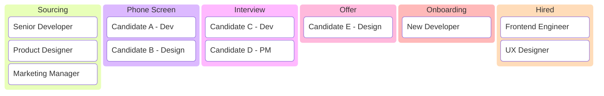

## Tips

- Columns represent workflow stages
- Cards represent work items/tasks
- Move cards left to right as work progresses
- Keep columns focused on clear stages
- Limit work in progress (WIP limits)
- Use for visual workflow management
- Update regularly to reflect current status
- Common columns: To Do, In Progress, Done
- Customize columns for your workflow
- Include all relevant stages
