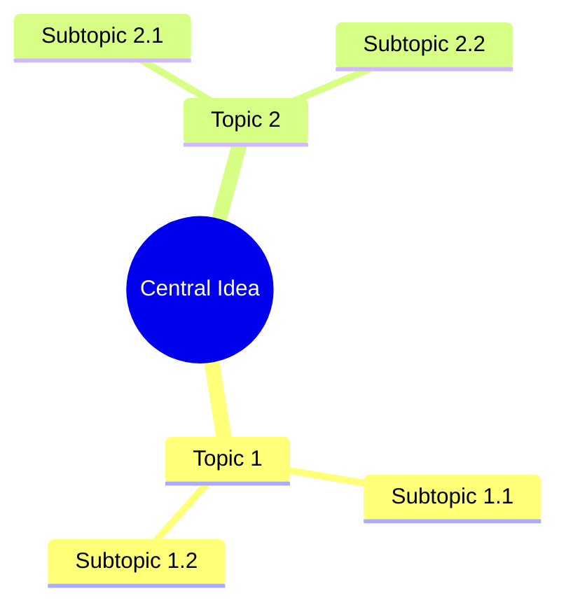
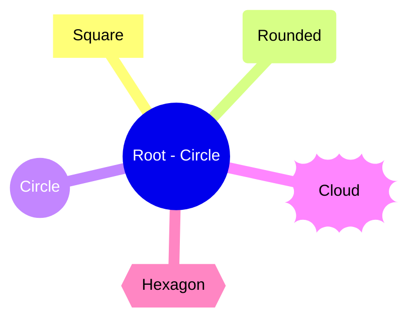
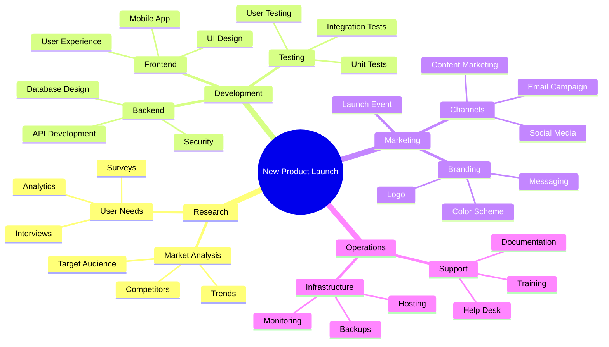
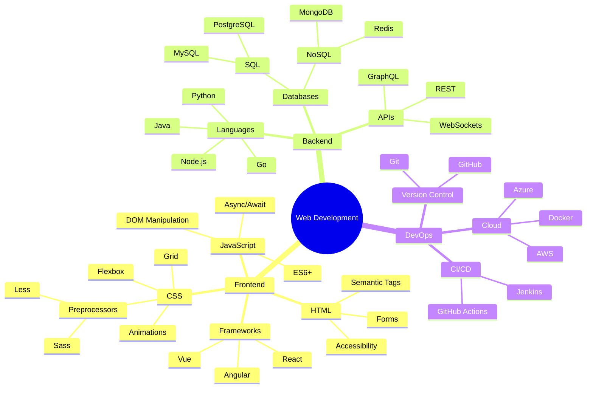
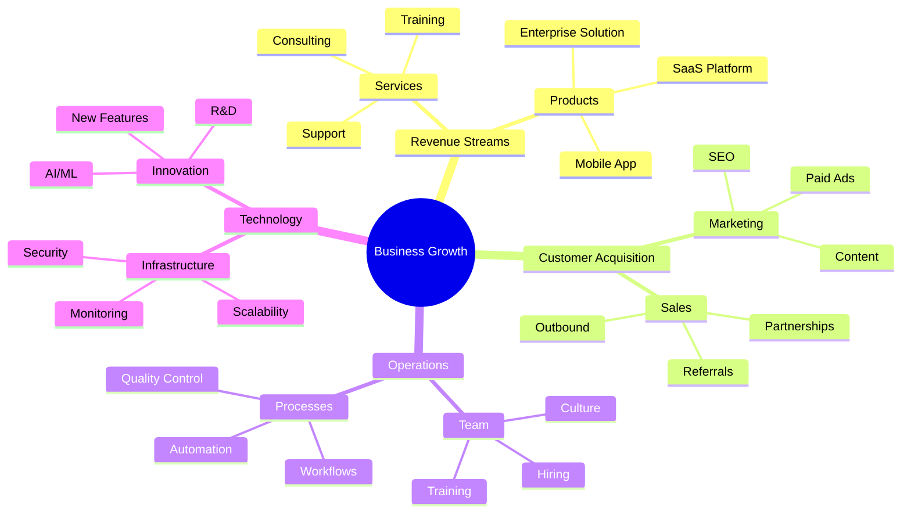
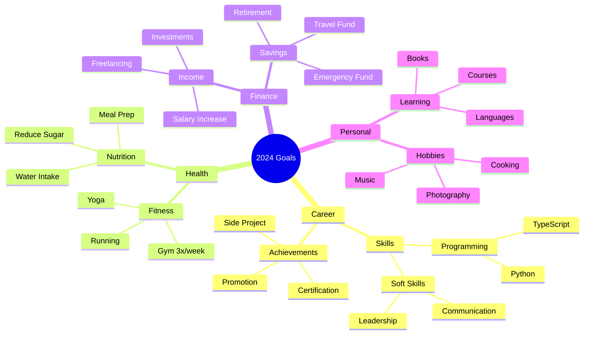
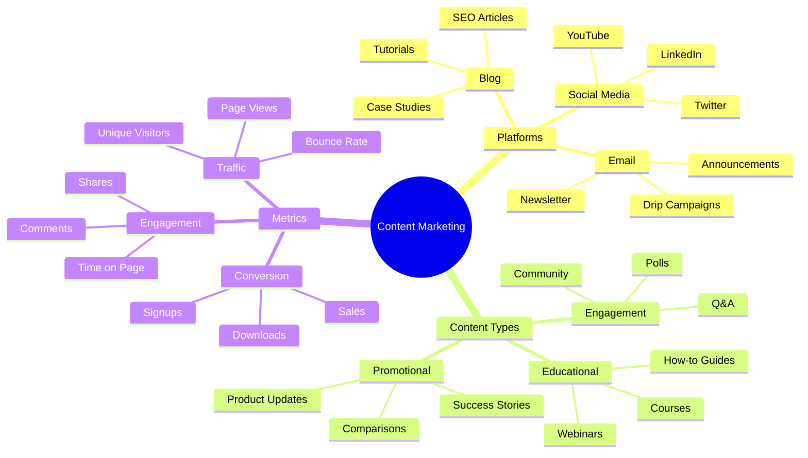
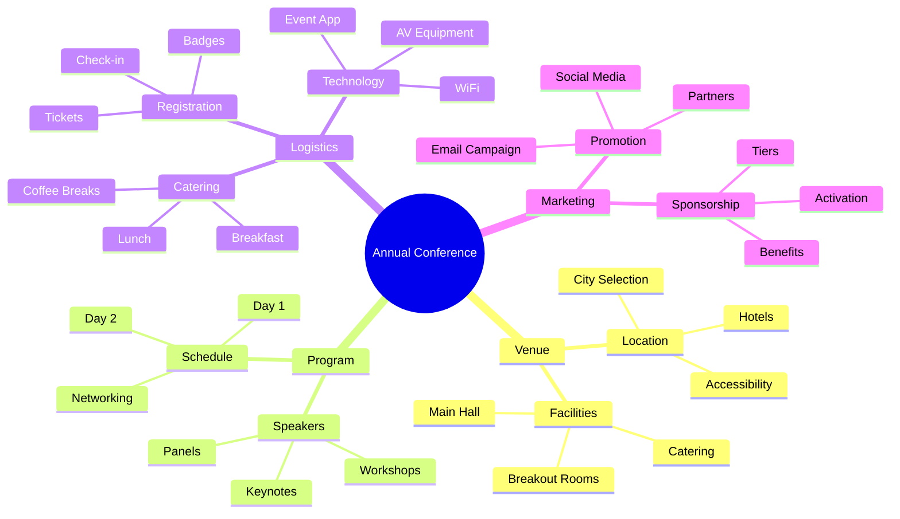
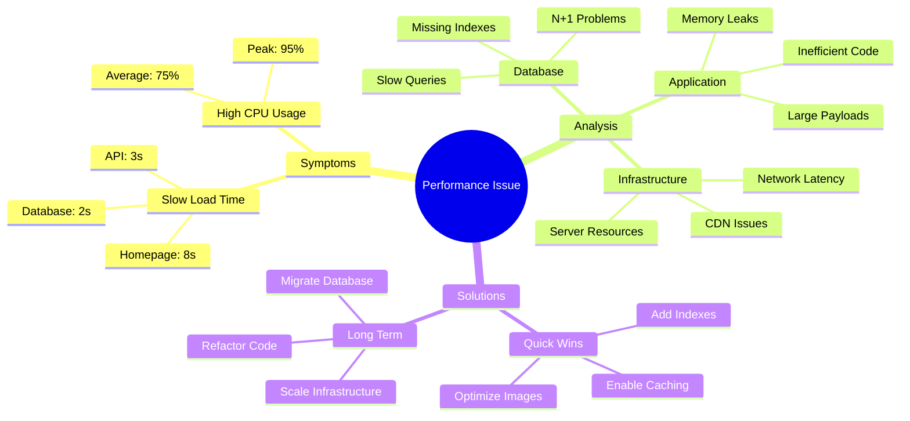

# Mindmaps

Mindmaps organize ideas hierarchically around a central concept.

## Basic Syntax

## Node Shapes

## Common Patterns

### Project Planning

### Learning Path

### Business Strategy

### Personal Goals

### Software Architecture

```mermaid
mindmap
  root((E-Commerce Platform))
    Frontend
      Web App
        React
        Redux
        TypeScript
      Mobile
        React Native
        iOS
        Android
    Backend
      API Gateway
        Authentication
        Rate Limiting
        Routing
      Microservices
        User Service
        Product Service
        Order Service
        Payment Service
      Databases
        PostgreSQL
        MongoDB
        Redis Cache
    Infrastructure
      Cloud Provider
        AWS
        Load Balancers
        Auto Scaling
      Monitoring
        Logs
        Metrics
        Alerts
      Security
        SSL/TLS
        Firewall
        Encryption
```

### Content Strategy

### Event Planning

### Problem Solving

## Tips

- Use indentation to show hierarchy (2 or 4 spaces)
- Central node uses `root((text))` syntax
- Keep node text concise
- Use shapes to categorize types of information
- Limit depth to 3-4 levels for readability
- Organize clockwise or by importance
- Group related concepts together
- Use mindmaps for brainstorming and planning
