# Pie Charts

Pie charts visualize proportional data and percentages.

## Basic Syntax

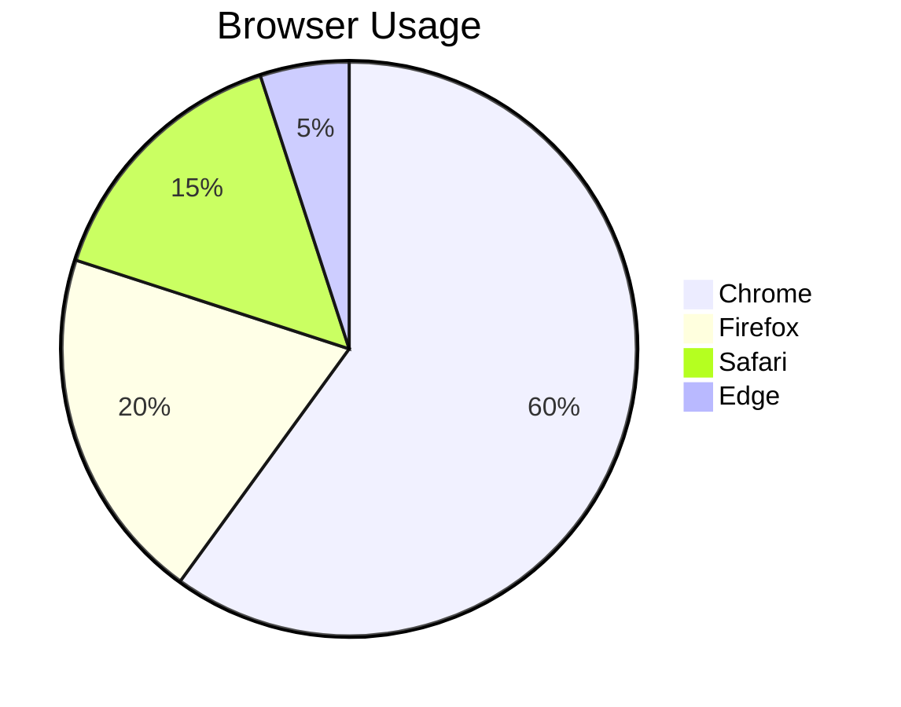

## Simple Data

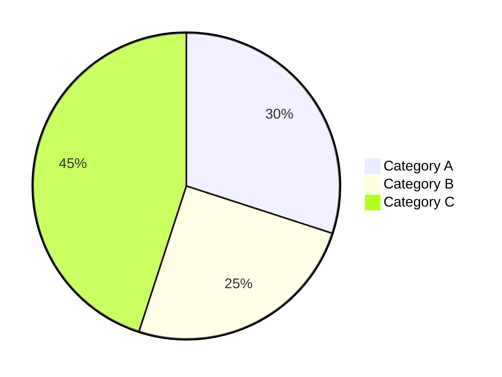

## Common Patterns

### Budget Distribution
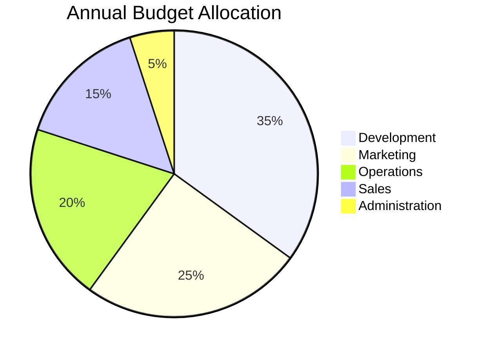

### Market Share
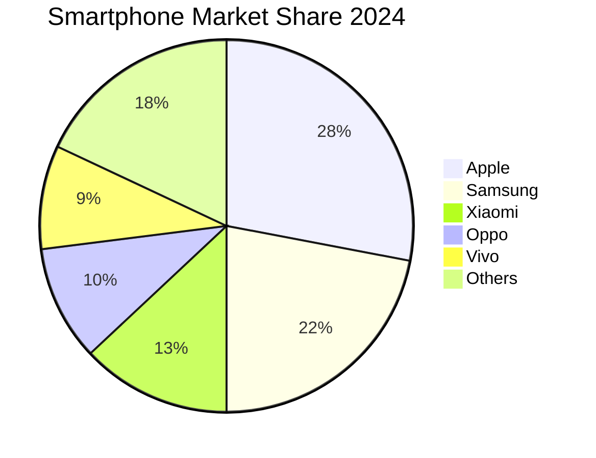

### Time Allocation
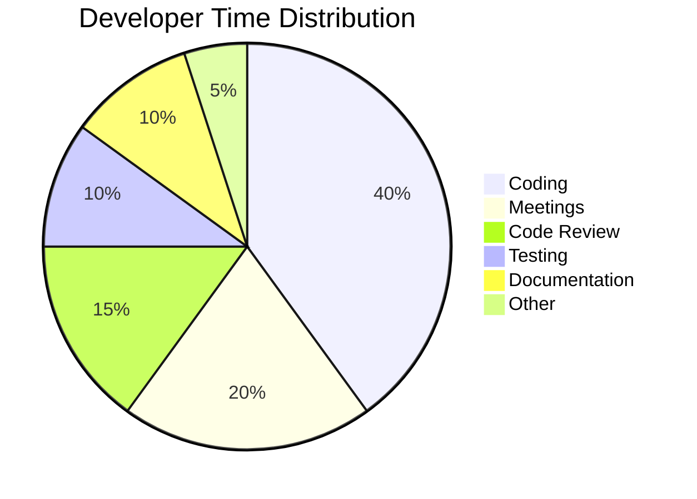

### Survey Results
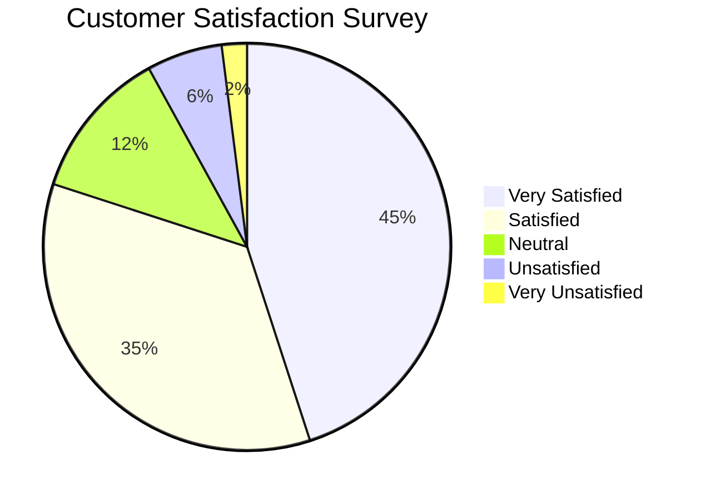

### Technology Stack Usage
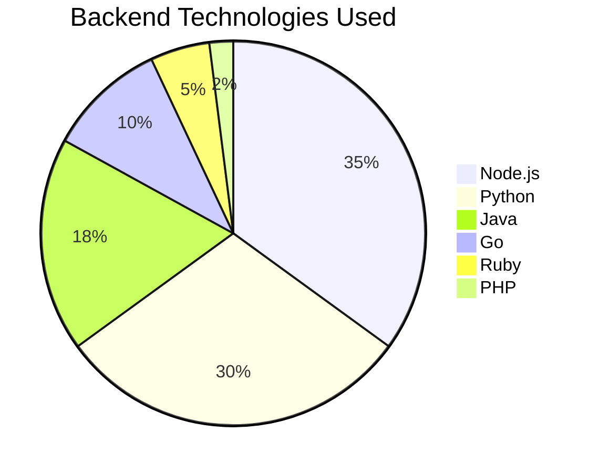

### Traffic Sources
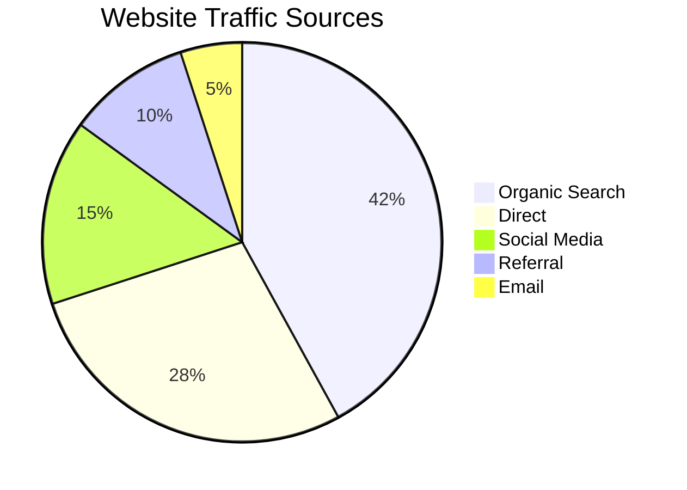

### Product Sales
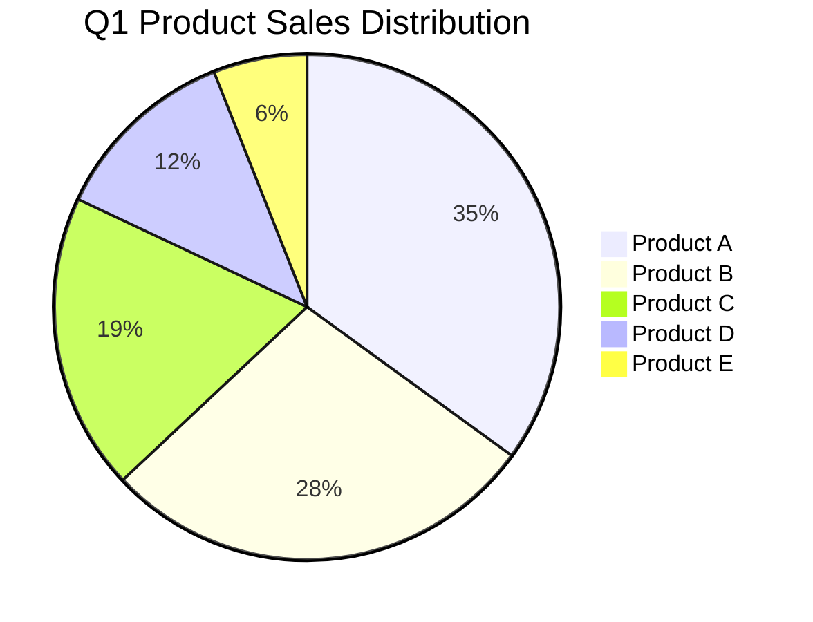

### Employee Distribution
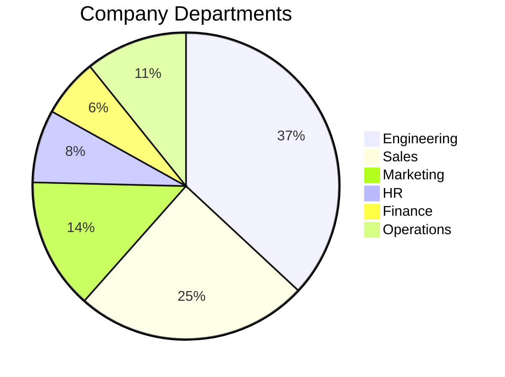

### Cloud Provider Usage
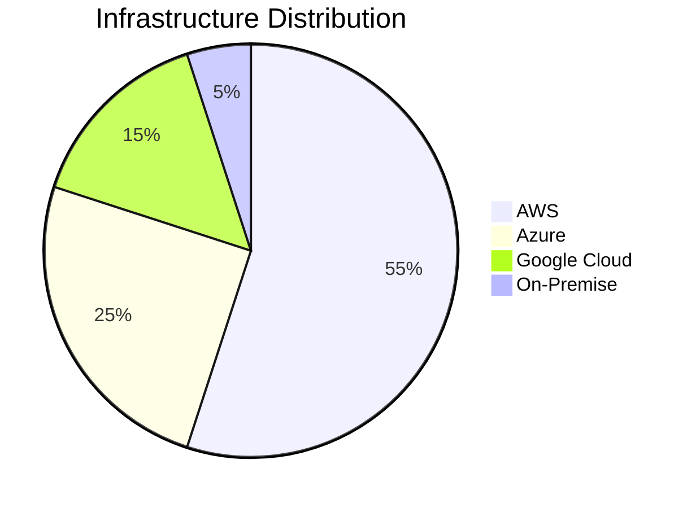

### Issue Types
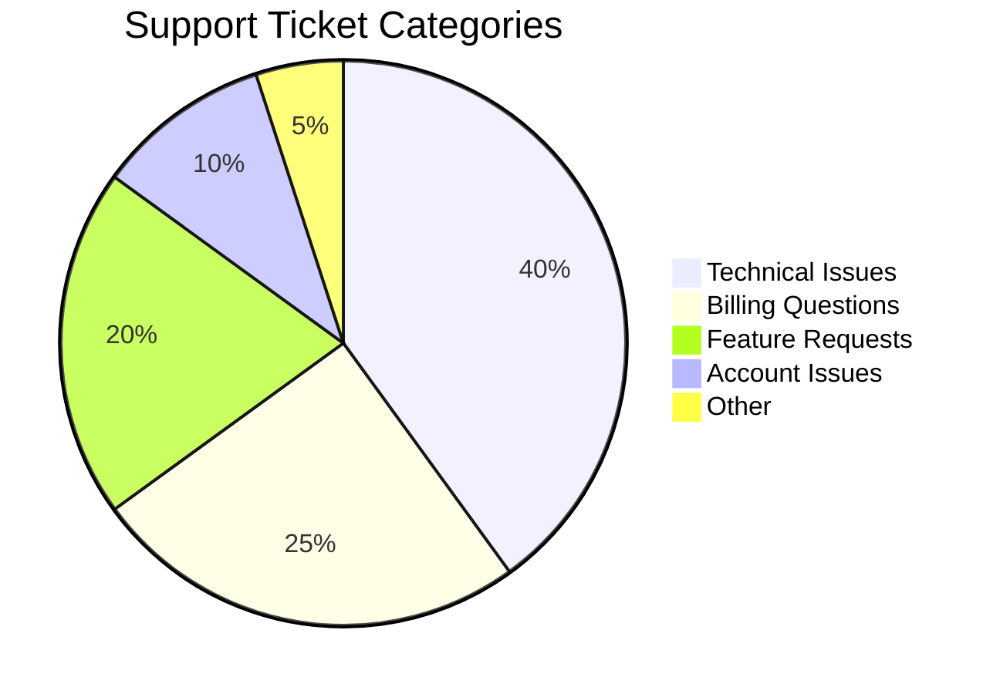

## Tips

- Values are relative (will be converted to percentages)
- Use quotes around labels with spaces
- Keep number of slices reasonable (5-8 max for readability)
- Order slices by size (largest to smallest) for clarity
- Group small categories into "Others" if needed
- Use meaningful, concise labels
- Values can be any positive number
- Percentages are calculated automatically
