# Quadrant Charts

Quadrant charts visualize items across two dimensions, often for prioritization matrices.

## Basic Syntax

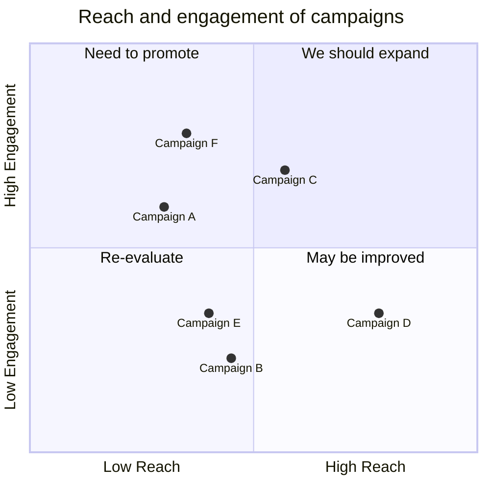
```mermaid
quadrantChart
    title Reach and engagement of campaigns
    x-axis Low Reach --> High Reach
    y-axis Low Engagement --> High Engagement
    quadrant-1 We should expand
    quadrant-2 Need to promote
    quadrant-3 Re-evaluate
    quadrant-4 May be improved
    Campaign A: [0.3, 0.6]
    Campaign B: [0.45, 0.23]
    Campaign C: [0.57, 0.69]
    Campaign D: [0.78, 0.34]
    Campaign E: [0.40, 0.34]
    Campaign F: [0.35, 0.78]
```

## Common Patterns

### Eisenhower Matrix (Task Prioritization)
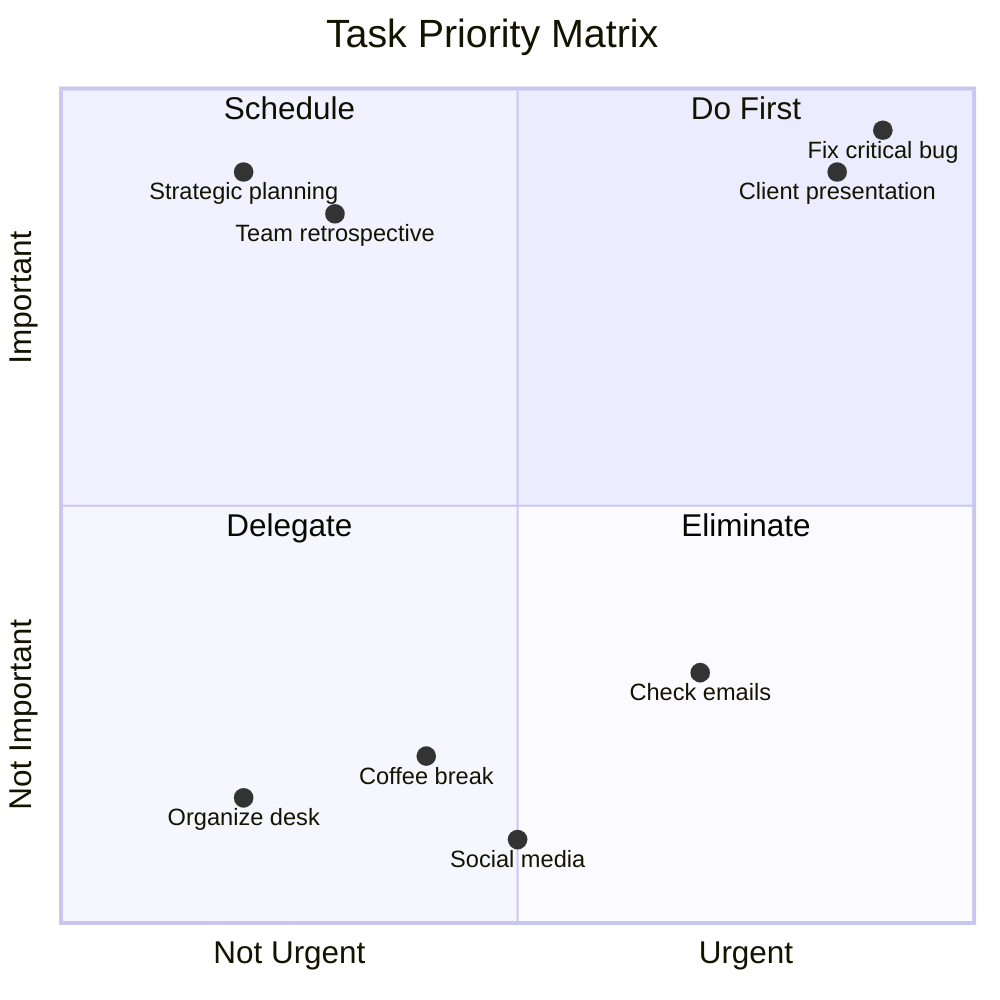
```mermaid
quadrantChart
    title Task Priority Matrix
    x-axis Not Urgent --> Urgent
    y-axis Not Important --> Important
    quadrant-1 Do First
    quadrant-2 Schedule
    quadrant-3 Delegate
    quadrant-4 Eliminate
    Fix critical bug: [0.9, 0.95]
    Client presentation: [0.85, 0.90]
    Strategic planning: [0.2, 0.9]
    Team retrospective: [0.3, 0.85]
    Check emails: [0.7, 0.3]
    Social media: [0.5, 0.1]
    Organize desk: [0.2, 0.15]
    Coffee break: [0.4, 0.2]
```

### Product Feature Prioritization
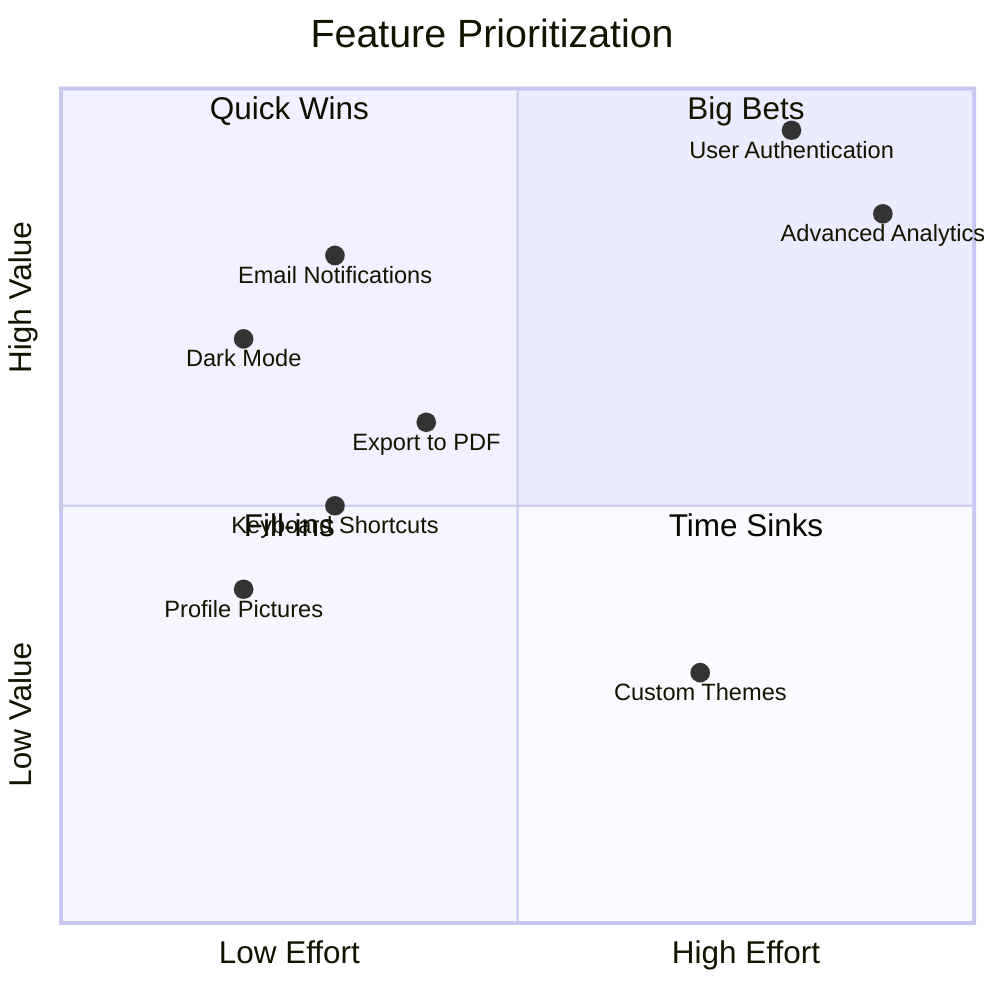
```mermaid
quadrantChart
    title Feature Prioritization
    x-axis Low Effort --> High Effort
    y-axis Low Value --> High Value
    quadrant-1 Big Bets
    quadrant-2 Quick Wins
    quadrant-3 Fill-ins
    quadrant-4 Time Sinks
    User Authentication: [0.8, 0.95]
    Dark Mode: [0.2, 0.7]
    Advanced Analytics: [0.9, 0.85]
    Email Notifications: [0.3, 0.8]
    Custom Themes: [0.7, 0.3]
    Profile Pictures: [0.2, 0.4]
    Export to PDF: [0.4, 0.6]
    Keyboard Shortcuts: [0.3, 0.5]
```

### Risk Assessment Matrix
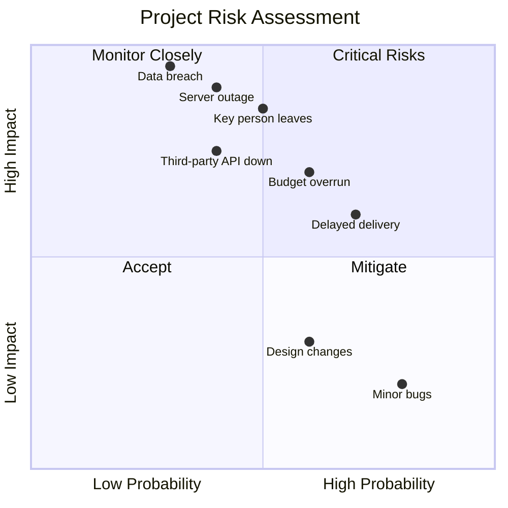
```mermaid
quadrantChart
    title Project Risk Assessment
    x-axis Low Probability --> High Probability
    y-axis Low Impact --> High Impact
    quadrant-1 Critical Risks
    quadrant-2 Monitor Closely
    quadrant-3 Accept
    quadrant-4 Mitigate
    Data breach: [0.3, 0.95]
    Server outage: [0.4, 0.9]
    Key person leaves: [0.5, 0.85]
    Budget overrun: [0.6, 0.7]
    Minor bugs: [0.8, 0.2]
    Delayed delivery: [0.7, 0.6]
    Third-party API down: [0.4, 0.75]
    Design changes: [0.6, 0.3]
```

### Market Analysis
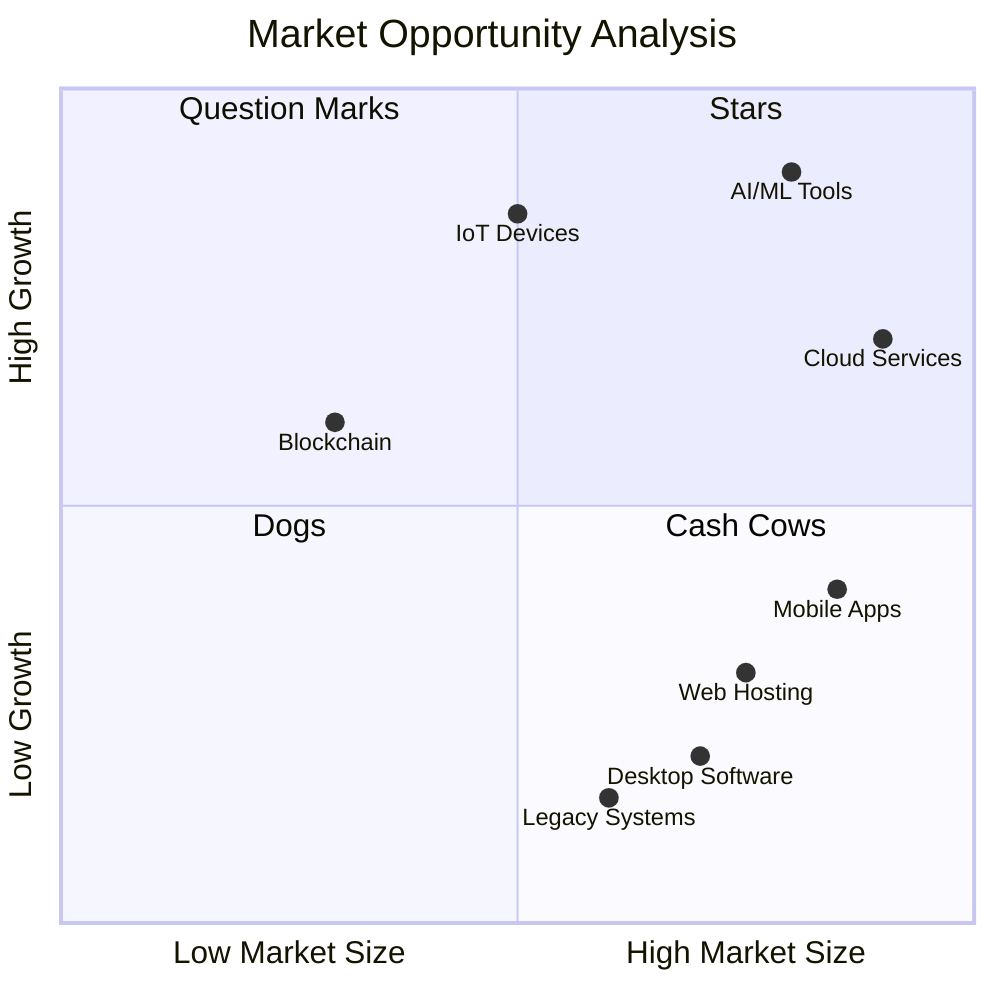
```mermaid
quadrantChart
    title Market Opportunity Analysis
    x-axis Low Market Size --> High Market Size
    y-axis Low Growth --> High Growth
    quadrant-1 Stars
    quadrant-2 Question Marks
    quadrant-3 Dogs
    quadrant-4 Cash Cows
    AI/ML Tools: [0.8, 0.9]
    Cloud Services: [0.9, 0.7]
    Mobile Apps: [0.85, 0.4]
    Desktop Software: [0.7, 0.2]
    IoT Devices: [0.5, 0.85]
    Blockchain: [0.3, 0.6]
    Legacy Systems: [0.6, 0.15]
    Web Hosting: [0.75, 0.3]
```

### Customer Segmentation
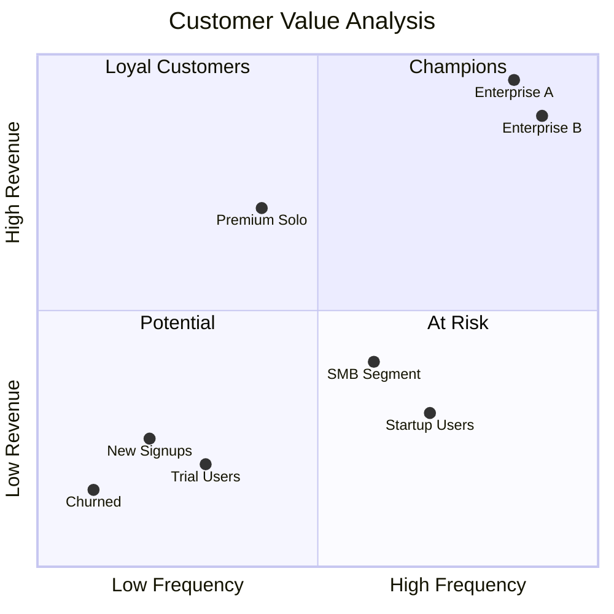
```mermaid
quadrantChart
    title Customer Value Analysis
    x-axis Low Frequency --> High Frequency
    y-axis Low Revenue --> High Revenue
    quadrant-1 Champions
    quadrant-2 Loyal Customers
    quadrant-3 Potential
    quadrant-4 At Risk
    Enterprise A: [0.85, 0.95]
    Enterprise B: [0.9, 0.88]
    SMB Segment: [0.6, 0.4]
    Startup Users: [0.7, 0.3]
    Trial Users: [0.3, 0.2]
    Premium Solo: [0.4, 0.7]
    Churned: [0.1, 0.15]
    New Signups: [0.2, 0.25]
```

### Technology Adoption
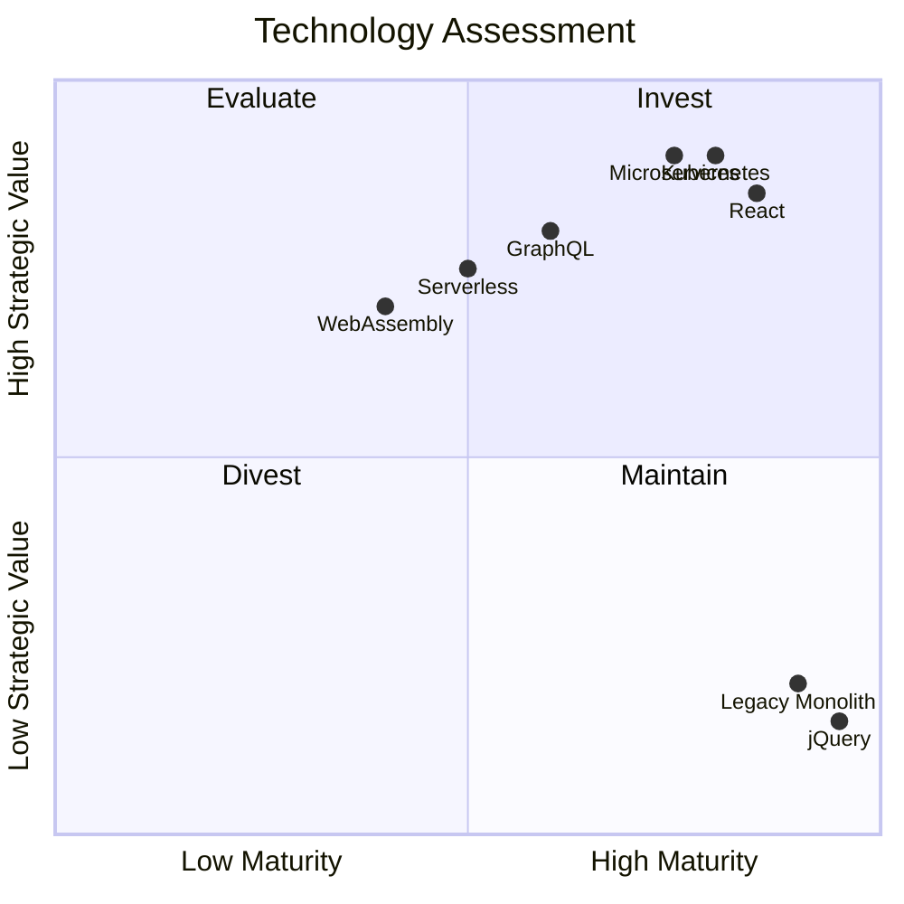
```mermaid
quadrantChart
    title Technology Assessment
    x-axis Low Maturity --> High Maturity
    y-axis Low Strategic Value --> High Strategic Value
    quadrant-1 Invest
    quadrant-2 Evaluate
    quadrant-3 Divest
    quadrant-4 Maintain
    Kubernetes: [0.8, 0.9]
    React: [0.85, 0.85]
    GraphQL: [0.6, 0.8]
    Microservices: [0.75, 0.9]
    Legacy Monolith: [0.9, 0.2]
    jQuery: [0.95, 0.15]
    Serverless: [0.5, 0.75]
    WebAssembly: [0.4, 0.7]
```

### Skill Development
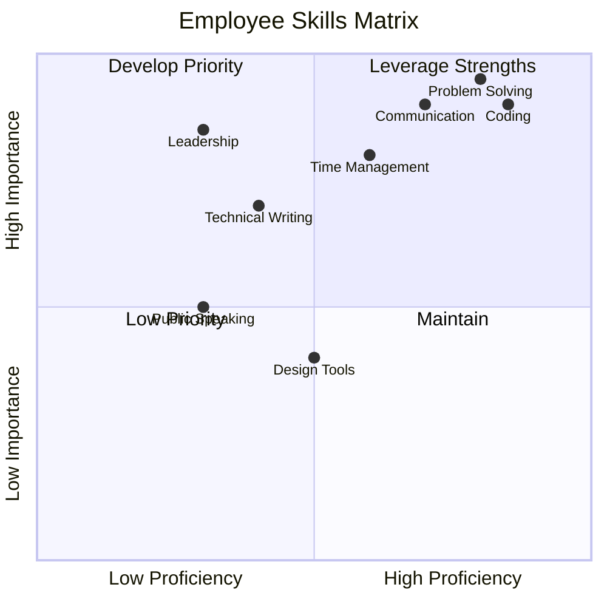
```mermaid
quadrantChart
    title Employee Skills Matrix
    x-axis Low Proficiency --> High Proficiency
    y-axis Low Importance --> High Importance
    quadrant-1 Leverage Strengths
    quadrant-2 Develop Priority
    quadrant-3 Low Priority
    quadrant-4 Maintain
    Problem Solving: [0.8, 0.95]
    Communication: [0.7, 0.9]
    Leadership: [0.3, 0.85]
    Technical Writing: [0.4, 0.7]
    Public Speaking: [0.3, 0.5]
    Time Management: [0.6, 0.8]
    Coding: [0.85, 0.9]
    Design Tools: [0.5, 0.4]
```

### Content Performance
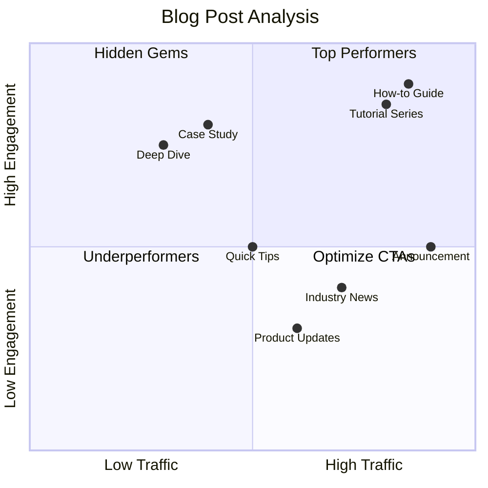
```mermaid
quadrantChart
    title Blog Post Analysis
    x-axis Low Traffic --> High Traffic
    y-axis Low Engagement --> High Engagement
    quadrant-1 Top Performers
    quadrant-2 Hidden Gems
    quadrant-3 Underperformers
    quadrant-4 Optimize CTAs
    How-to Guide: [0.85, 0.9]
    Tutorial Series: [0.8, 0.85]
    Industry News: [0.7, 0.4]
    Product Updates: [0.6, 0.3]
    Case Study: [0.4, 0.8]
    Deep Dive: [0.3, 0.75]
    Quick Tips: [0.5, 0.5]
    Announcement: [0.9, 0.5]
```

### Investment Portfolio
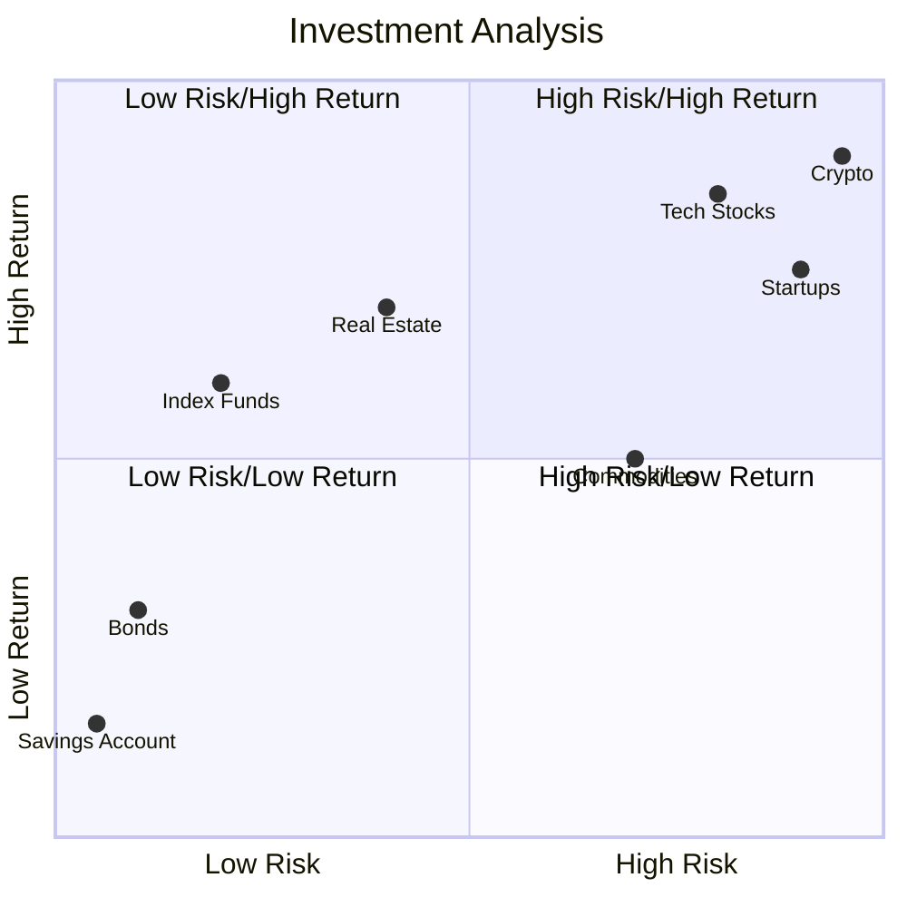
```mermaid
quadrantChart
    title Investment Analysis
    x-axis Low Risk --> High Risk
    y-axis Low Return --> High Return
    quadrant-1 High Risk/High Return
    quadrant-2 Low Risk/High Return
    quadrant-3 Low Risk/Low Return
    quadrant-4 High Risk/Low Return
    Tech Stocks: [0.8, 0.85]
    Crypto: [0.95, 0.9]
    Index Funds: [0.2, 0.6]
    Bonds: [0.1, 0.3]
    Real Estate: [0.4, 0.7]
    Savings Account: [0.05, 0.15]
    Commodities: [0.7, 0.5]
    Startups: [0.9, 0.75]
```

### Product Portfolio
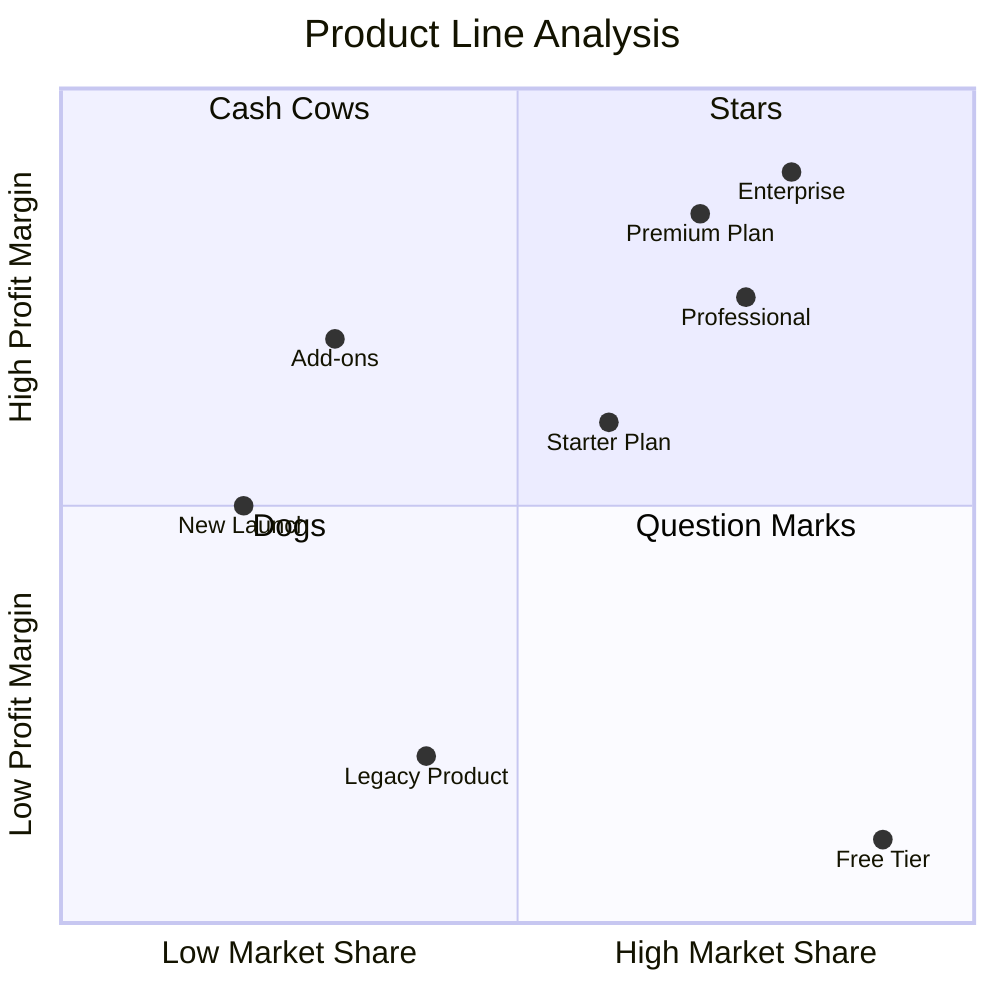
```mermaid
quadrantChart
    title Product Line Analysis
    x-axis Low Market Share --> High Market Share
    y-axis Low Profit Margin --> High Profit Margin
    quadrant-1 Stars
    quadrant-2 Cash Cows
    quadrant-3 Dogs
    quadrant-4 Question Marks
    Premium Plan: [0.7, 0.85]
    Enterprise: [0.8, 0.9]
    Free Tier: [0.9, 0.1]
    Starter Plan: [0.6, 0.6]
    Add-ons: [0.3, 0.7]
    Legacy Product: [0.4, 0.2]
    New Launch: [0.2, 0.5]
    Professional: [0.75, 0.75]
```

## Coordinate System

- Values range from 0.0 to 1.0
- Format: `[x-value, y-value]`
- x-axis: 0 = left, 1 = right
- y-axis: 0 = bottom, 1 = top

## Quadrant Numbering

- **Quadrant 1**: Top-right (high x, high y)
- **Quadrant 2**: Top-left (low x, high y)
- **Quadrant 3**: Bottom-left (low x, low y)
- **Quadrant 4**: Bottom-right (high x, low y)

## Tips

- Choose meaningful axis labels
- Name quadrants descriptively
- Place items using coordinates [x, y] from 0 to 1
- Limit number of items for readability (8-15 ideal)
- Use for 2x2 prioritization matrices
- Common frameworks: Eisenhower Matrix, BCG Matrix, Risk Matrix
- Ensure even distribution across quadrants when possible
- Update regularly as conditions change
