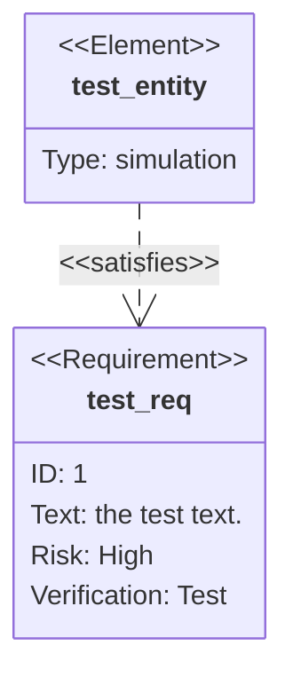

# Requirement Diagrams

Requirement diagrams model system requirements and their relationships.

## Basic Syntax



## Requirement Types

- `requirement` - Functional requirement
- `functionalRequirement` - Functional requirement (explicit)
- `interfaceRequirement` - Interface requirement
- `performanceRequirement` - Performance requirement
- `physicalRequirement` - Physical requirement
- `designConstraint` - Design constraint

## Requirement Attributes

- `id` - Unique identifier
- `text` - Description
- `risk` - Risk level (low, medium, high)
- `verifymethod` - Verification method (analysis, inspection, test, demonstration)

## Element Types

- `simulation` - Simulation element
- `test` - Test element
- `analysis` - Analysis element
- `demonstration` - Demonstration element
- `inspection` - Inspection element

## Relationships

- `satisfies` - Element satisfies requirement
- `verifies` - Element verifies requirement
- `traces` - Requirement traces to another
- `refines` - Requirement refines another
- `contains` - Contains relationship
- `derives` - Derives from relationship

## Common Patterns

### Authentication System Requirements
```mermaid
requirementDiagram

    requirement user_auth {
        id: REQ-001
        text: System shall authenticate users
        risk: high
        verifymethod: test
    }

    requirement password_policy {
        id: REQ-002
        text: Passwords must be at least 12 characters
        risk: medium
        verifymethod: test
    }

    requirement mfa {
        id: REQ-003
        text: System shall support multi-factor authentication
        risk: high
        verifymethod: test
    }

    requirement session_timeout {
        id: REQ-004
        text: Sessions shall timeout after 30 minutes
        risk: medium
        verifymethod: test
    }

    element auth_module {
        type: simulation
    }

    element password_validator {
        type: test
    }

    element mfa_service {
        type: simulation
    }

    user_auth - contains -> password_policy
    user_auth - contains -> mfa
    user_auth - contains -> session_timeout
    auth_module - satisfies -> user_auth
    password_validator - verifies -> password_policy
    mfa_service - satisfies -> mfa
```

### E-Commerce Platform Requirements
```mermaid
requirementDiagram

    requirement product_catalog {
        id: REQ-100
        text: System shall display product catalog
        risk: high
        verifymethod: demonstration
    }

    requirement search_function {
        id: REQ-101
        text: Users shall search products by keyword
        risk: medium
        verifymethod: test
    }

    requirement shopping_cart {
        id: REQ-102
        text: Users shall add items to cart
        risk: high
        verifymethod: test
    }

    performanceRequirement page_load {
        id: REQ-103
        text: Pages shall load within 2 seconds
        risk: high
        verifymethod: test
    }

    element catalog_service {
        type: simulation
    }

    element search_engine {
        type: simulation
    }

    element cart_module {
        type: simulation
    }

    element performance_test {
        type: test
    }

    catalog_service - satisfies -> product_catalog
    search_engine - satisfies -> search_function
    cart_module - satisfies -> shopping_cart
    performance_test - verifies -> page_load
    product_catalog - contains -> search_function
```

### Mobile App Requirements
```mermaid
requirementDiagram

    requirement offline_mode {
        id: REQ-200
        text: App shall work offline
        risk: high
        verifymethod: test
    }

    requirement data_sync {
        id: REQ-201
        text: Data shall sync when online
        risk: high
        verifymethod: test
    }

    performanceRequirement battery_usage {
        id: REQ-202
        text: Battery drain shall be minimal
        risk: medium
        verifymethod: analysis
    }

    interfaceRequirement responsive_ui {
        id: REQ-203
        text: UI shall be responsive on all devices
        risk: medium
        verifymethod: inspection
    }

    element offline_storage {
        type: simulation
    }

    element sync_service {
        type: simulation
    }

    element ui_framework {
        type: demonstration
    }

    offline_storage - satisfies -> offline_mode
    sync_service - satisfies -> data_sync
    offline_mode - derives -> data_sync
    ui_framework - satisfies -> responsive_ui
```

### Security Requirements
```mermaid
requirementDiagram

    requirement data_encryption {
        id: SEC-001
        text: All data shall be encrypted at rest
        risk: high
        verifymethod: inspection
    }

    requirement secure_transmission {
        id: SEC-002
        text: All communications shall use TLS 1.3
        risk: high
        verifymethod: test
    }

    requirement access_control {
        id: SEC-003
        text: Role-based access control shall be enforced
        risk: high
        verifymethod: test
    }

    requirement audit_logging {
        id: SEC-004
        text: All security events shall be logged
        risk: medium
        verifymethod: inspection
    }

    designConstraint compliance {
        id: SEC-005
        text: System shall comply with GDPR
        risk: high
        verifymethod: analysis
    }

    element encryption_service {
        type: simulation
    }

    element tls_layer {
        type: test
    }

    element rbac_module {
        type: simulation
    }

    element audit_system {
        type: simulation
    }

    encryption_service - satisfies -> data_encryption
    tls_layer - satisfies -> secure_transmission
    rbac_module - satisfies -> access_control
    audit_system - satisfies -> audit_logging
    compliance - contains -> data_encryption
    compliance - contains -> access_control
```

### API Requirements
```mermaid
requirementDiagram

    interfaceRequirement rest_api {
        id: API-001
        text: System shall provide RESTful API
        risk: high
        verifymethod: test
    }

    performanceRequirement api_response {
        id: API-002
        text: API response time shall be under 200ms
        risk: high
        verifymethod: test
    }

    requirement api_versioning {
        id: API-003
        text: API shall support versioning
        risk: medium
        verifymethod: demonstration
    }

    requirement rate_limiting {
        id: API-004
        text: API shall implement rate limiting
        risk: medium
        verifymethod: test
    }

    requirement api_docs {
        id: API-005
        text: API shall have OpenAPI documentation
        risk: low
        verifymethod: inspection
    }

    element api_gateway {
        type: simulation
    }

    element load_test {
        type: test
    }

    element swagger_ui {
        type: demonstration
    }

    api_gateway - satisfies -> rest_api
    load_test - verifies -> api_response
    api_gateway - satisfies -> api_versioning
    api_gateway - satisfies -> rate_limiting
    swagger_ui - satisfies -> api_docs
```

### Data Management Requirements
```mermaid
requirementDiagram

    requirement data_backup {
        id: DATA-001
        text: System shall backup data daily
        risk: high
        verifymethod: test
    }

    requirement data_retention {
        id: DATA-002
        text: Data shall be retained for 7 years
        risk: medium
        verifymethod: analysis
    }

    requirement data_recovery {
        id: DATA-003
        text: System shall recover from backup within 4 hours
        risk: high
        verifymethod: test
    }

    performanceRequirement query_performance {
        id: DATA-004
        text: Database queries shall complete within 1 second
        risk: medium
        verifymethod: test
    }

    element backup_system {
        type: simulation
    }

    element recovery_procedure {
        type: test
    }

    element database_optimizer {
        type: analysis
    }

    backup_system - satisfies -> data_backup
    recovery_procedure - verifies -> data_recovery
    database_optimizer - verifies -> query_performance
    data_backup - derives -> data_recovery
```

## Tips

- Use clear, testable requirement statements
- Assign unique IDs to all requirements
- Set appropriate risk levels
- Choose correct verification methods
- Show traceability with relationships
- Group related requirements
- Use specific requirement types for clarity
- Include elements that satisfy/verify requirements
- Document constraints as designConstraint type
