# Sankey Diagrams

Sankey diagrams visualize flow and distribution of quantities between nodes.

## Basic Syntax

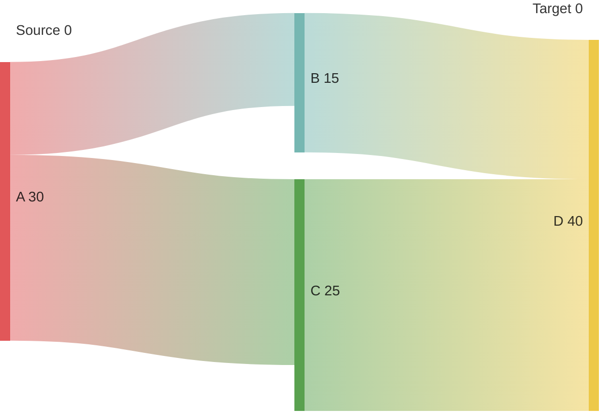

## Common Patterns

### Website Traffic Flow
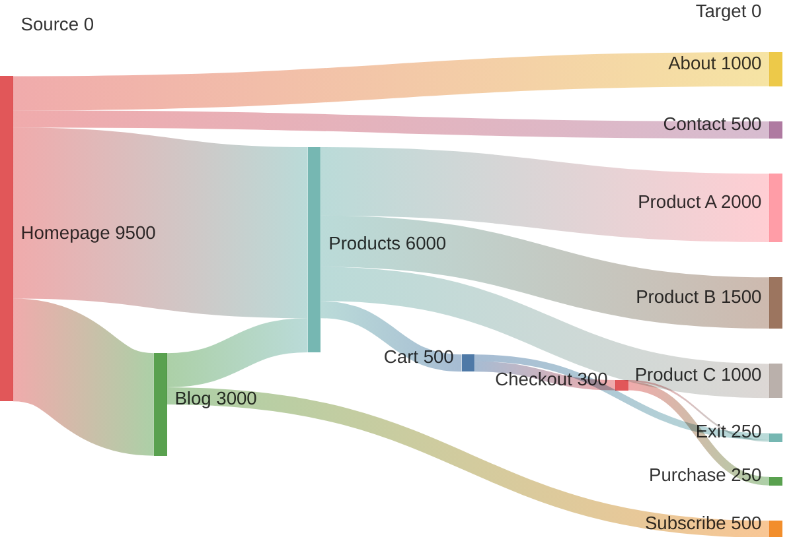

### Energy Distribution
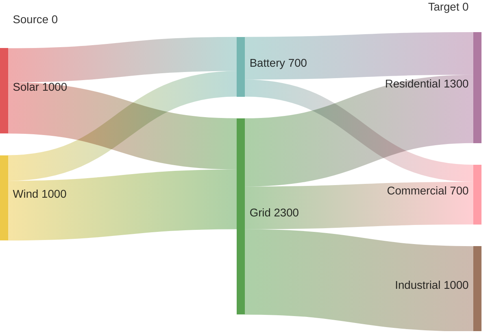

### Budget Allocation
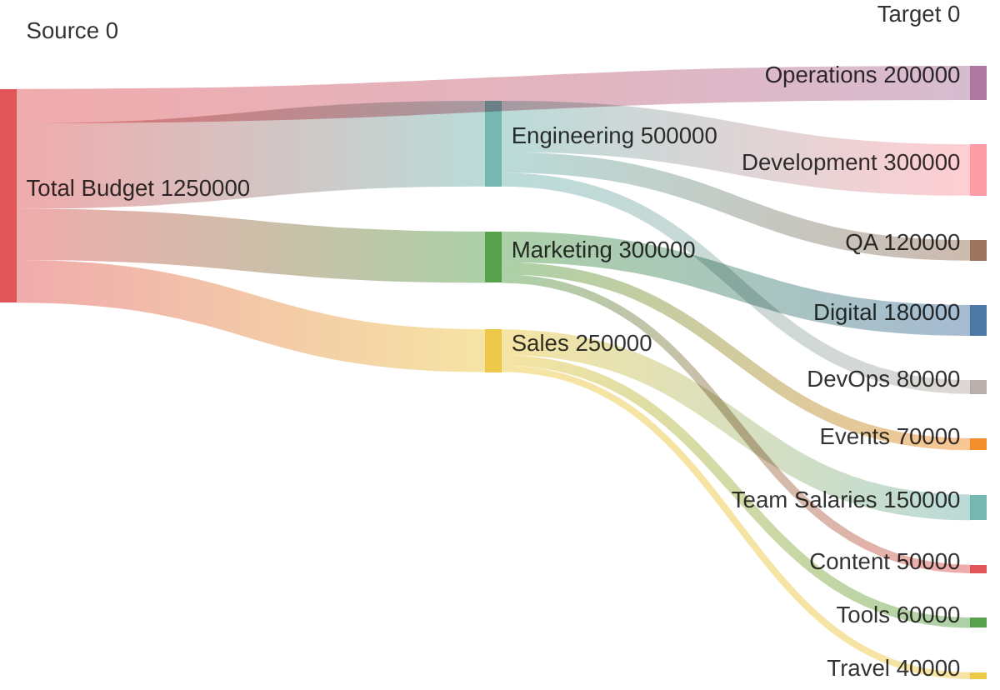

### Customer Journey Conversion
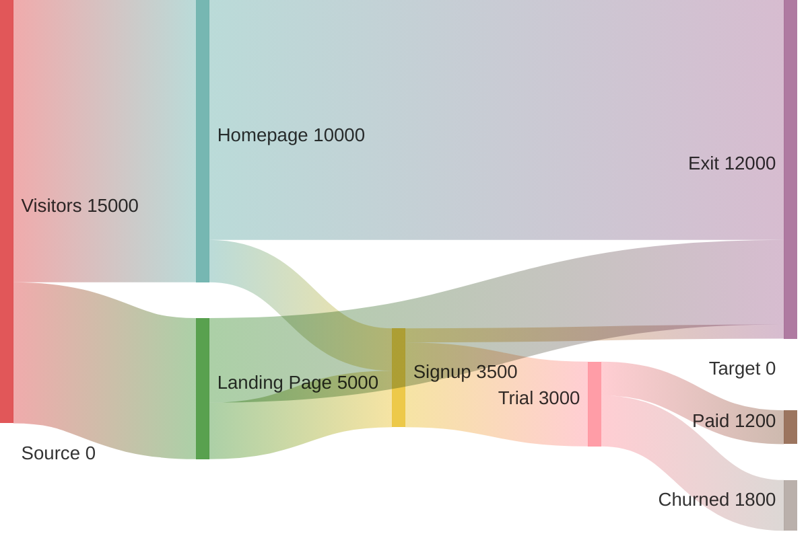

### Supply Chain Flow
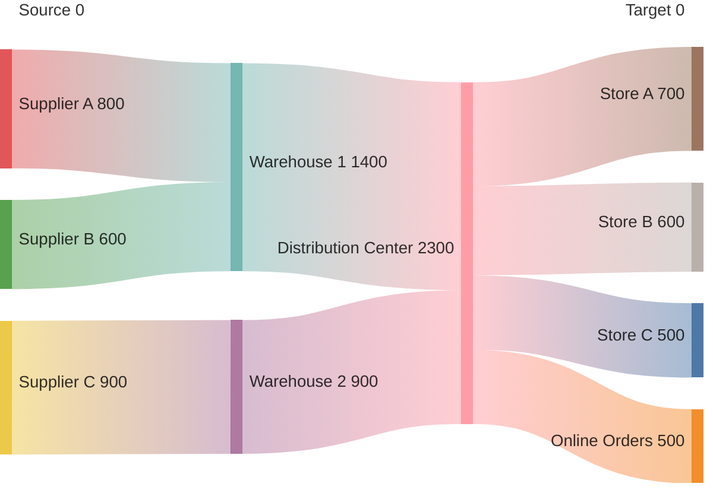

### Revenue Streams
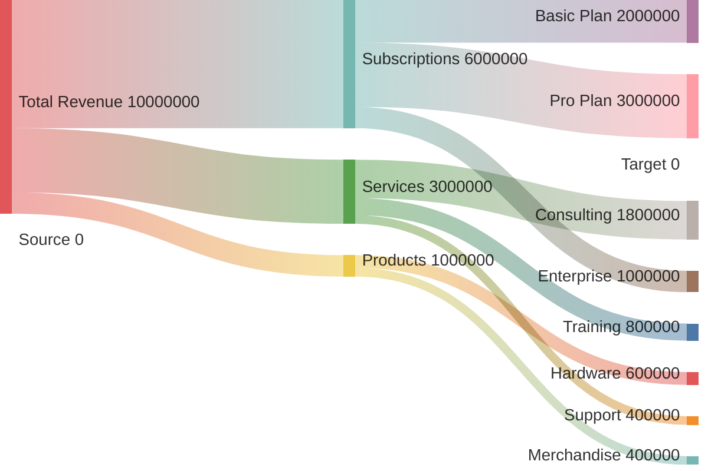

### Manufacturing Process
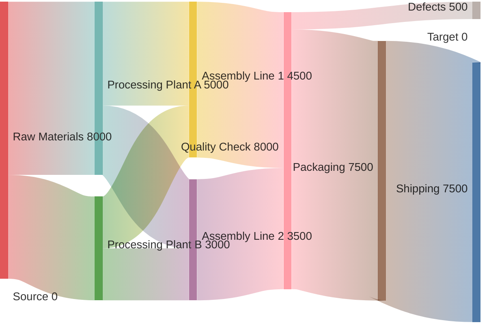

### User Acquisition Channels
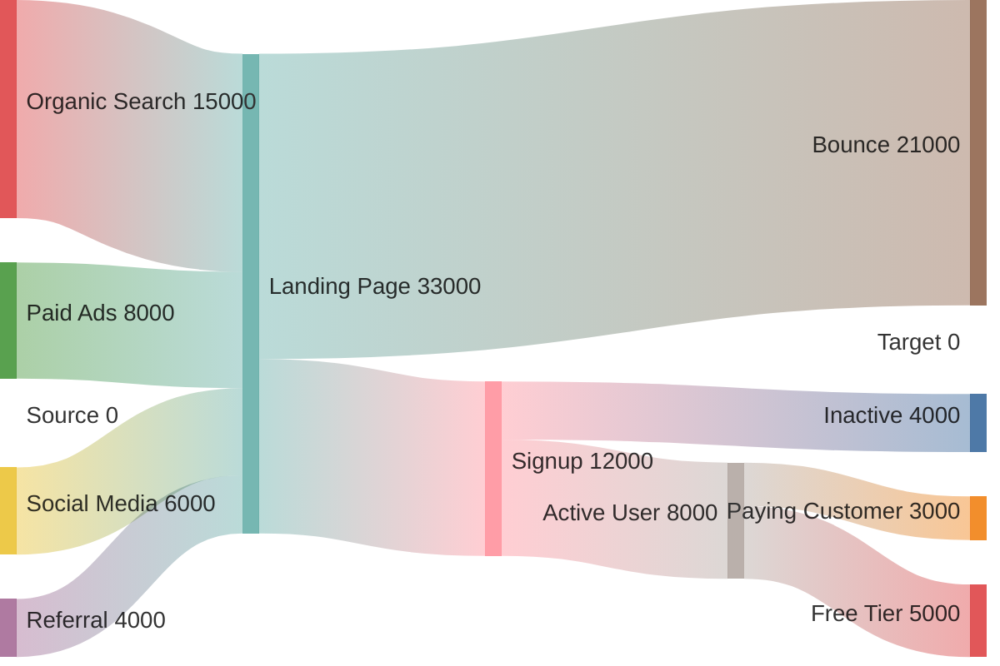

### Cost Breakdown
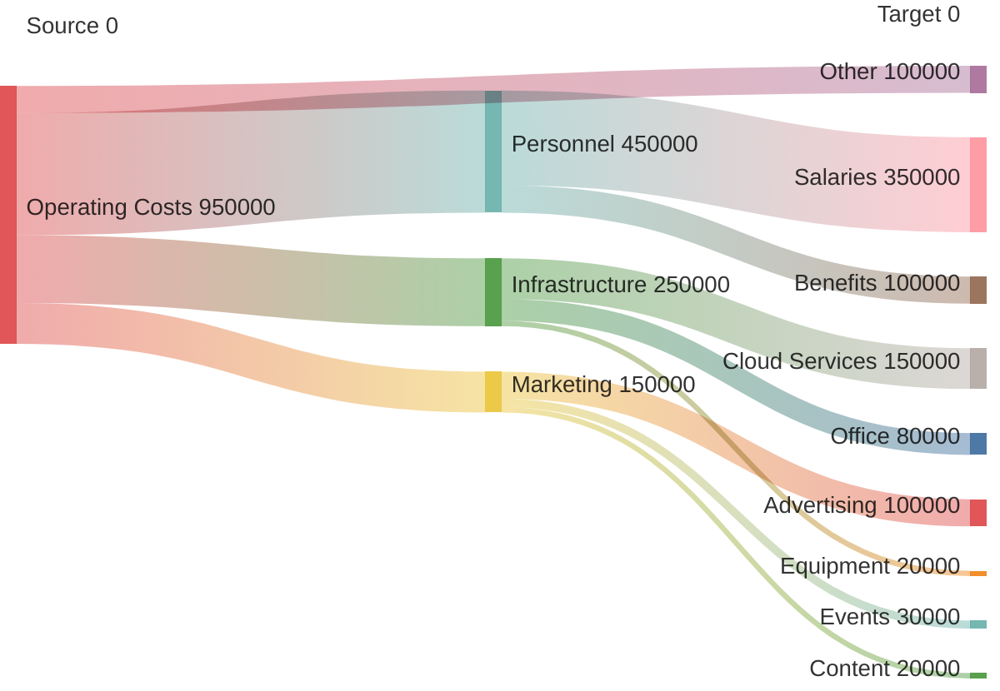

### Data Flow Architecture
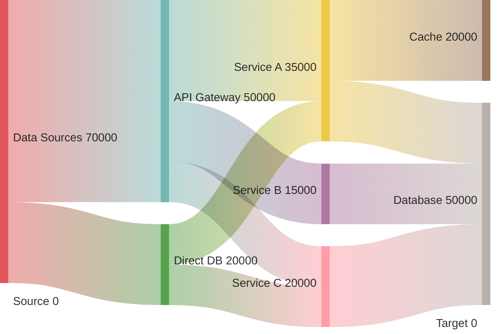

### Educational Path
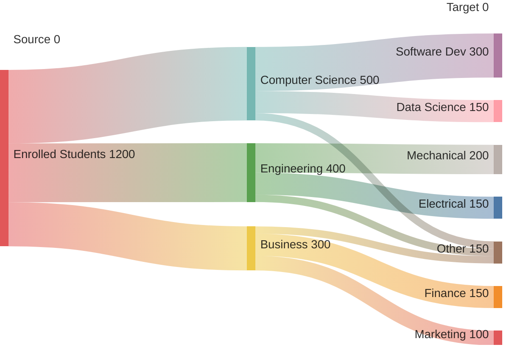

### Food Waste Analysis
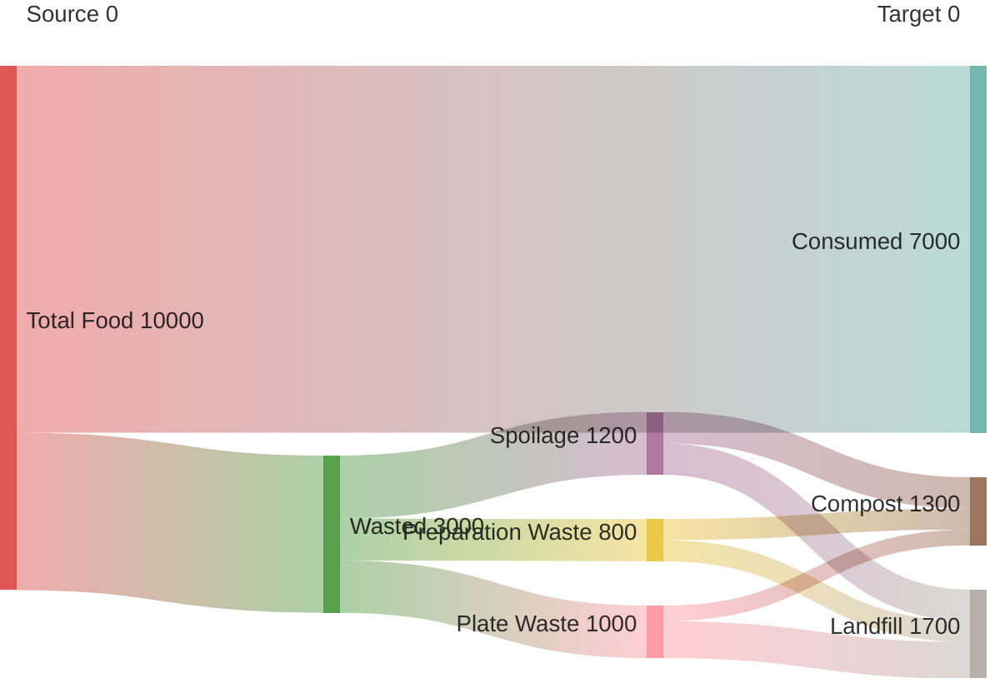

## Data Format

The CSV-like format requires three columns:
- **Source**: Starting node
- **Target**: Ending node  
- **Value**: Flow amount (positive number)

## Tips

- Values represent flow magnitude/quantity
- Node names are case-sensitive
- Flows are directional (Source → Target)
- Larger values = thicker flows
- Use meaningful node names
- Group related flows for clarity
- Keep node count reasonable (< 20 for readability)
- Values should be proportional and meaningful
- Perfect for: conversions, distributions, processes, journeys
- Show where quantities split, merge, or transform
