# Sequence Diagrams

Sequence diagrams show interactions between participants over time.

## Basic Syntax

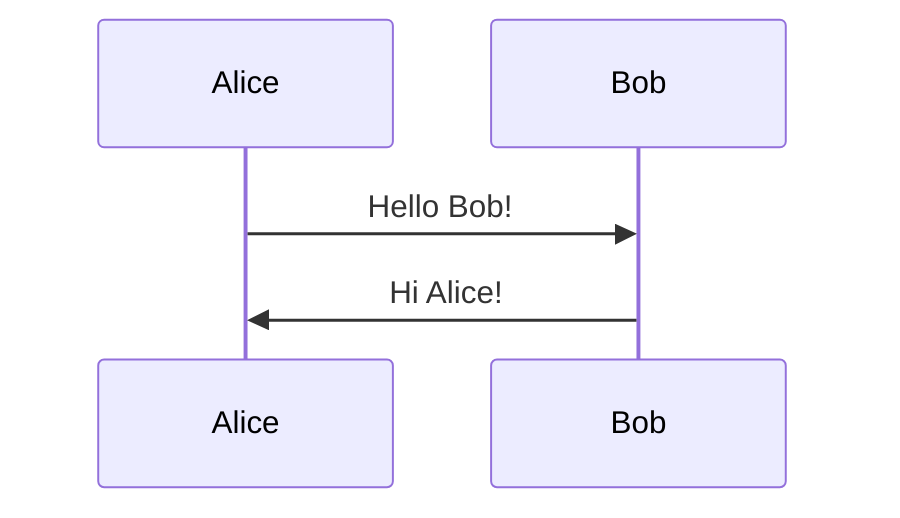

## Participants

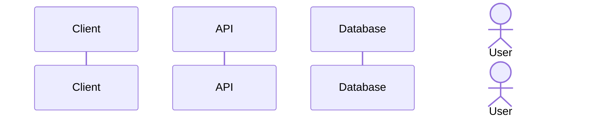

## Arrow Types

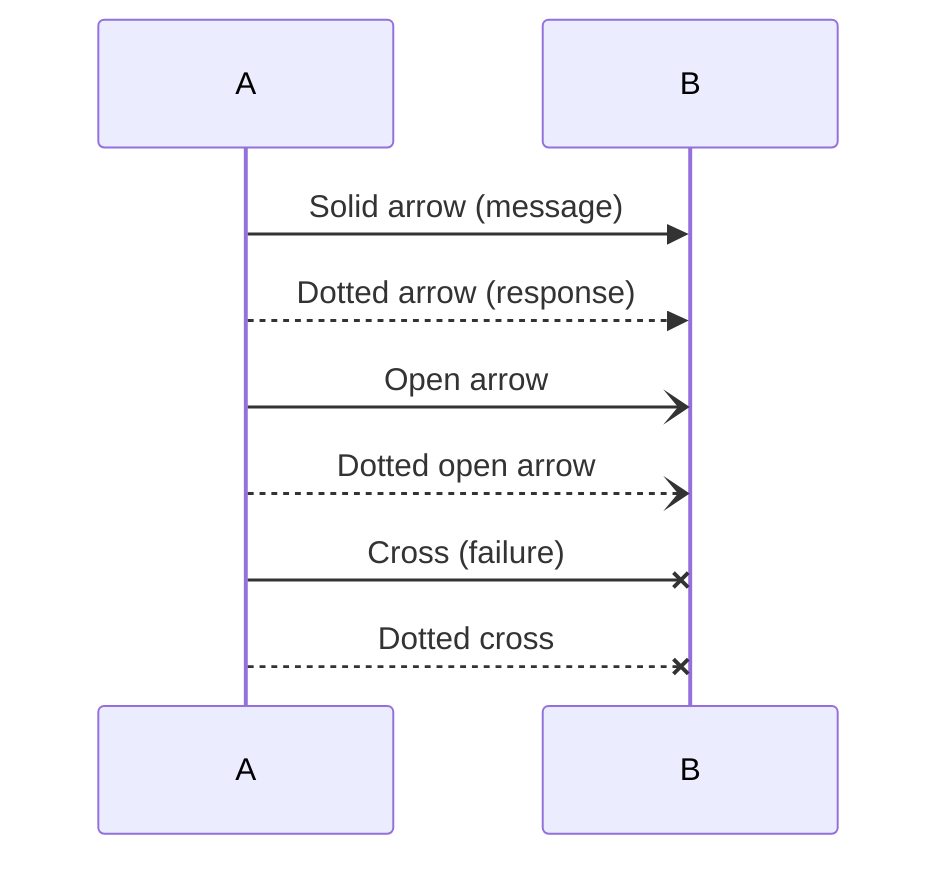

## Activation Boxes

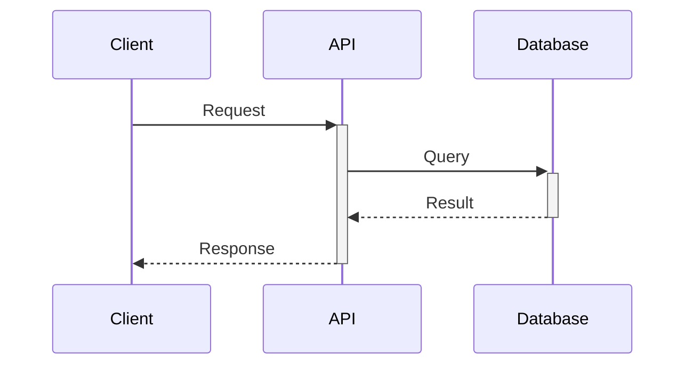

## Notes

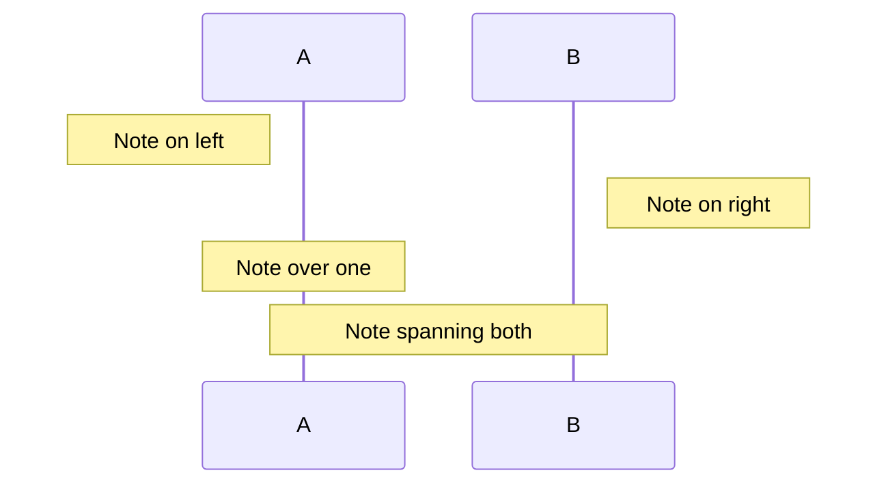

## Loops

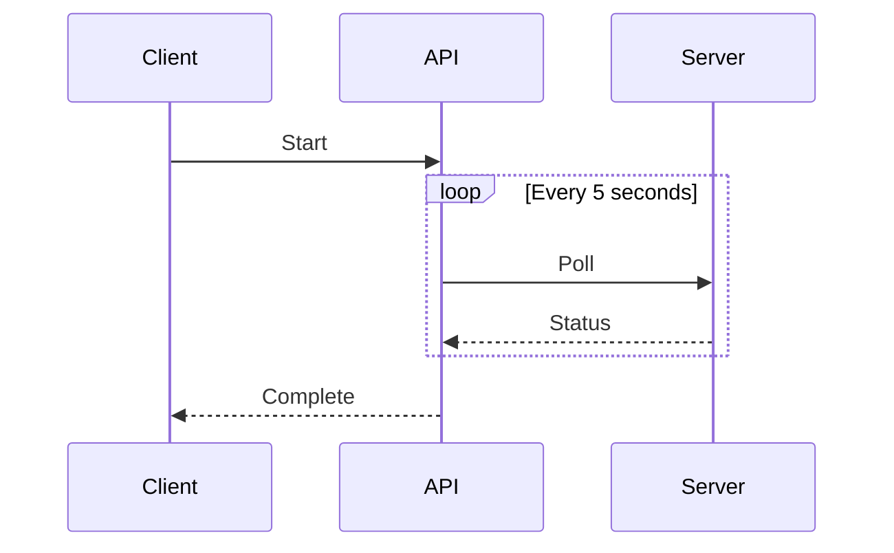

## Alternatives (if/else)

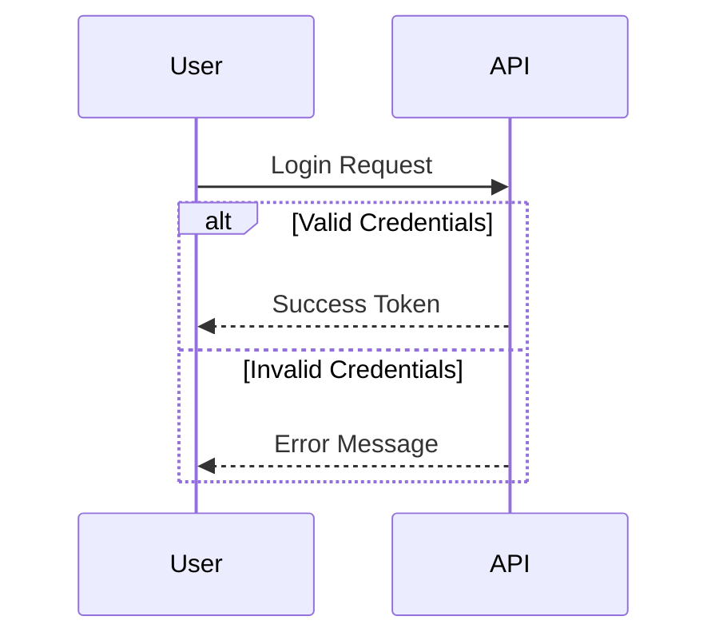

## Optional Blocks

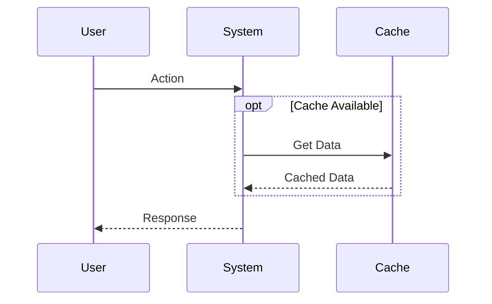

## Parallel Processing

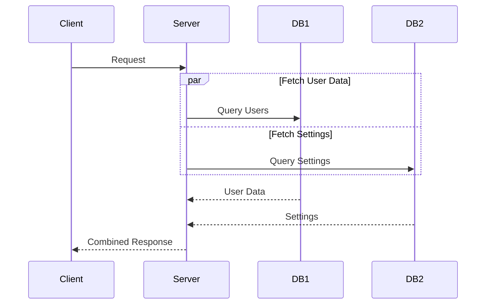

## Common Patterns

### Authentication Flow
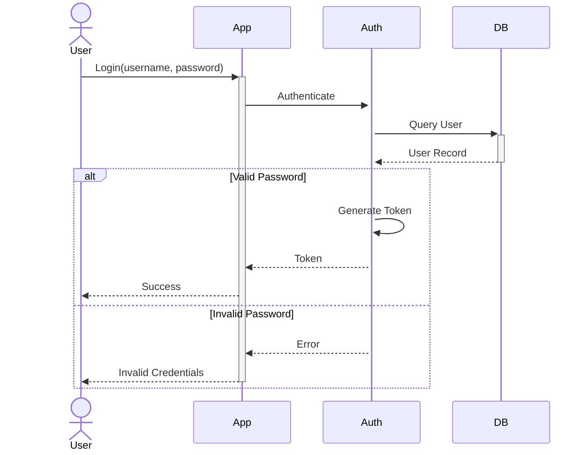

### API Request Flow
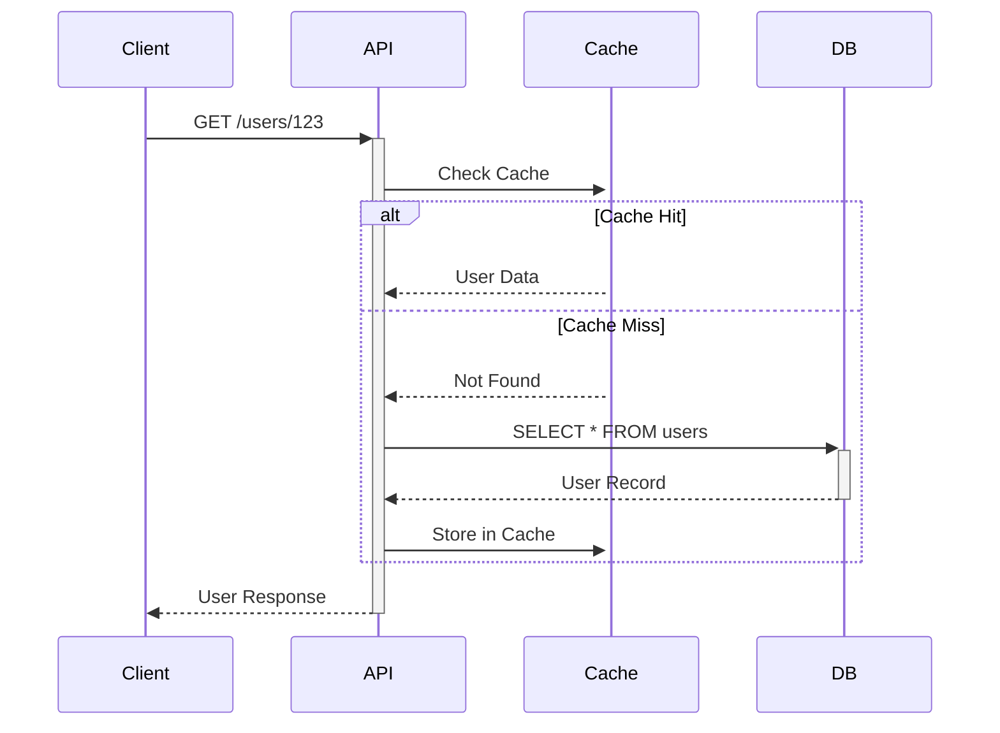

### Microservice Communication
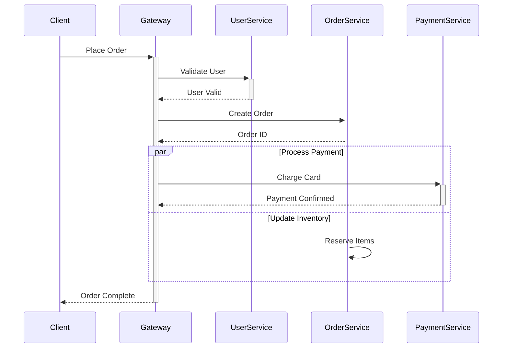

## Background Highlighting

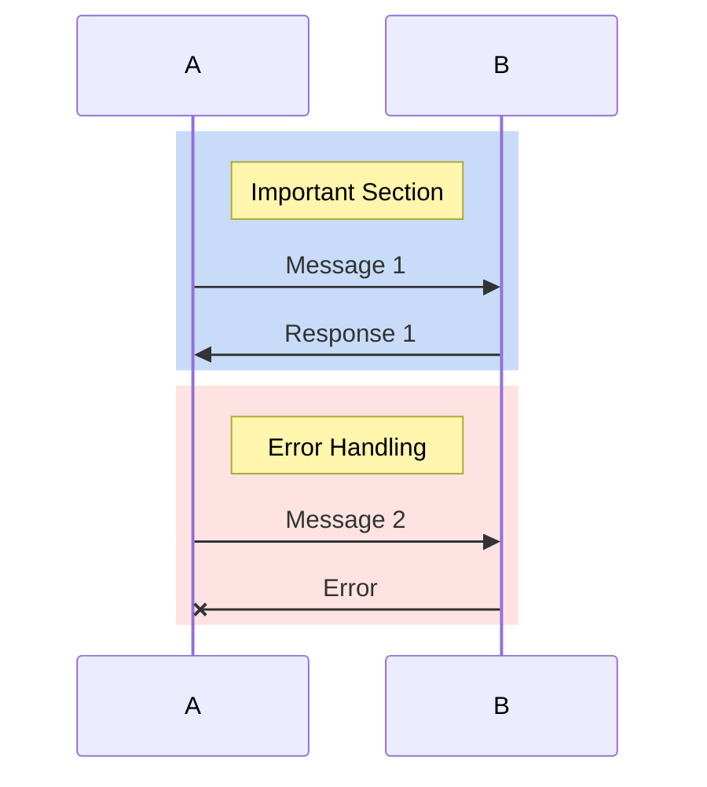

## Autonumbering

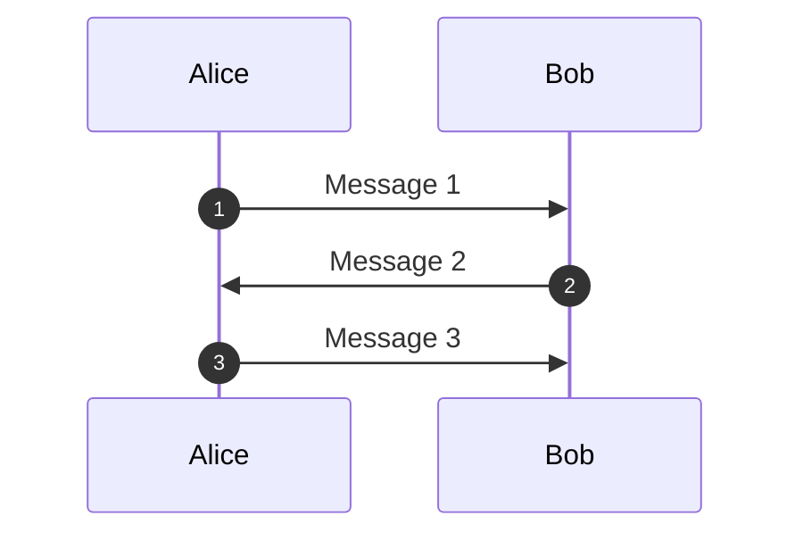

## Tips

- Use `participant` to control order of appearance
- Use `actor` for human participants
- Activate (+) and deactivate (-) to show when components are processing
- Use `alt/else` for conditional flows
- Use `par/and` for concurrent operations
- Add `autonumber` for step numbering
