# State Diagrams

State diagrams model state machines and lifecycle transitions.

## Basic Syntax

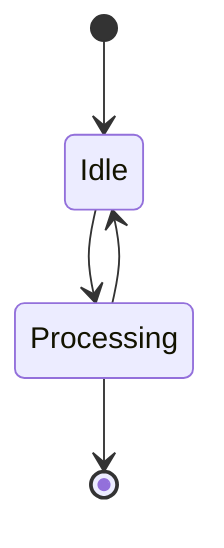

## States with Descriptions

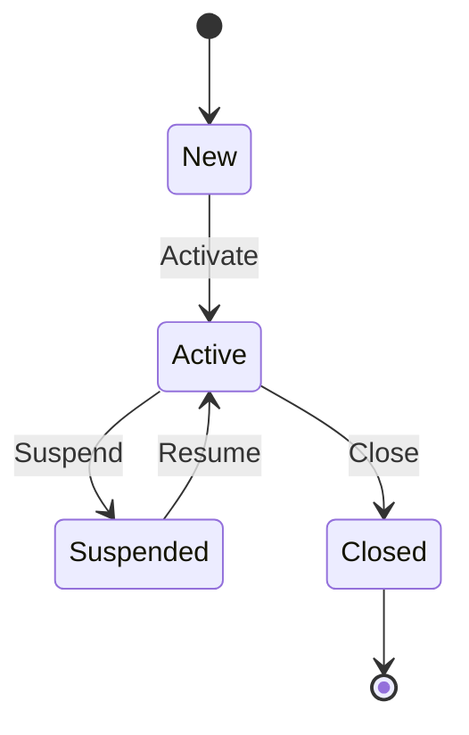

## Composite States

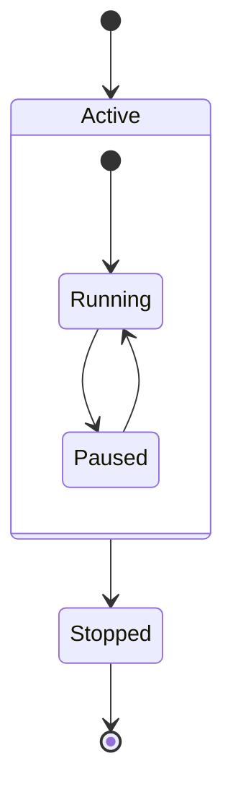

## Concurrent States

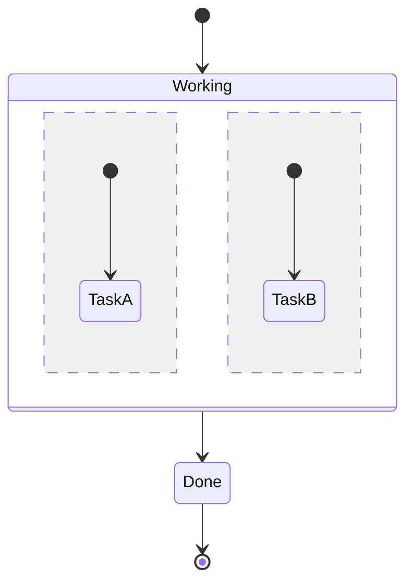

## Choice (Conditional)

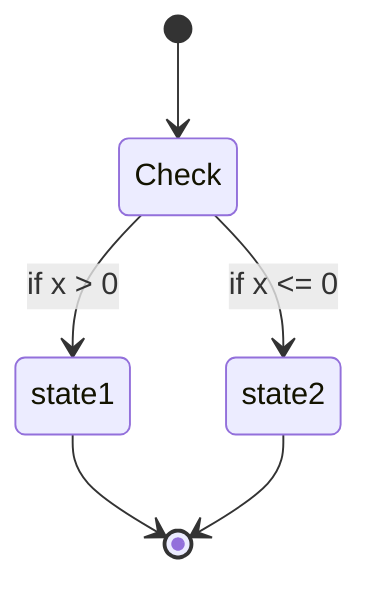

## Fork and Join

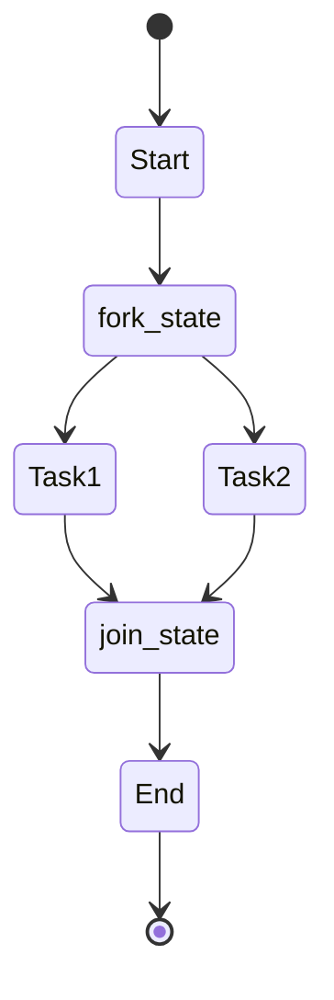

## Notes

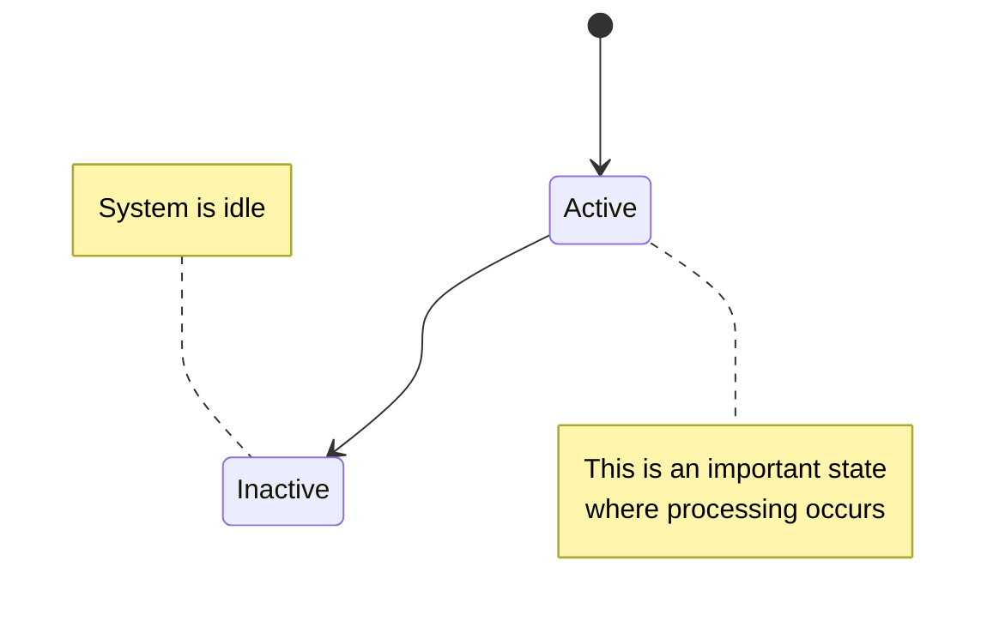

## Common Patterns

### Order Lifecycle
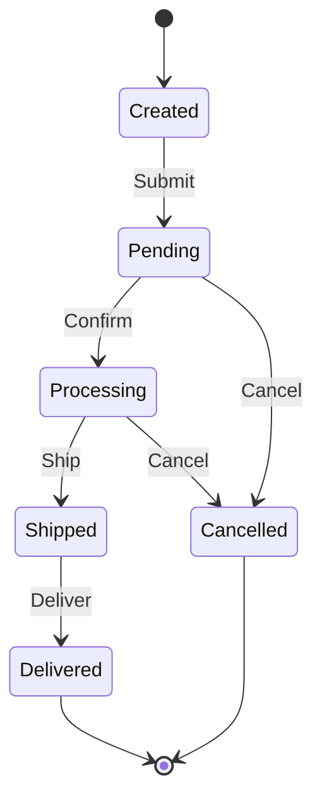

### User Authentication States
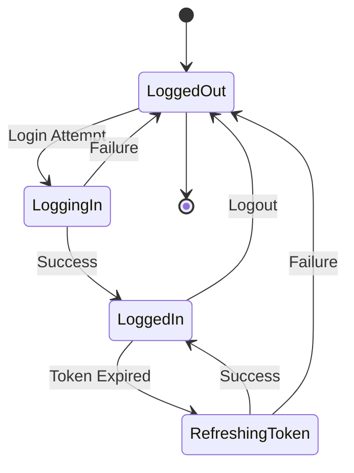

### Connection States
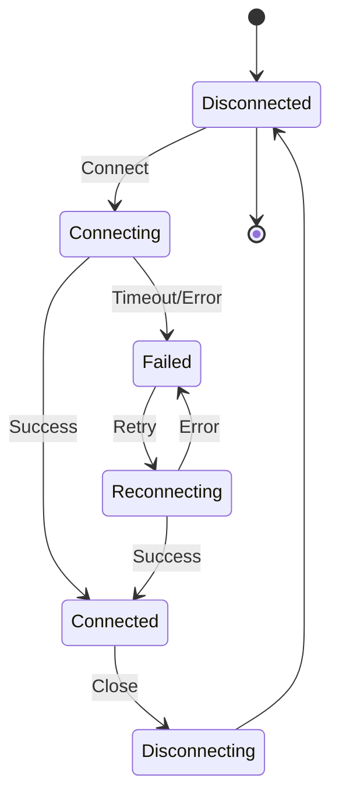

### Document Workflow
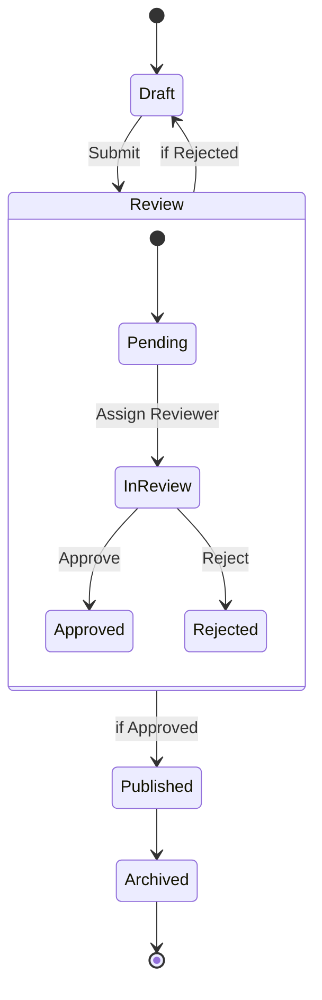

### Media Player States
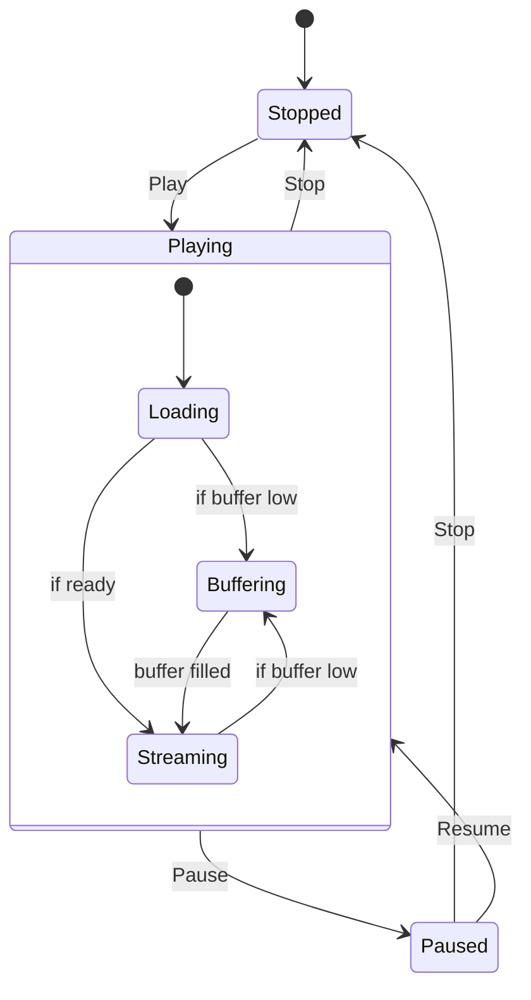

### Payment Processing
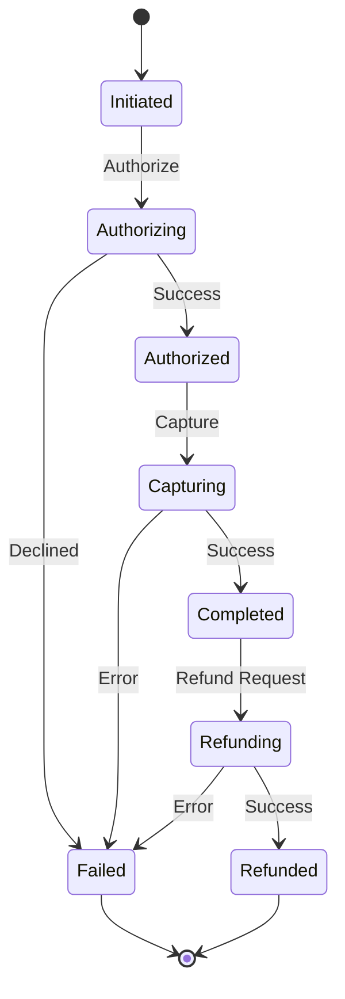

## State Actions

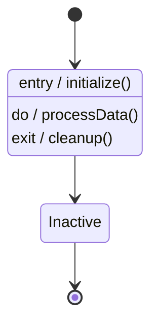

## Direction

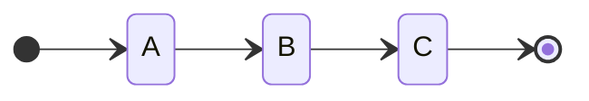

## Styling

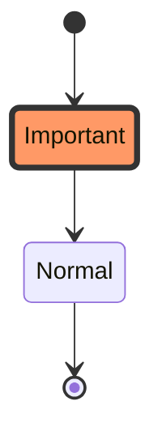

## Tips

- `[*]` represents start/end states
- Use composite states for sub-states
- Use `--` for concurrent regions
- Transition labels show triggering events/conditions
- Keep state names concise and descriptive
- Model only relevant states (avoid over-complication)
- Use choice nodes for conditional transitions
