# Timeline Diagrams

Timeline diagrams visualize chronological events and milestones.

## Basic Syntax

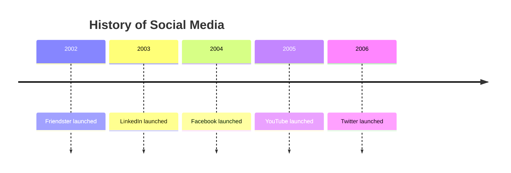

## Sections

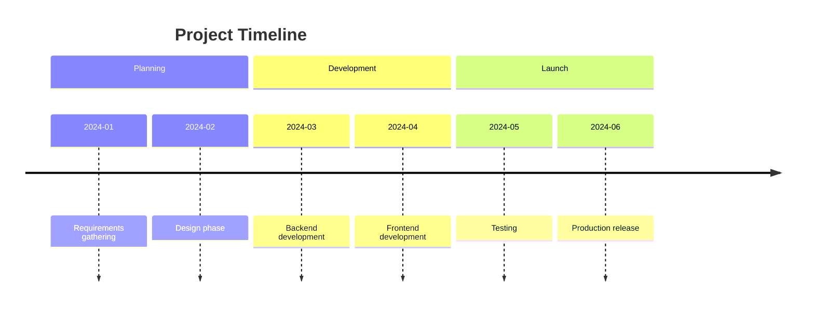

## Multiple Events per Period

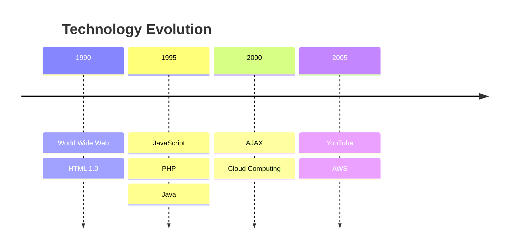

## Common Patterns

### Company History
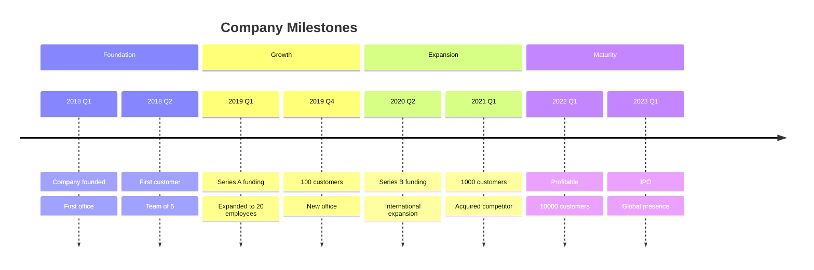

### Product Roadmap
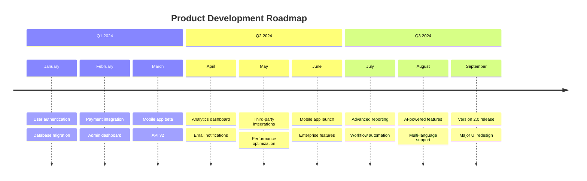

### Historical Events
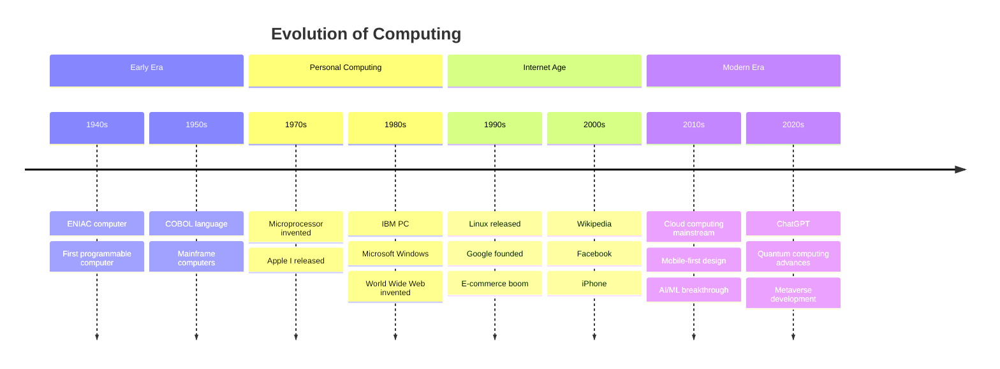

### Personal Career Timeline
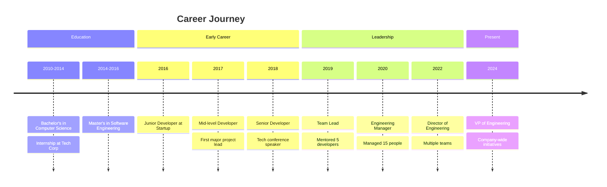

### Project Lifecycle
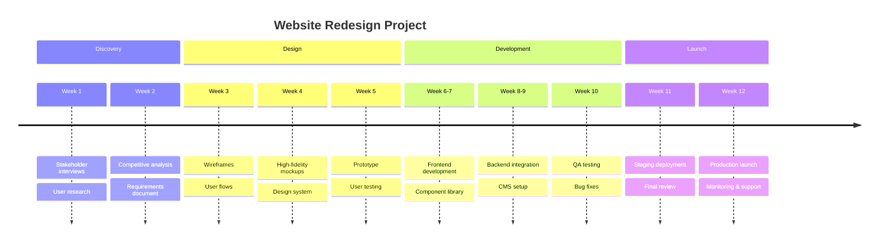

### Technology Adoption
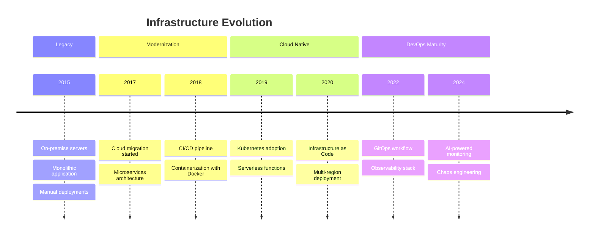

### Marketing Campaign
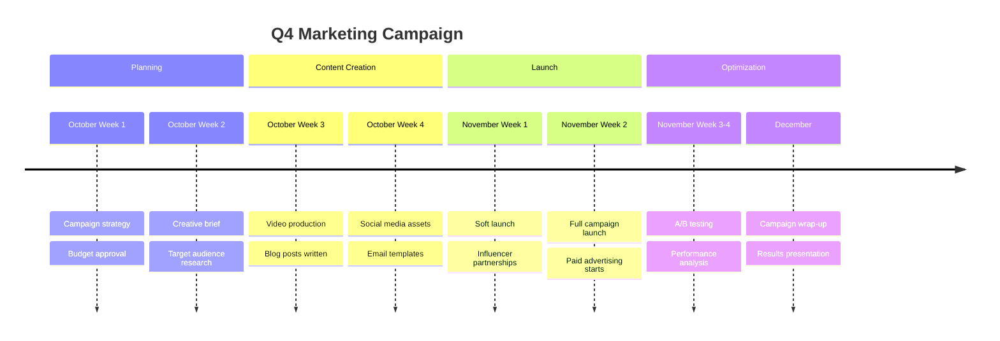

### Software Release History
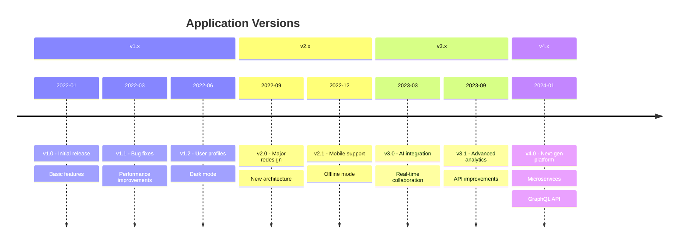

### Learning Journey
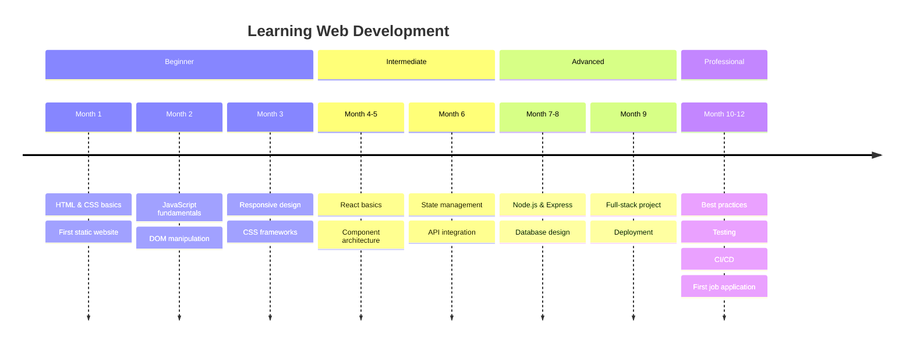

### Business Transformation
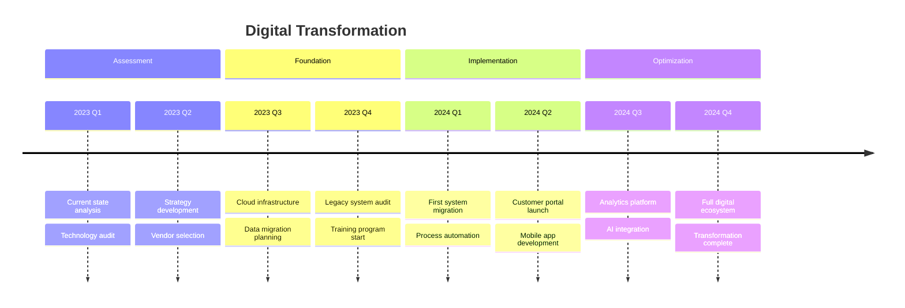

## Tips

- Use consistent time period formatting
- Group related events in sections
- Include multiple events per period when needed
- Keep event descriptions concise
- Order chronologically (top to bottom or left to right)
- Use sections to organize different themes
- Highlight major milestones
- Consider audience when choosing time granularity
