# Treemap Diagrams

Treemap diagrams visualize hierarchical data using nested rectangles sized by value.

**Note:** Treemap support in Mermaid is new and experimental.

## Basic Syntax

```mermaid
treemap
    title Budget Breakdown
    "Engineering": 50000
    "Marketing": 30000
    "Sales": 25000
    "Operations": 20000
```

## Common Patterns

### File System Size
```mermaid
treemap
    title Disk Space Usage
    "src": 250
      "components": 120
      "utils": 50
      "services": 80
    "node_modules": 500
    "public": 80
    "dist": 150
    "tests": 45
```

### Revenue by Product
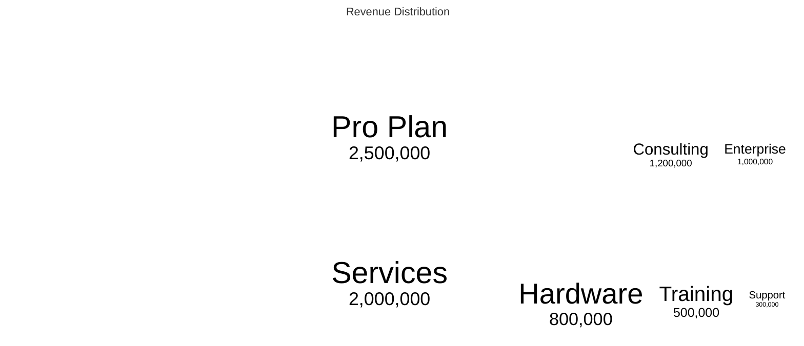

### Team Size by Department
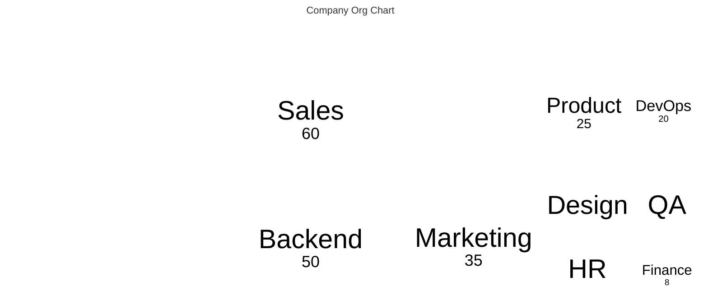

### Website Traffic Sources
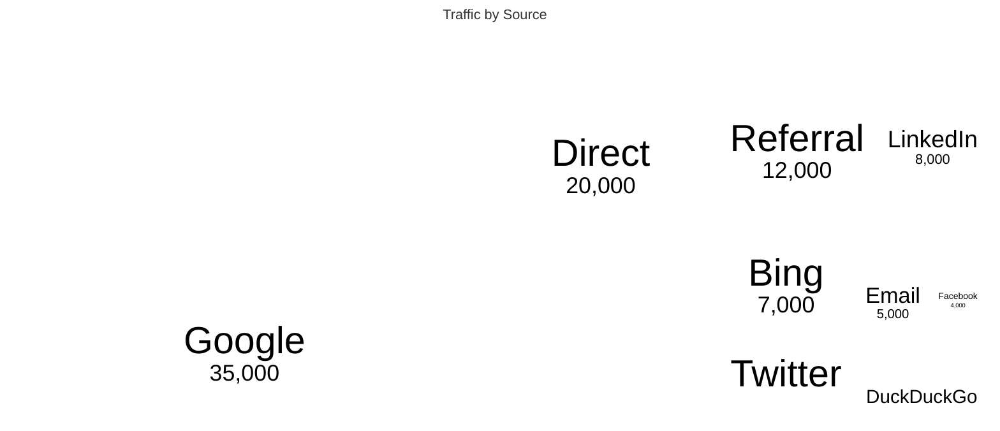

### Budget Allocation
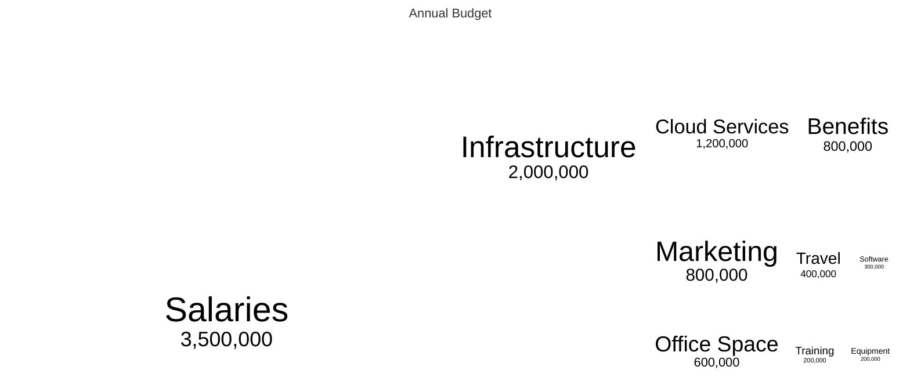

### Code Complexity
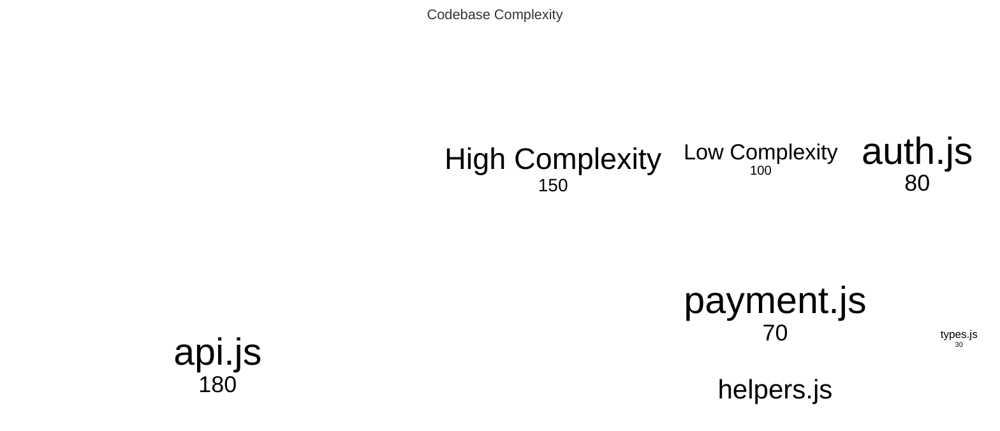

### Sales by Region
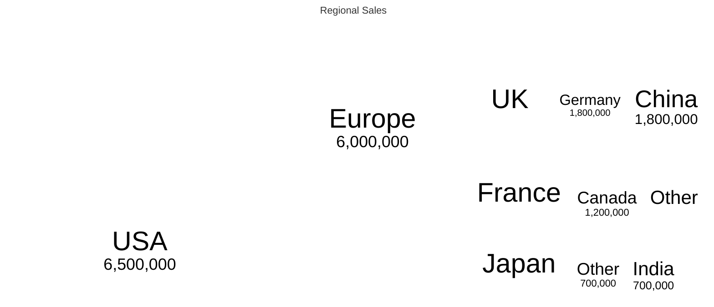

### Cloud Cost Breakdown
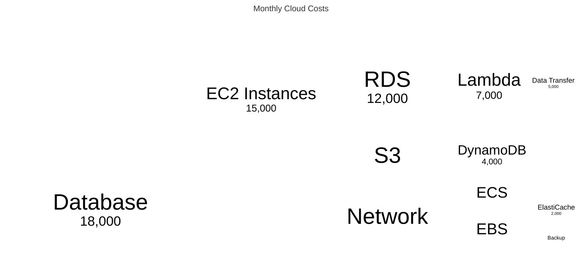

### Project Time Allocation
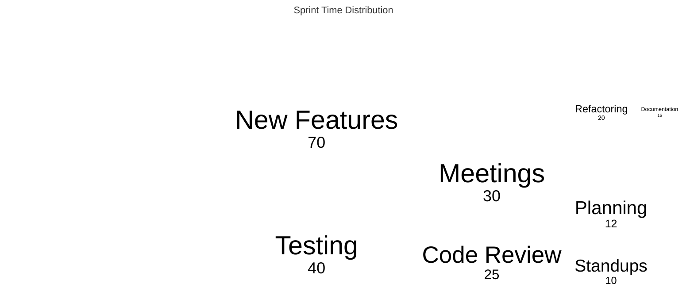

### Error Distribution
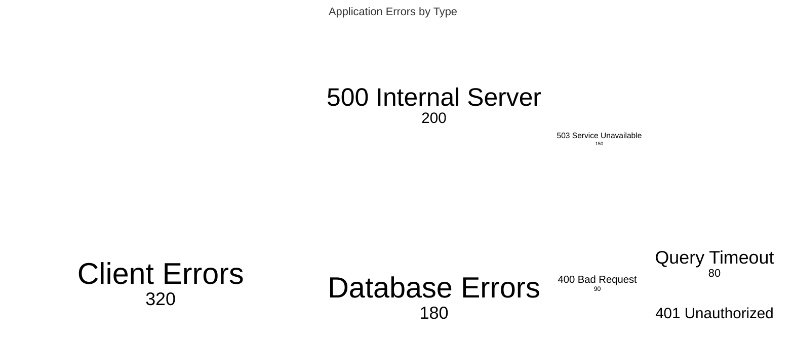

### Library Dependencies Size
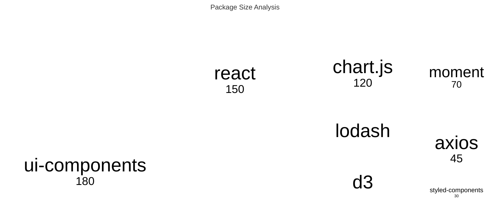

### Customer Segments
```mermaid
treemap
    title Customer Base
    "Enterprise": 50
      "Fortune 500": 15
      "Mid-Market": 35
    "SMB": 200
      "Small Business": 150
      "Startups": 50
    "Individual": 500
      "Freelancers": 300
      "Personal Use": 200
```

### Support Ticket Categories
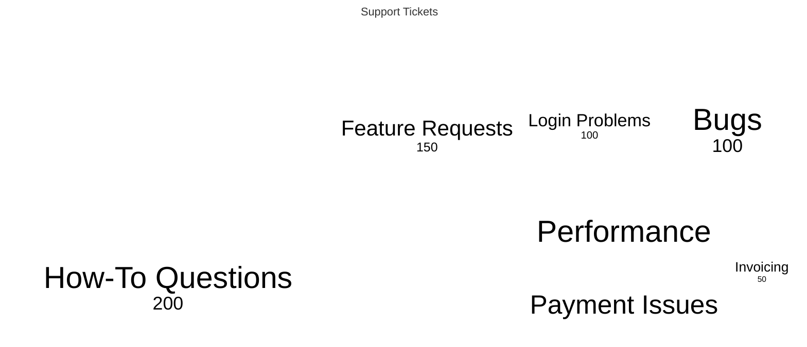

### Marketing Spend
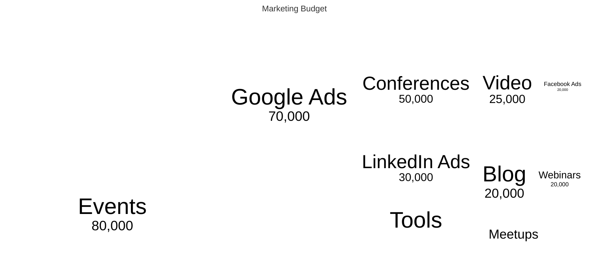

### Technical Debt
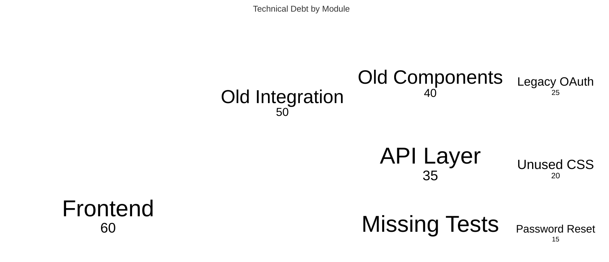

## Tips

- Rectangle size represents value/magnitude
- Use hierarchical structure with indentation
- Larger rectangles = higher values
- Perfect for: proportions, distributions, hierarchies
- Shows part-to-whole relationships
- Nested levels show sub-categories
- Values should be positive numbers
- Good for budget, resource, and space visualization
- Color coding helps distinguish categories
- Keep nesting levels reasonable (2-3 max)
