# XY Charts

XY charts plot data points on Cartesian coordinates for trend and correlation analysis.

## Basic Syntax

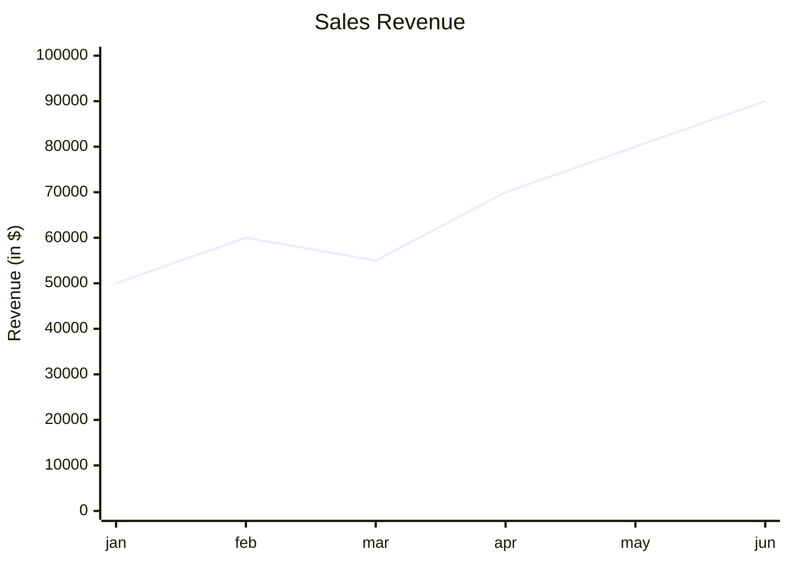
```mermaid
xychart-beta
    title "Sales Revenue"
    x-axis [jan, feb, mar, apr, may, jun]
    y-axis "Revenue (in $)" 0 --> 100000
    line [50000, 60000, 55000, 70000, 80000, 90000]
```

## Chart Types

- `line` - Line chart
- `bar` - Bar chart
- Multiple datasets can be combined

## Common Patterns

### Monthly Sales Comparison
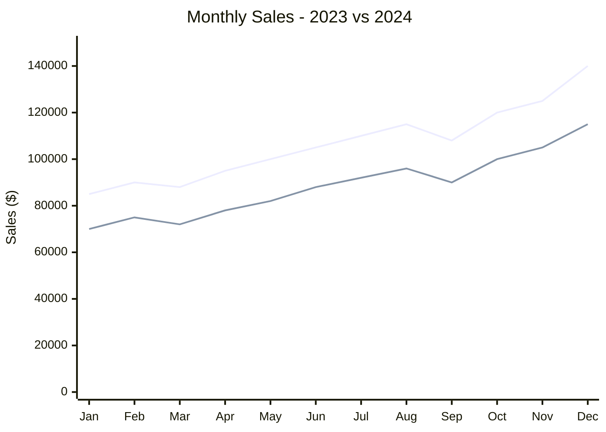
```mermaid
xychart-beta
    title "Monthly Sales - 2023 vs 2024"
    x-axis [Jan, Feb, Mar, Apr, May, Jun, Jul, Aug, Sep, Oct, Nov, Dec]
    y-axis "Sales ($)" 0 --> 150000
    line [85000, 90000, 88000, 95000, 100000, 105000, 110000, 115000, 108000, 120000, 125000, 140000]
    line [70000, 75000, 72000, 78000, 82000, 88000, 92000, 96000, 90000, 100000, 105000, 115000]
```

### Website Traffic Growth
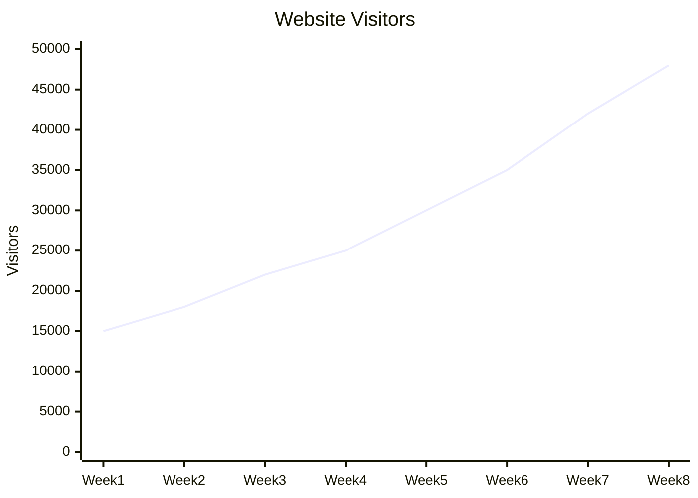
```mermaid
xychart-beta
    title "Website Visitors"
    x-axis [Week 1, Week 2, Week 3, Week 4, Week 5, Week 6, Week 7, Week 8]
    y-axis "Visitors" 0 --> 50000
    line [15000, 18000, 22000, 25000, 30000, 35000, 42000, 48000]
```

### Server Response Time
```mermaid
xychart-beta
    title "API Response Time by Hour"
    x-axis [00:00, 03:00, 06:00, 09:00, 12:00, 15:00, 18:00, 21:00]
    y-axis "Response Time (ms)" 0 --> 500
    line [120, 100, 95, 180, 250, 300, 280, 150]
```

### User Engagement Metrics
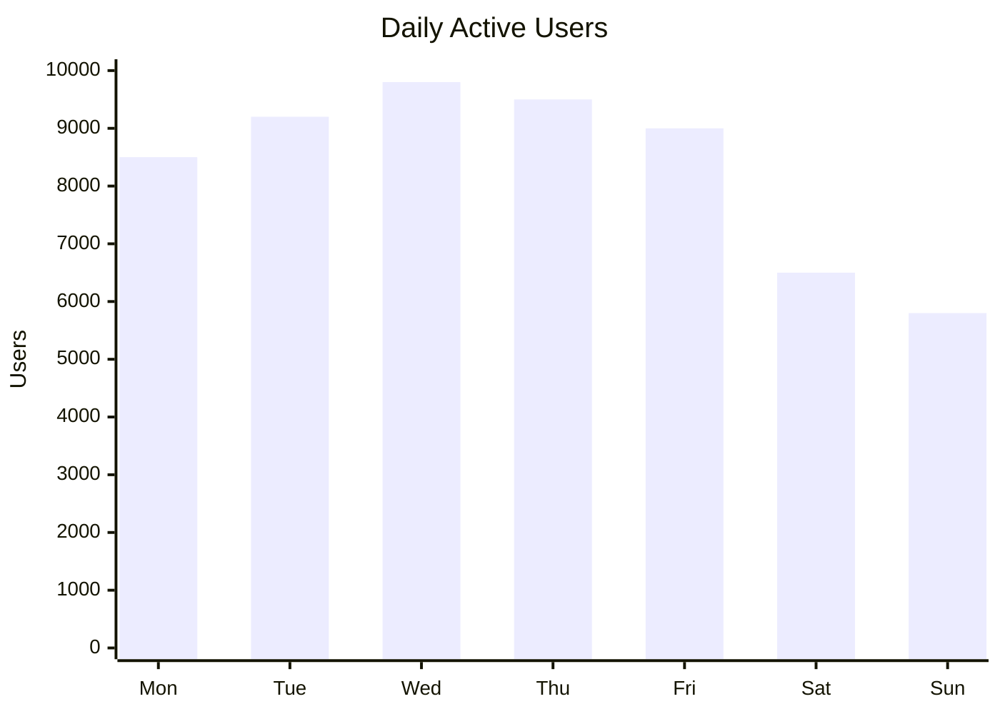
```mermaid
xychart-beta
    title "Daily Active Users"
    x-axis [Mon, Tue, Wed, Thu, Fri, Sat, Sun]
    y-axis "Users" 0 --> 10000
    bar [8500, 9200, 9800, 9500, 9000, 6500, 5800]
```

### Quarterly Revenue
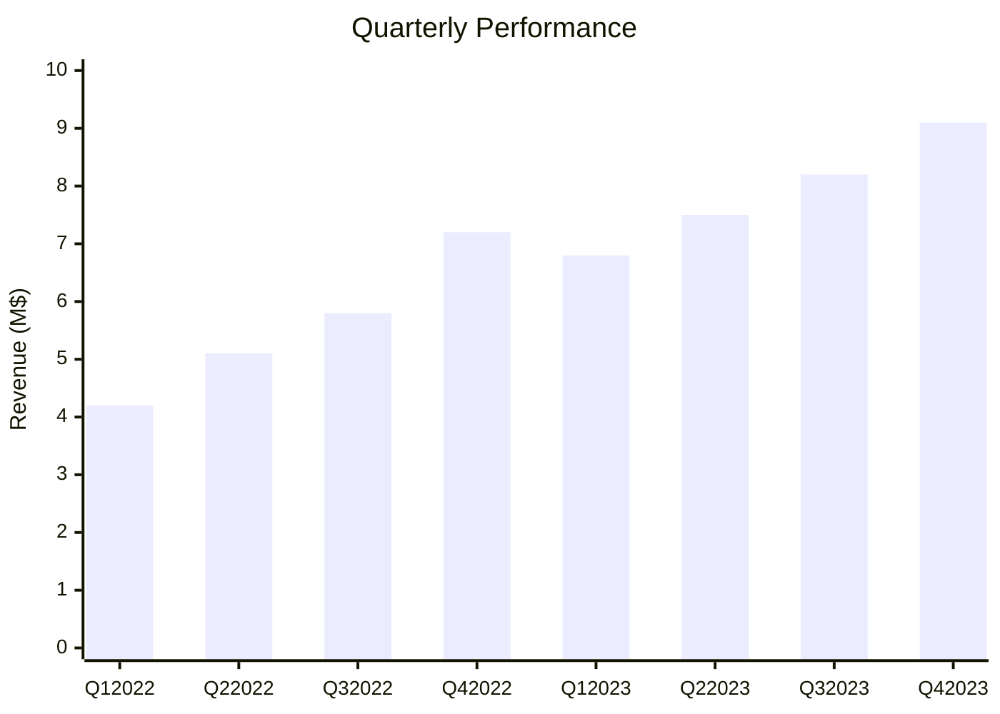
```mermaid
xychart-beta
    title "Quarterly Performance"
    x-axis [Q1 2022, Q2 2022, Q3 2022, Q4 2022, Q1 2023, Q2 2023, Q3 2023, Q4 2023]
    y-axis "Revenue (M$)" 0 --> 10
    bar [4.2, 5.1, 5.8, 7.2, 6.8, 7.5, 8.2, 9.1]
```

### Temperature Monitoring
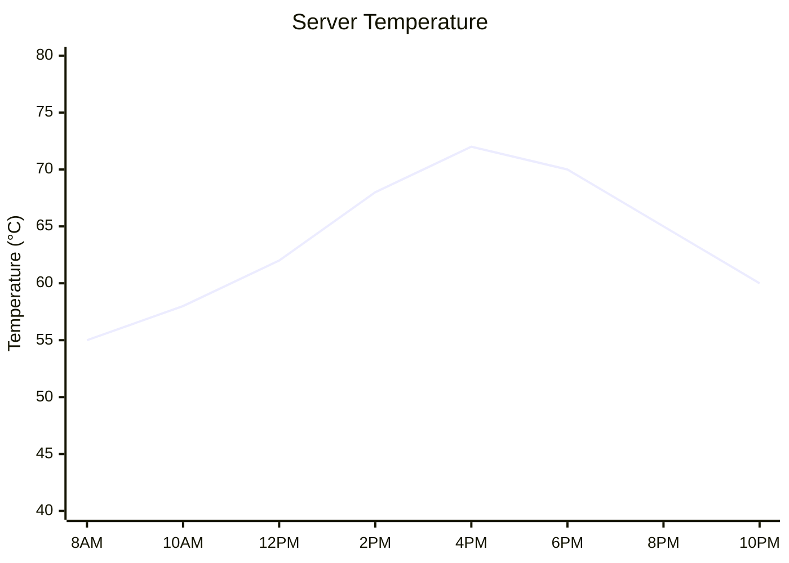
```mermaid
xychart-beta
    title "Server Temperature"
    x-axis [8AM, 10AM, 12PM, 2PM, 4PM, 6PM, 8PM, 10PM]
    y-axis "Temperature (°C)" 40 --> 80
    line [55, 58, 62, 68, 72, 70, 65, 60]
```

### Conversion Funnel
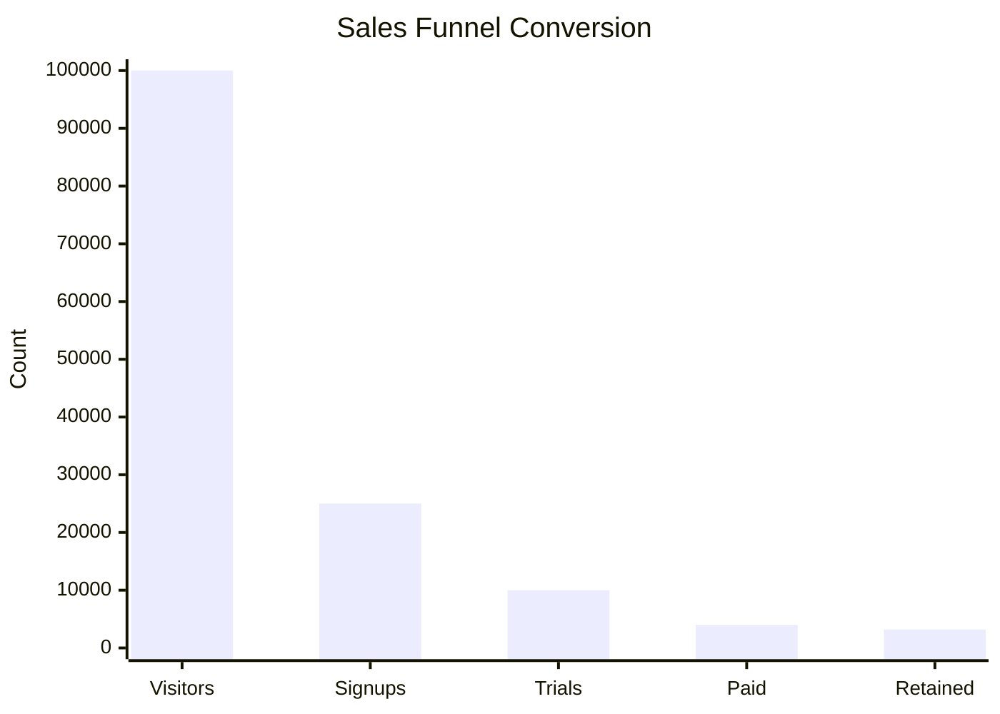
```mermaid
xychart-beta
    title "Sales Funnel Conversion"
    x-axis [Visitors, Signups, Trials, Paid, Retained]
    y-axis "Count" 0 --> 100000
    bar [100000, 25000, 10000, 4000, 3200]
```

### Product Comparison
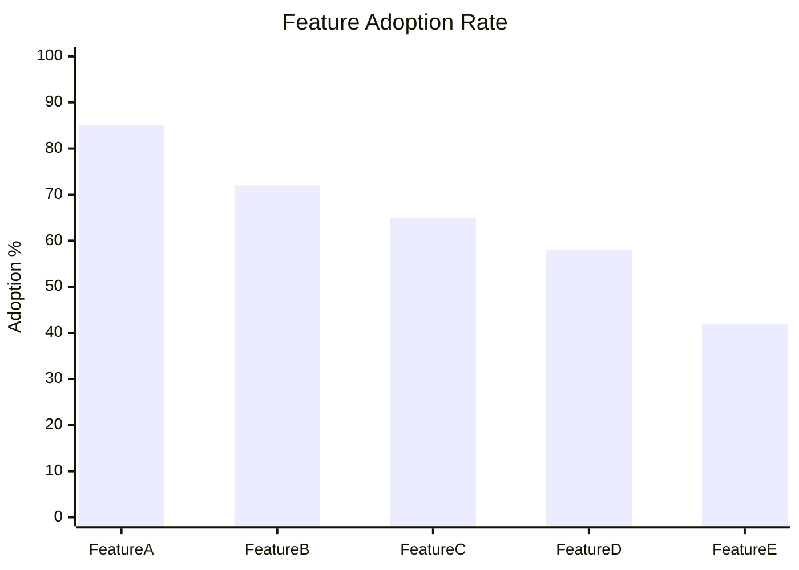
```mermaid
xychart-beta
    title "Feature Adoption Rate"
    x-axis [Feature A, Feature B, Feature C, Feature D, Feature E]
    y-axis "Adoption %" 0 --> 100
    bar [85, 72, 65, 58, 42]
```

### Error Rate Tracking
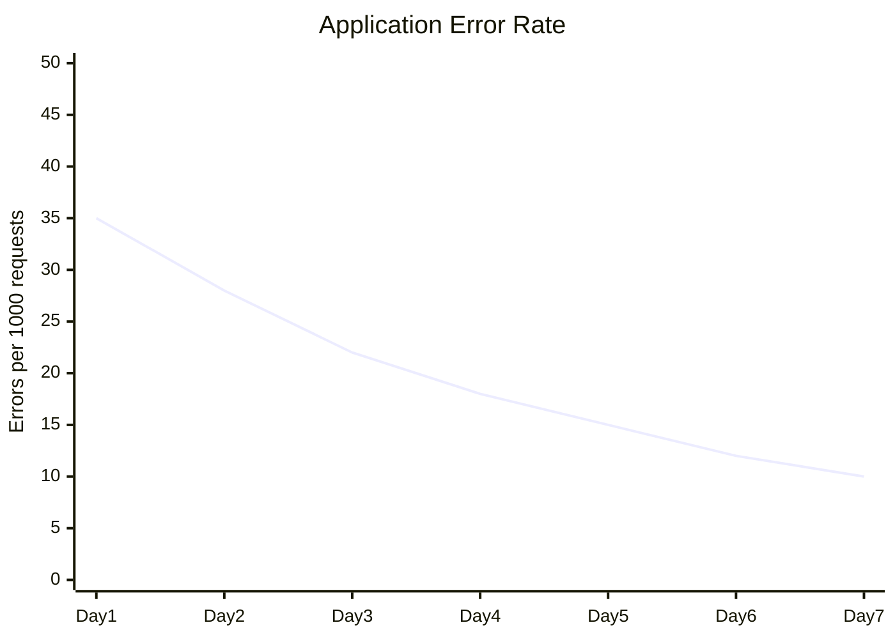
```mermaid
xychart-beta
    title "Application Error Rate"
    x-axis [Day 1, Day 2, Day 3, Day 4, Day 5, Day 6, Day 7]
    y-axis "Errors per 1000 requests" 0 --> 50
    line [35, 28, 22, 18, 15, 12, 10]
```

### Customer Satisfaction Scores
```mermaid
xychart-beta
    title "Monthly NPS Score"
    x-axis [Jan, Feb, Mar, Apr, May, Jun]
    y-axis "NPS" -100 --> 100
    line [45, 48, 52, 55, 58, 62]
```

### Memory Usage
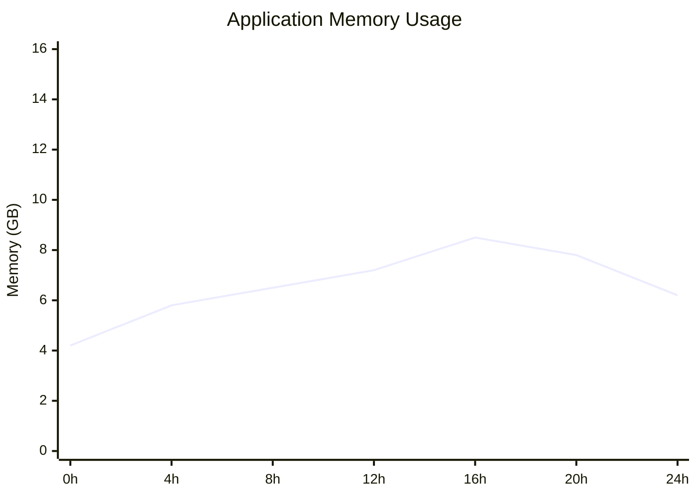
```mermaid
xychart-beta
    title "Application Memory Usage"
    x-axis [0h, 4h, 8h, 12h, 16h, 20h, 24h]
    y-axis "Memory (GB)" 0 --> 16
    line [4.2, 5.8, 6.5, 7.2, 8.5, 7.8, 6.2]
```

### Sprint Velocity
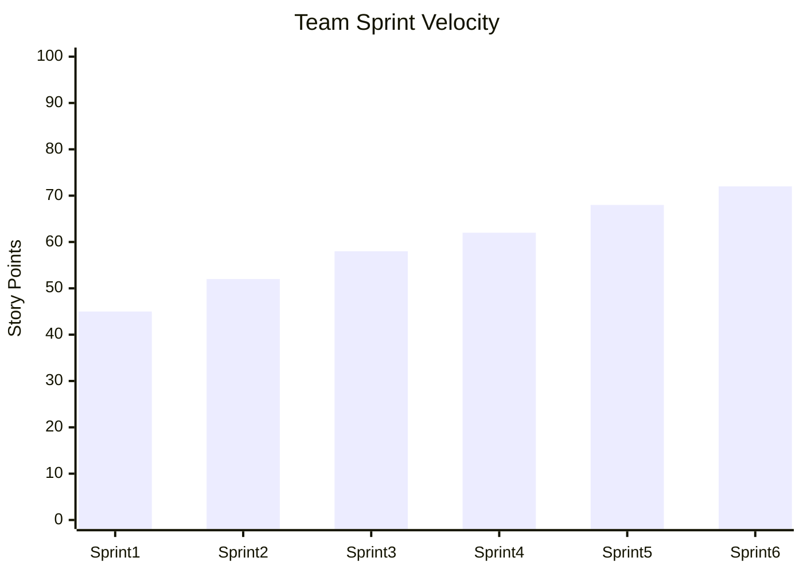
```mermaid
xychart-beta
    title "Team Sprint Velocity"
    x-axis [Sprint 1, Sprint 2, Sprint 3, Sprint 4, Sprint 5, Sprint 6]
    y-axis "Story Points" 0 --> 100
    bar [45, 52, 58, 62, 68, 72]
```

### Budget vs Actual Spend
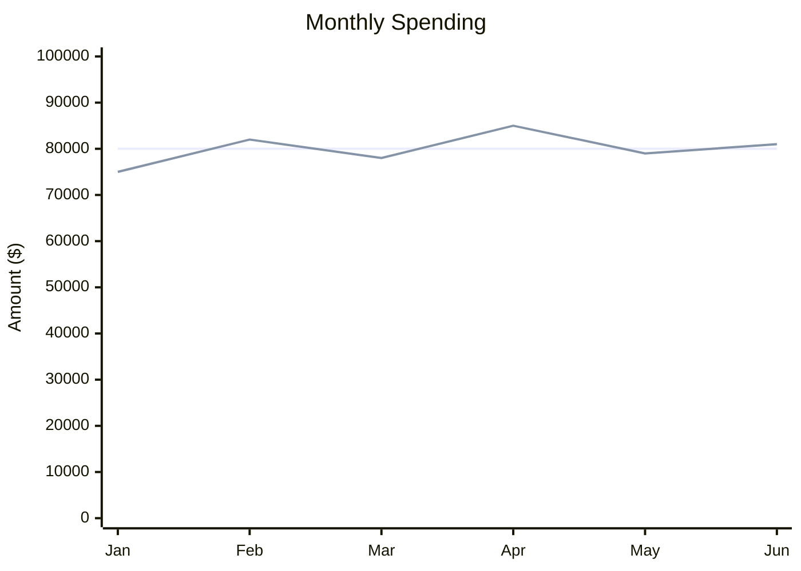
```mermaid
xychart-beta
    title "Monthly Spending"
    x-axis [Jan, Feb, Mar, Apr, May, Jun]
    y-axis "Amount ($)" 0 --> 100000
    line [80000, 80000, 80000, 80000, 80000, 80000]
    line [75000, 82000, 78000, 85000, 79000, 81000]
```

### App Downloads

```mermaid
xychart-beta
    title "Mobile App Downloads by Platform"
    x-axis [Week 1, Week 2, Week 3, Week 4]
    y-axis "Downloads" 0 --> 5000
    bar [3200, 3500, 3800, 4200]
    bar [2800, 3100, 3400, 3900]
```

### Page Load Times
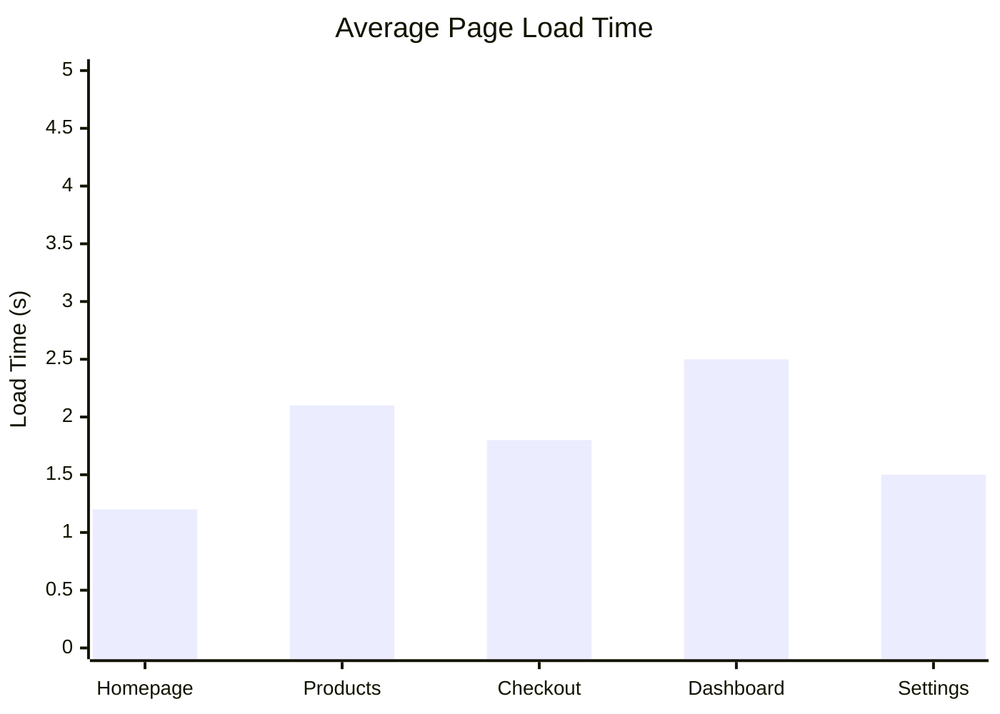
```mermaid
xychart-beta
    title "Average Page Load Time"
    x-axis [Homepage, Products, Checkout, Dashboard, Settings]
    y-axis "Load Time (s)" 0 --> 5
    bar [1.2, 2.1, 1.8, 2.5, 1.5]
```

### Support Ticket Volume
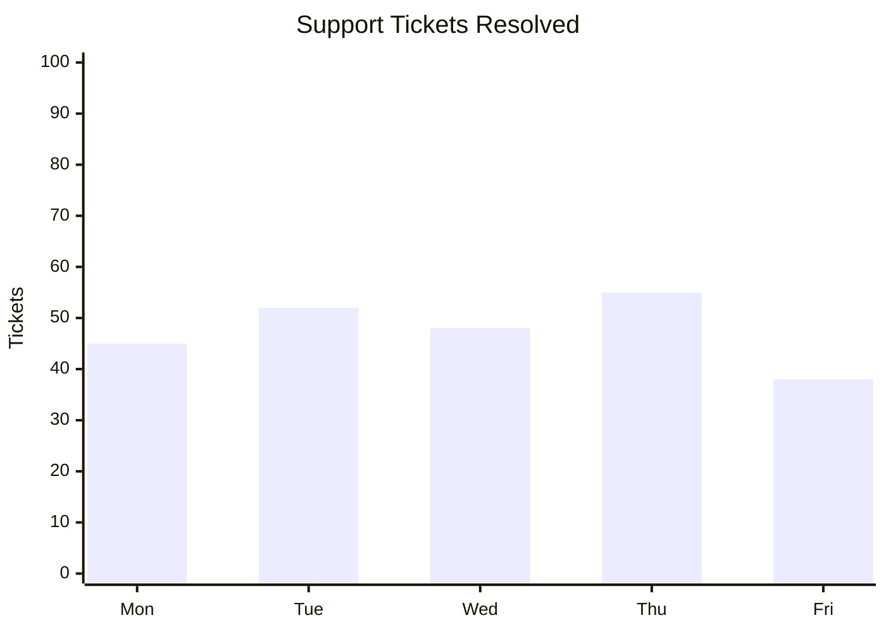
```mermaid
xychart-beta
    title "Support Tickets Resolved"
    x-axis [Mon, Tue, Wed, Thu, Fri]
    y-axis "Tickets" 0 --> 100
    bar [45, 52, 48, 55, 38]
```

### A/B Test Results
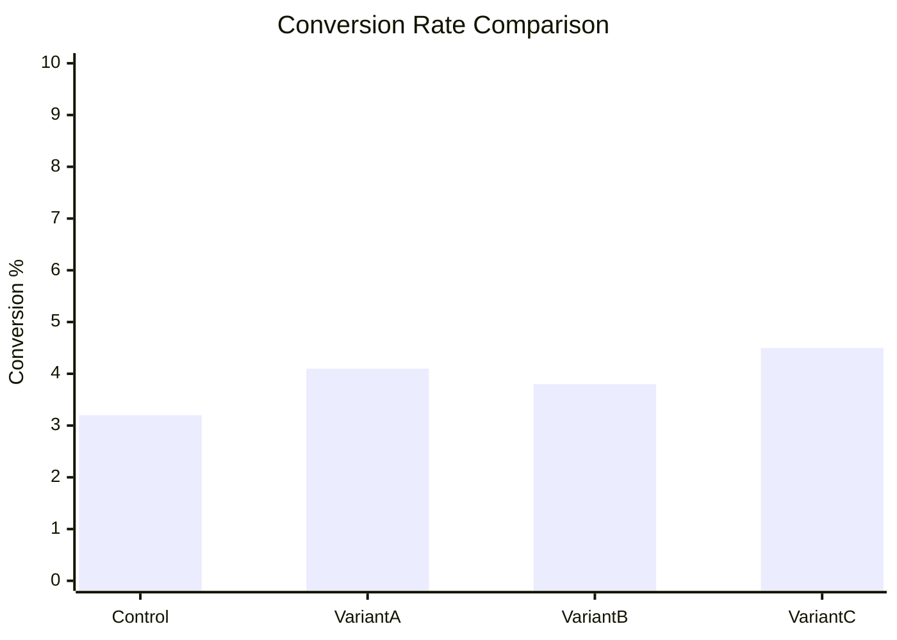
```mermaid
xychart-beta
    title "Conversion Rate Comparison"
    x-axis [Control, Variant A, Variant B, Variant C]
    y-axis "Conversion %" 0 --> 10
    bar [3.2, 4.1, 3.8, 4.5]
```

### Database Query Performance
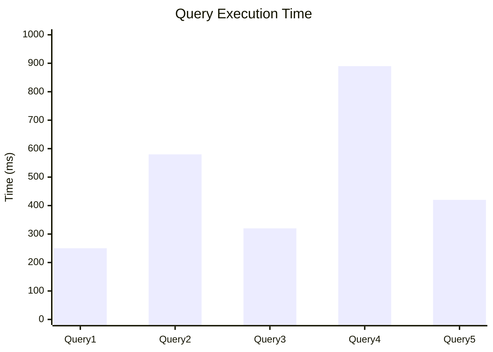
```mermaid
xychart-beta
    title "Query Execution Time"
    x-axis [Query 1, Query 2, Query 3, Query 4, Query 5]
    y-axis "Time (ms)" 0 --> 1000
    bar [250, 580, 320, 890, 420]
```

### Social Media Growth
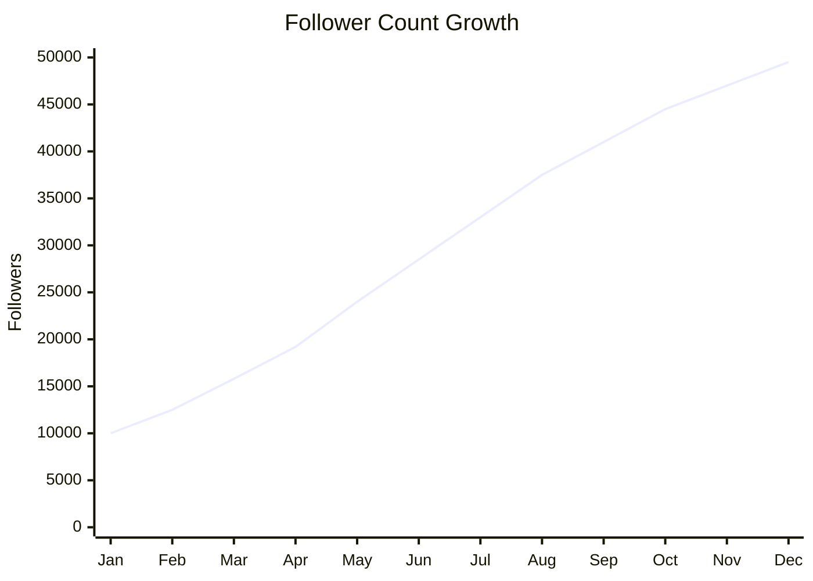
```mermaid
xychart-beta
    title "Follower Count Growth"
    x-axis [Jan, Feb, Mar, Apr, May, Jun, Jul, Aug, Sep, Oct, Nov, Dec]
    y-axis "Followers" 0 --> 50000
    line [10000, 12500, 15800, 19200, 24000, 28500, 33000, 37500, 41000, 44500, 47000, 49500]
```

### Inventory Levels
```mermaid
xychart-beta
    title "Product Stock Levels"
    x-axis [Product A, Product B, Product C, Product D, Product E]
    y-axis "Units in Stock" 0 --> 1000
    bar [450, 780, 320, 890, 550]
```

## Features

- **x-axis**: Category labels or time periods
- **y-axis**: Value range with optional label
- **line**: Line chart data series
- **bar**: Bar chart data series
- **title**: Chart title

## Y-Axis Range

```mermaid
y-axis "Label" min --> max
```

Example:
```mermaid
y-axis "Temperature (°C)" 20 --> 100
```

## Tips

- Use line charts for trends over time
- Use bar charts for comparisons across categories
- Combine multiple series for comparison
- Set appropriate y-axis range
- Keep x-axis labels concise
- Choose meaningful titles
- Data points must match x-axis count
- Use consistent intervals for time series
- Round values appropriately for readability
