# ZenUML Diagrams

ZenUML provides an alternative syntax for sequence diagrams with a more concise DSL.

**Note:** ZenUML support in Mermaid may be experimental.

## Basic Syntax

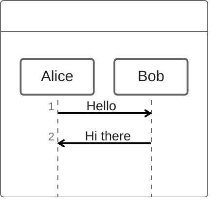

## Common Patterns

### Simple API Call
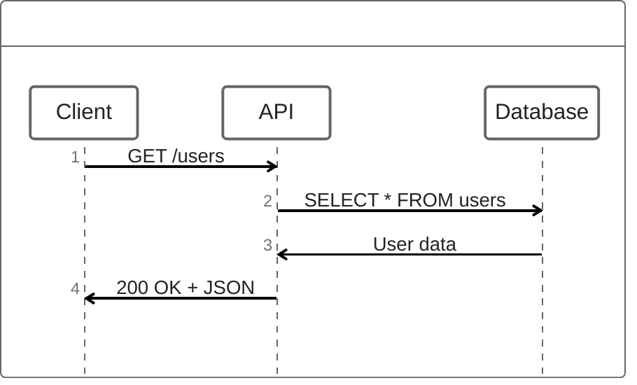

### Authentication Flow
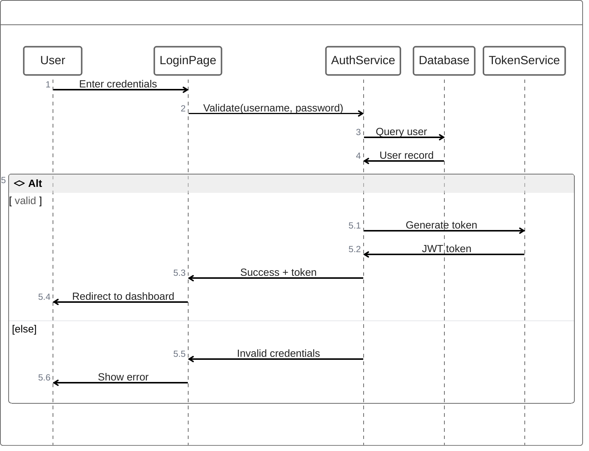

### Order Processing
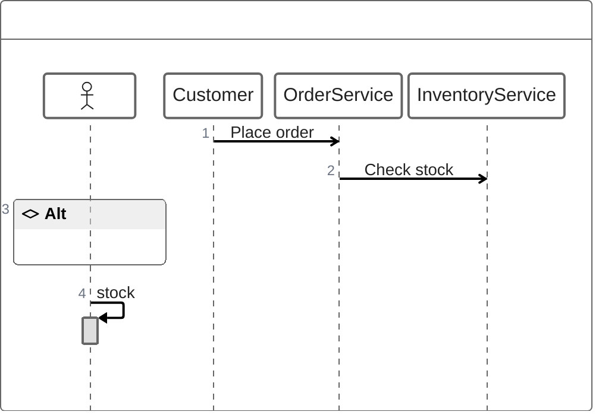

### User Registration
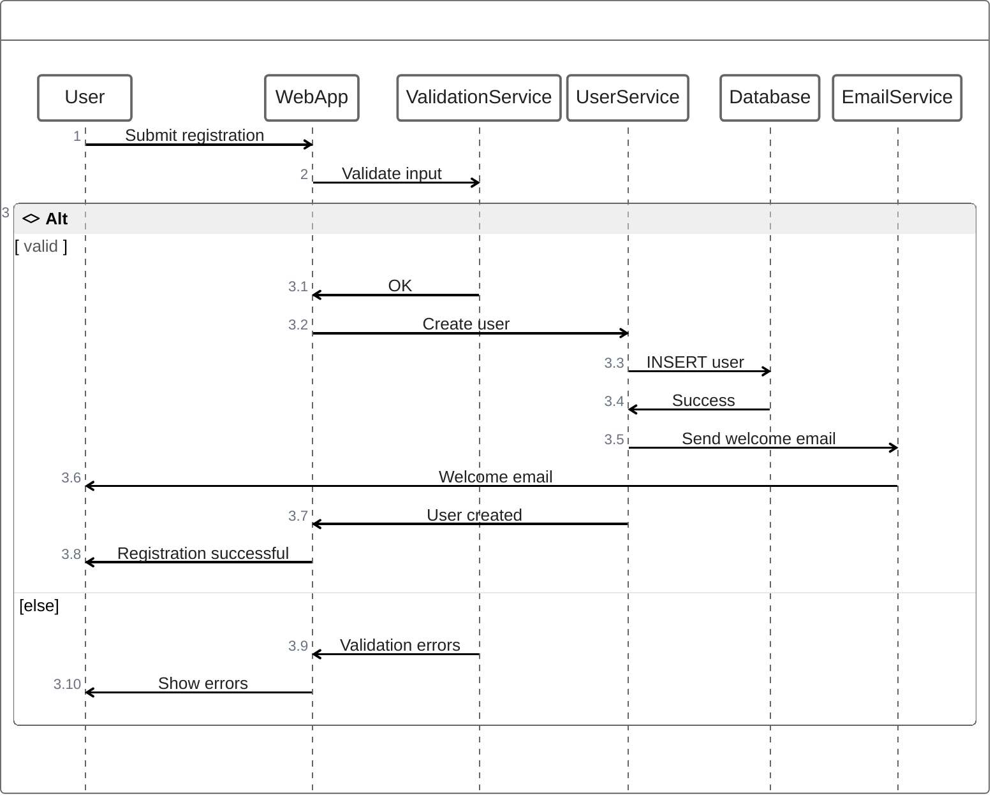

### Microservice Communication
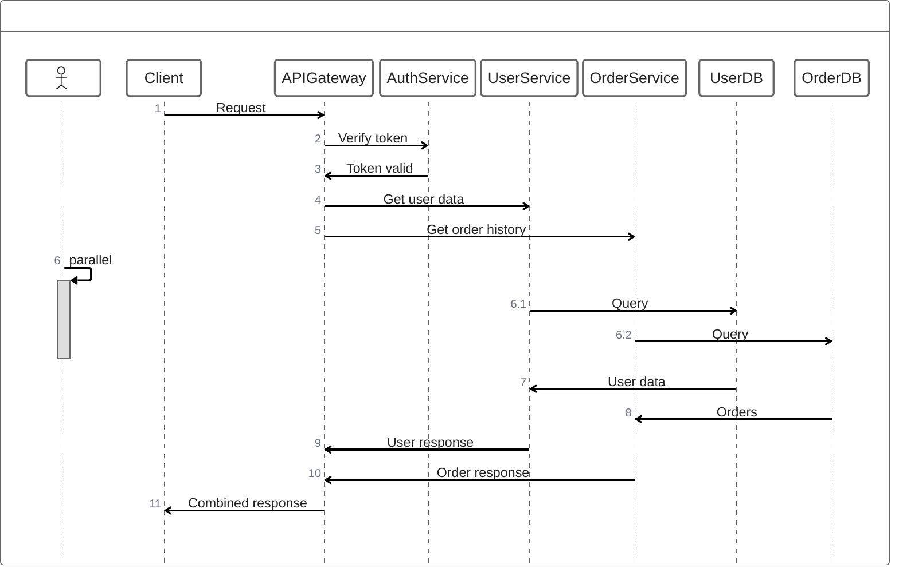

### Error Handling
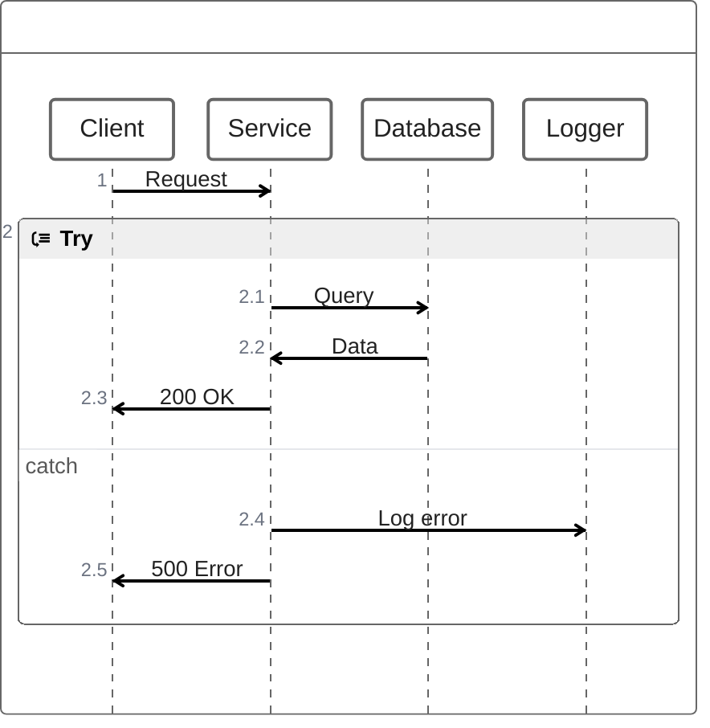

### Async Processing
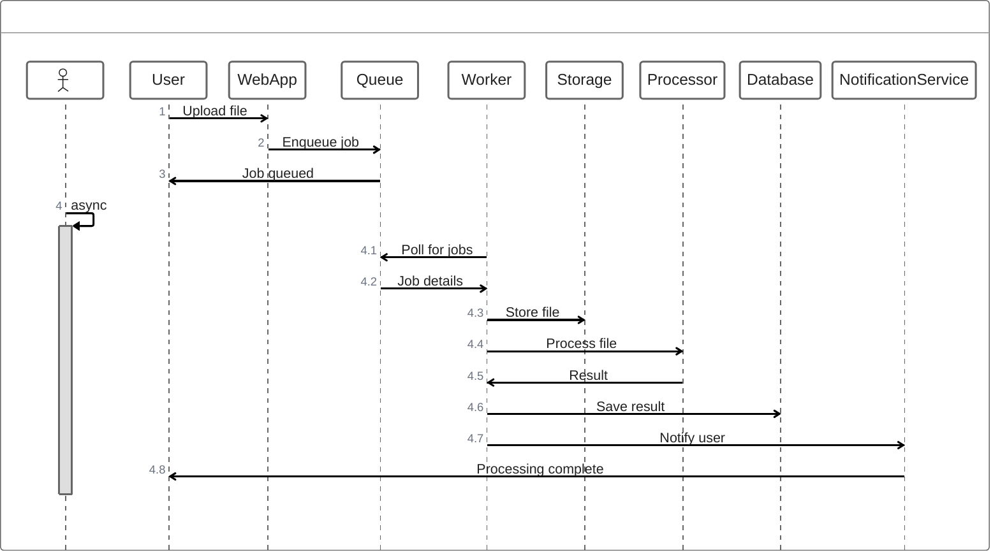

### Caching Pattern
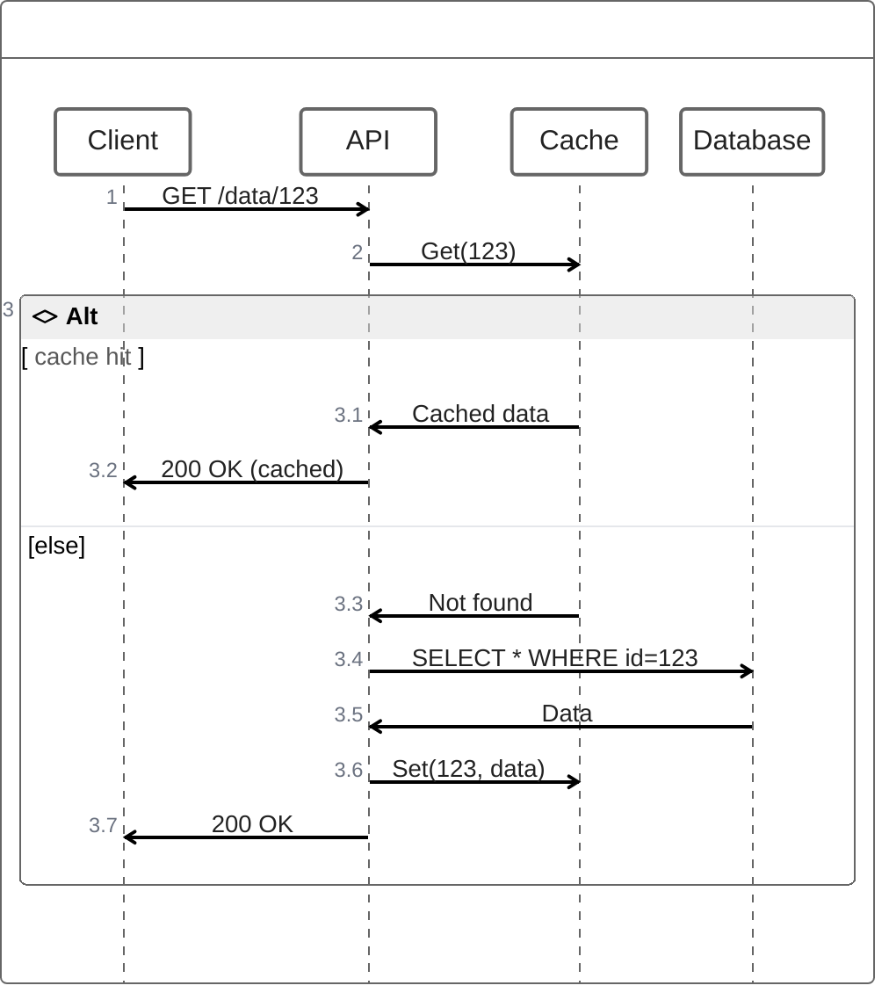

### Loop Example
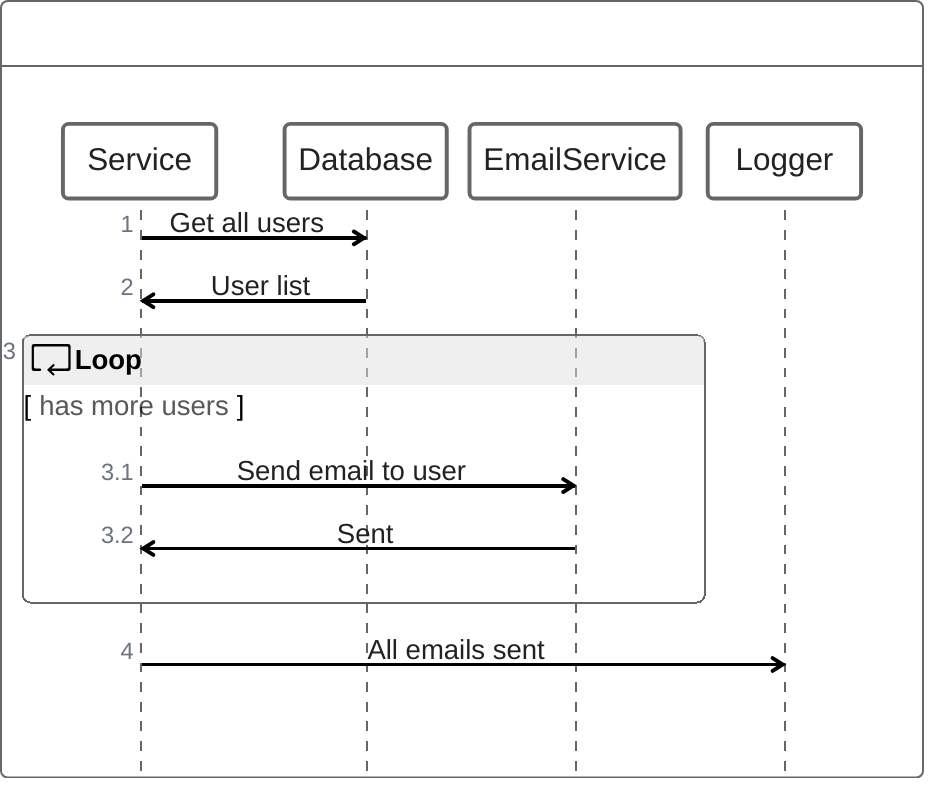

### Conditional Processing
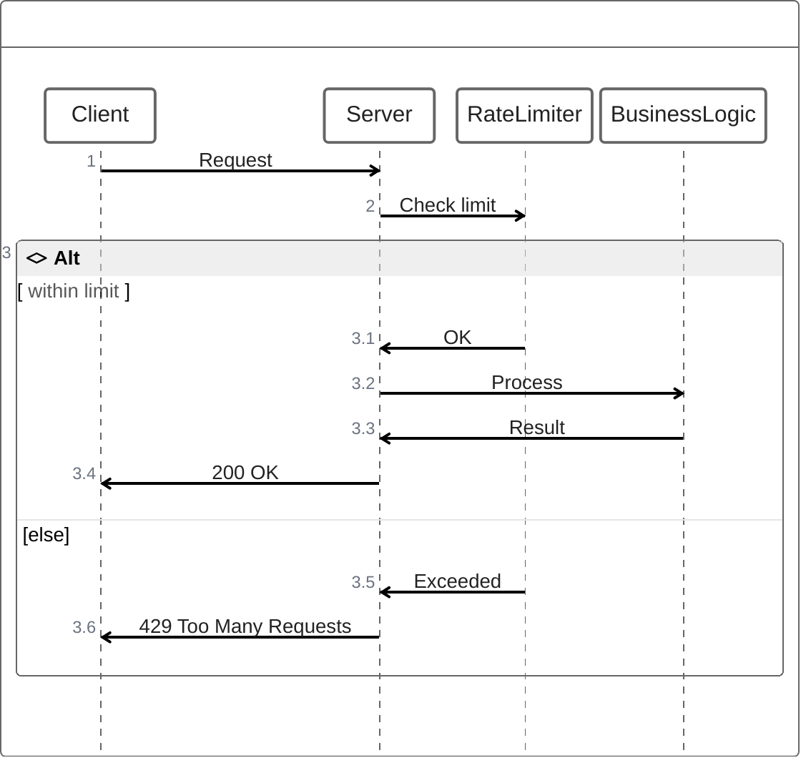

### Nested Calls
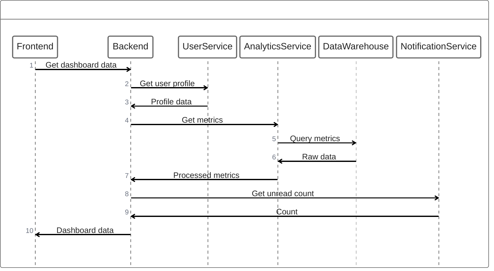

## Control Structures

### If-Else
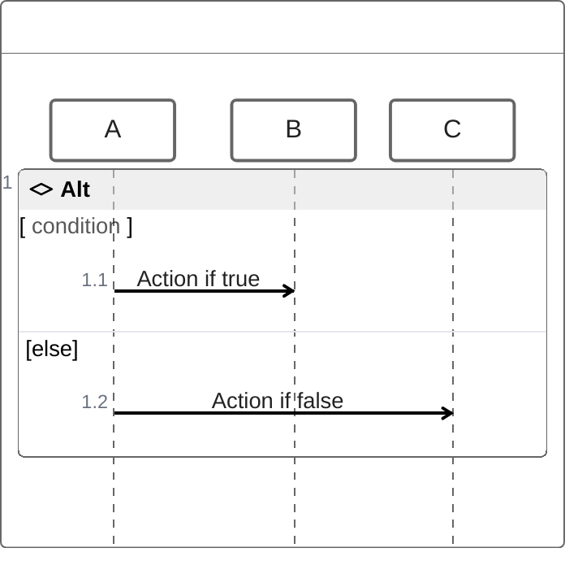

### Try-Catch
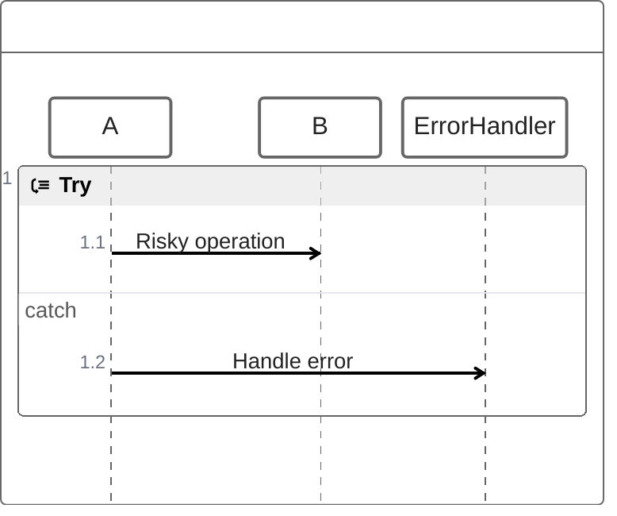

### While Loop
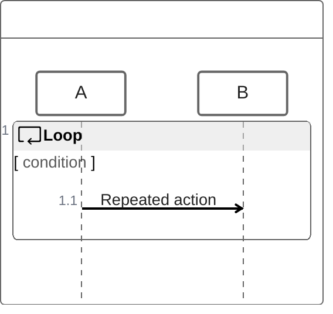

### Parallel
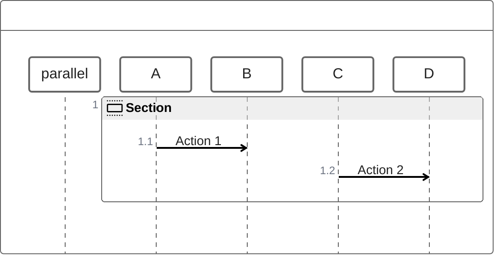

### Async
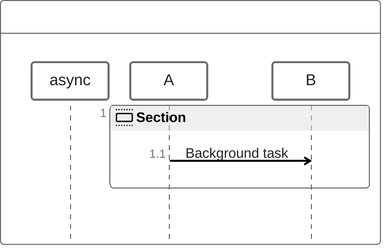

## Tips

- More concise than traditional sequence diagram syntax
- Supports control flow (if/else, loops, try/catch)
- Use `parallel` for concurrent operations
- Use `async` for background tasks
- Arrows: `->` for messages
- Group related logic in blocks
- Keep nesting reasonable for readability
- Good for showing complex control flow
- Cleaner syntax for developers
