# Common Mermaid Diagram Patterns

This file contains reusable templates and patterns for frequently used diagram scenarios.

## Software Development Workflows

### Feature Development Flow
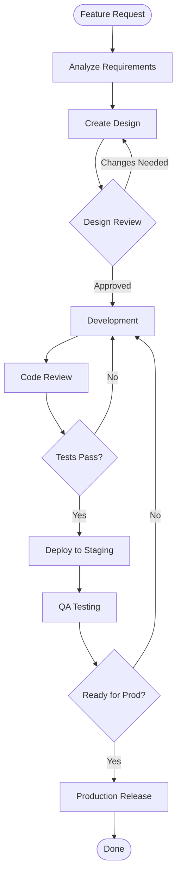

### Bug Fix Workflow
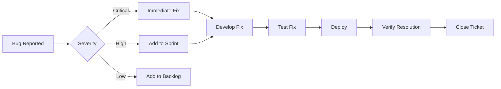

## Authentication Patterns

### OAuth 2.0 Flow
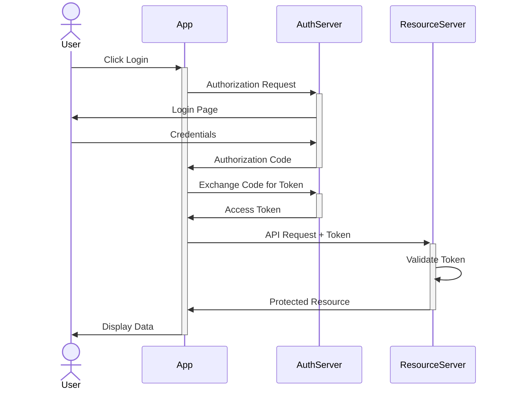

### JWT Authentication
```mermaid
sequenceDiagram
    participant Client
    participant API
    participant Auth
    participant DB
    
    Client->>+API: POST /login (credentials)
    API->>+Auth: Validate credentials
    Auth->>+DB: Query user
    DB->>-Auth: User data
    
    alt Valid credentials
        Auth->>Auth: Generate JWT
        Auth->>-API: JWT token
        API->>-Client: 200 OK + token
    else Invalid
        Auth->>-API: Invalid credentials
        API->>-Client: 401 Unauthorized
    end
    
    Note over Client,API: Subsequent requests
    Client->>+API: GET /protected (+ JWT)
    API->>API: Verify JWT
    API->>-Client: Protected data
```

## Database Patterns

### E-Commerce Database Schema
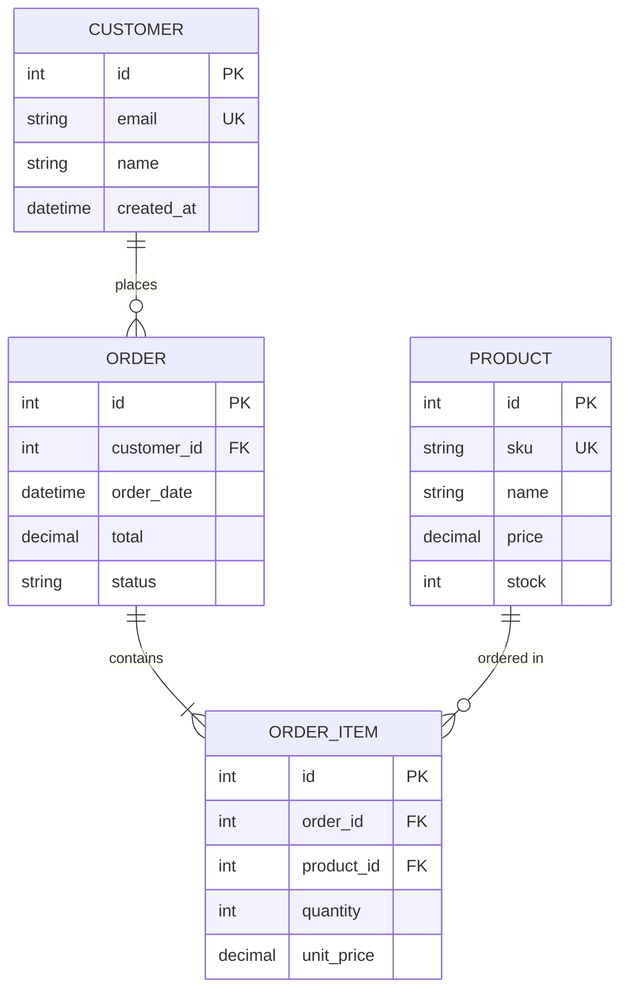

### User Management Schema
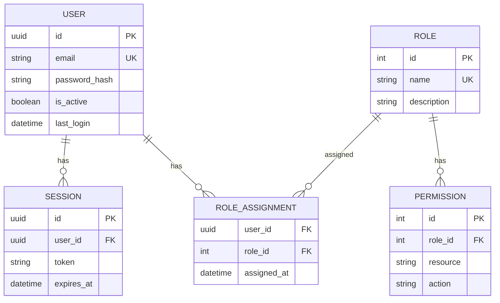

## Architecture Patterns

### Microservices Architecture
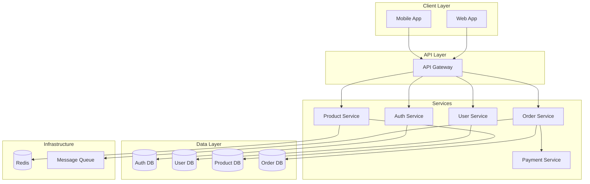

### Layered Architecture
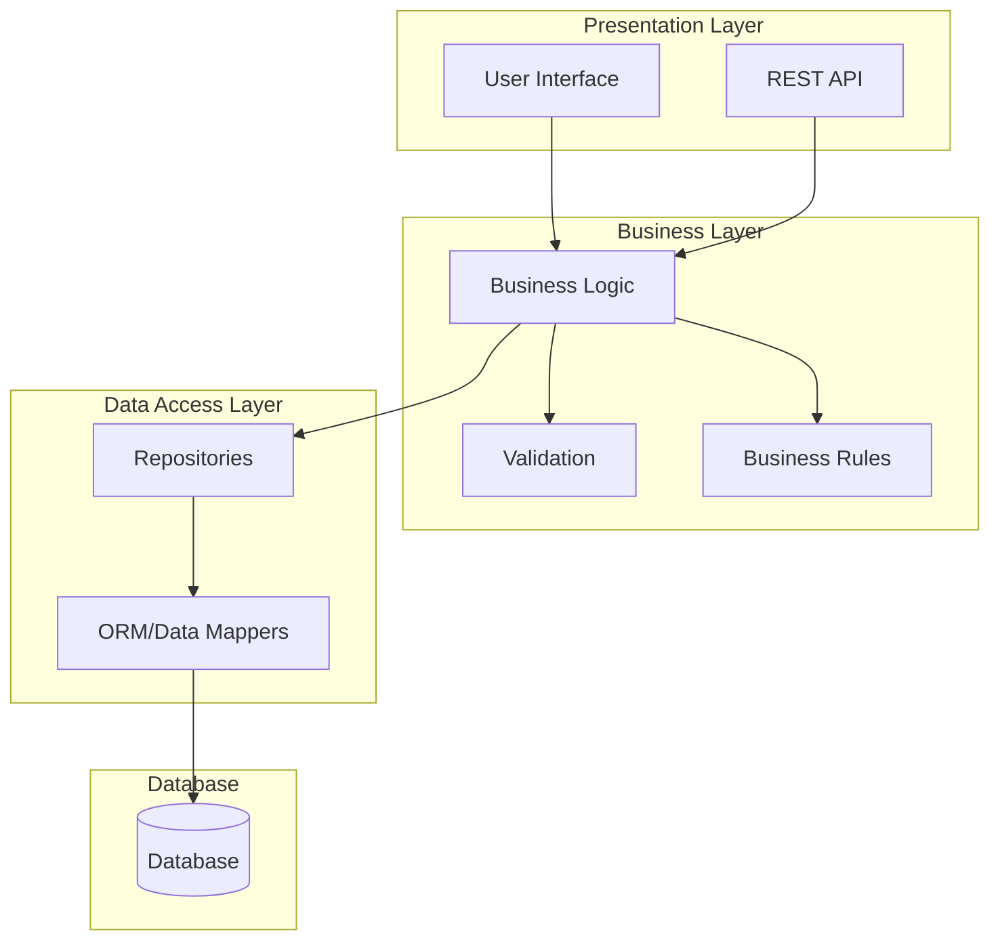

## State Management

### Order Lifecycle
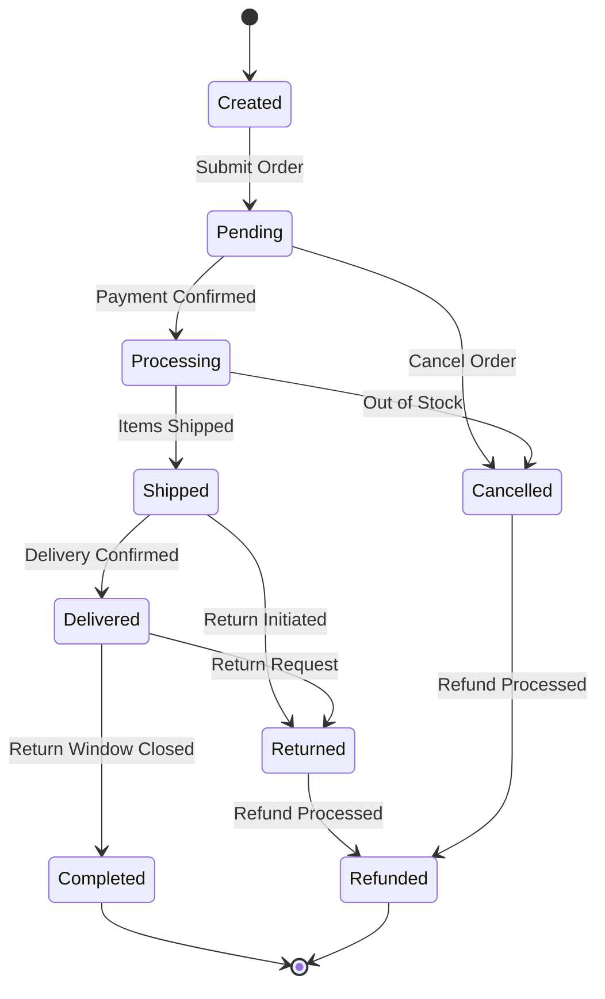

### User Account States
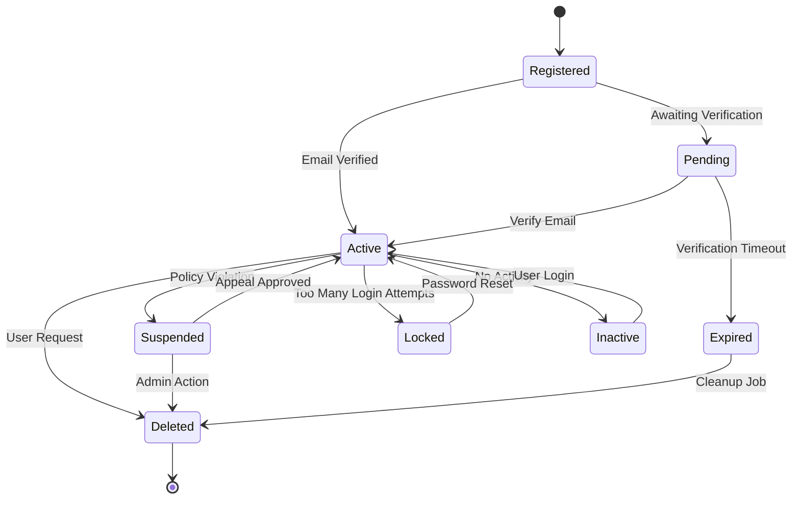

## Class Diagram Patterns

### Repository Pattern
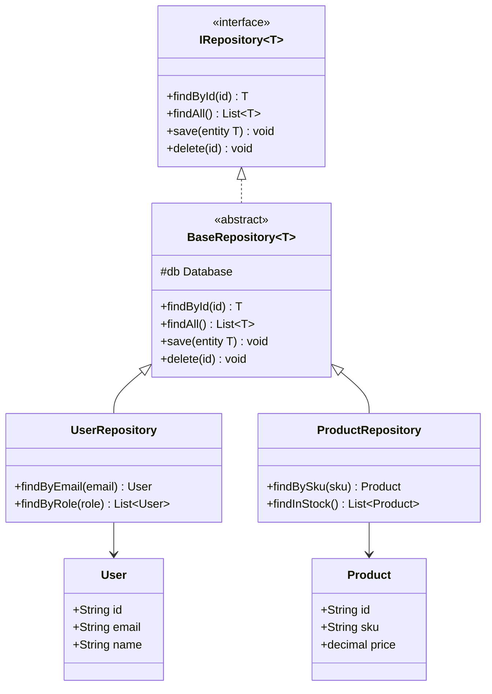

### Service Layer Pattern
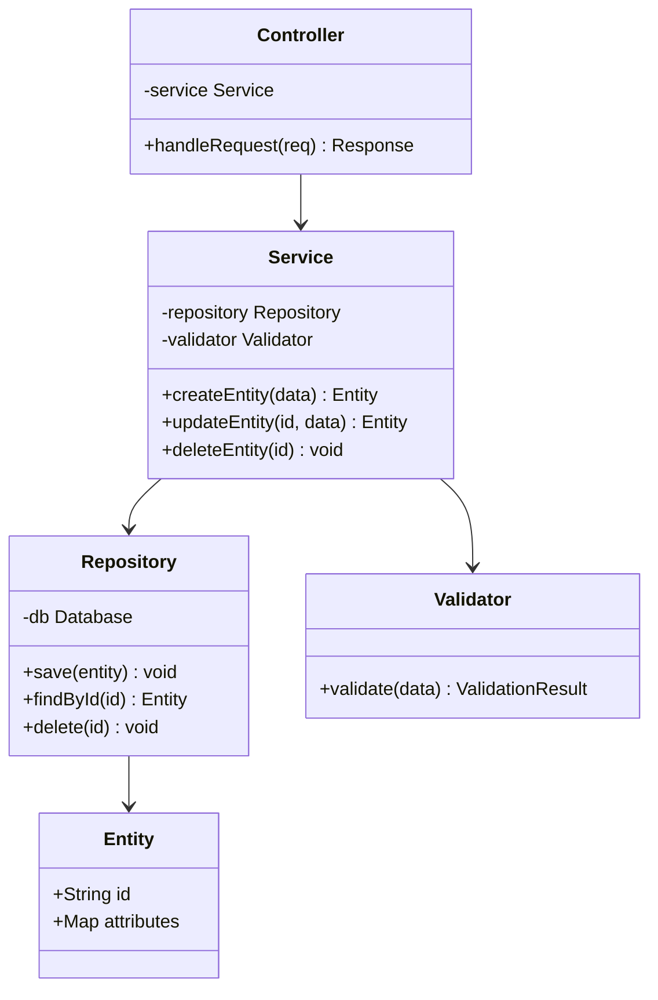

## CI/CD Pipeline

### Standard Pipeline
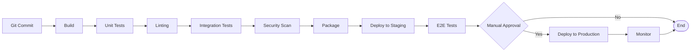

## API Patterns

### REST API Standard Flow
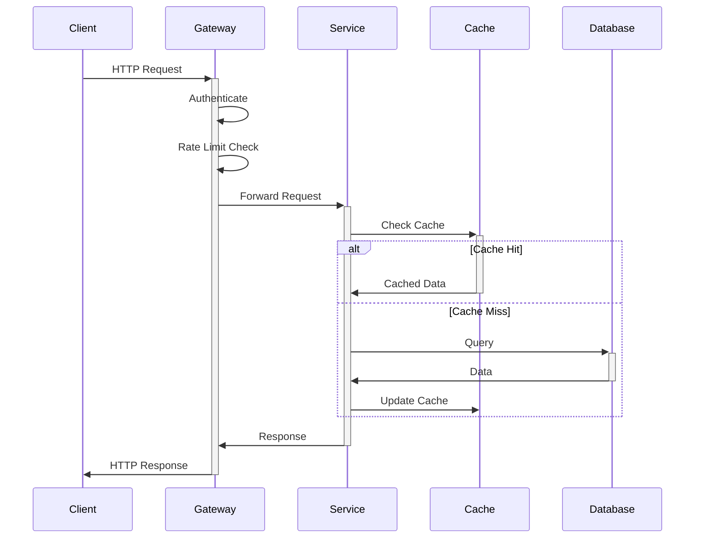

## Tips for Using Templates

1. **Customize**: Adjust templates to match your specific needs
2. **Simplify**: Remove unnecessary elements for clarity
3. **Extend**: Add domain-specific elements as needed
4. **Validate**: Always validate with mmdc after customization
5. **Document**: Add comments for complex logic
6. **Consistent**: Use consistent naming conventions
7. **Focused**: Keep diagrams focused on one aspect
8. **Updated**: Maintain templates as patterns evolve
